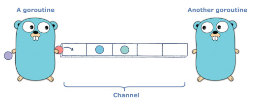
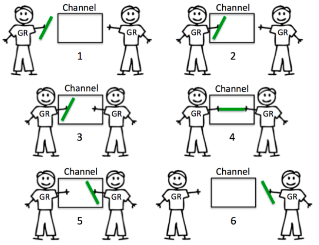

# Channel

`Channel` 是 `Go` 语言中一种用于在 `Goroutine` 之间传递数据的机制。`Channel` 通过**通信**实现**共享内存**，可以安全地传递数据，避免了多个 `Goroutine` 访问共享内存时出现的竞争和死锁问题。



`Channel` 可以分为有缓冲或无缓冲。**无缓冲的 `Channel`，**也称为同步 `Channel`，**发送操作和接收操作必须同时准备就绪**，否则会被阻塞。**有缓冲的 `Channel`，**也称为异步 `Channel`，**发送操作会在 `Channel` 缓冲区未满的情况下立即返回**，接收操作也会在 `Channel` 缓冲区不为空的情况下立即返回，否则会被阻塞。

## 目录

- `Channel` 定义
- 无缓冲`Channel`
- 缓冲`Channel` 
- 关闭 `Channel`
- 遍历 `Channel`
- 通过`Select` 操作`Channel`

## 定义Channel

在`Golang`中通过`make`来定义`Channel`, 格式为如下两种, 分别为**无缓冲`Channel`和有缓冲`Channel`**：

```go
c := make(chan T)      // 定义无缓冲channel
c := make(chan T,size) // 定义有缓冲channel
```

```go
package main

import (
	"fmt"
	"time"
)

// 定义 channel, channel 是带有类型的管道，可以通过信道操作符 <- 来发送或者接收值
func main() {
	// 信道在使用前必须通过内建函数 make 来创建

	// make(chan T,size)  标识用内建函数 make 来创建 一个T类型的缓冲大小为 size 的 channel
	// 如下: make(chan int) 用内建函数 make 来创建 一个 int 类型的缓冲大小为 0 的 channel
	c := make(chan int)

	go func() {
		// 从 c 接收值并赋予 num
		num := <-c
		fmt.Printf("recover:%d\n", num)
	}()

	// 将 1 发送至信道 c
	c <- 1

	<-time.After(time.Second * 3)

	fmt.Println("return")
}
```

首先通过 `make` 函数创建了一个无缓冲的 `int` 类型的 `Channel c`，即：`c := make(chan int)`。

然后通过 `go` 关键字启动了一个 `Goroutine`，用于从 `Channel c` 中接收数据。匿名函数 `Goroutine` 中，使用 `<-` 语法从 `Channel c` 中接收值，并将其赋值给变量 `num`。接收完值后，使用 `fmt.Printf` 打印出接收到的值。

接着，在 `main`函数 中，**使用 `<-` 语法将整数值 `1` 发送到 `Channel c` 中**，即`c <- 1`。

最后，为了保证 `Goroutine` 有足够的时间去接收 `Channel` 中的值，通过 `<-time.After(time.Second * 3)` 等待 3 秒钟之后，打印出 "return"。如果将 `<-time.After(time.Second * 3)` 去掉，那么程序可能在打印 "return" 之前就结束了，因为 `Goroutine` 没有足够的时间执行接收 `Channel` 中的值。

## 无缓冲Channel

无缓冲的`Channel`通过定义：

```go
make(chan T)
```

在无缓冲的 `Channel` 中，**发送和接收操作是同步**的。如果一个 `Goroutine` 向一个无缓冲的 `Channel` 发送数据，它将一直阻塞，直到另一个 `Goroutine` 从该 `Channel` 中接收到数据。同样地，如果一个 `Goroutine` 从一个无缓冲的 `Channel` 中接收数据，它将一直阻塞，直到另一个 `Goroutine` 向该 `Channel` 中发送数据。



```go
package main

import (
	"fmt"
	"time"
)

// 发送端和接收端的阻塞问题,发送端在没有准备好之前会阻塞,同样接收端在发送端没有准备好之前会阻塞
func main() {
	c := make(chan string) // 无缓冲字符串类型

	go func() {
		<-time.After(time.Second * 10)
		fmt.Println("发送端准备好了 send: ping")
		c <- "ping" // 发送
	}()

	// 发送端10s后才准备好，所以阻塞在当前位置
	fmt.Println("阻塞在当前位置，发送端发送数据后才继续执行")
	num := <-c
	fmt.Printf("recover: %s\n", num)
}
```

上面代码创建了一个无缓冲字符串类型的 `Channel c`，然后启动了一个新的 `Goroutine`，该 `Goroutine` 会在 10 秒后发送一个字符串 `"ping"` 到 `Channel c` 中。

在主 `main` 函数中，接收操作 `<-c` 会阻塞，直到接收到 `Channel c` 中的值为止。因为发送端需要 10 秒后才会发送数据，所以接收端会在 `<-c` 处阻塞 10 秒。接收到 `"ping"` 后，主 `main` 函数继续执行，输出 `"recover: ping"`后整个程序退出。

小练习：通过`Goroutine+Channel`计算数组之和。

```go
package main

import "fmt"

// 对切片中的数进行求和，将任务分配给两个 Go 程。一旦两个 Go 程完成了它们的计算，它就能算出最终的结果。

// sum 求和函数
func sum(s []int, c chan int) {
	ans := 0
	for _, v := range s {
		ans += v
	}
	c <- ans // 将和送入 c
}

func main() {
	s := []int{1, 1, 1, 1, 1, 2, 2, 2, 2, 2}

	c := make(chan int)
	go sum(s[:len(s)/2], c)
	go sum(s[len(s)/2:], c)
	x, y := <-c, <-c // 从 c 中接收

	fmt.Println(x, y, x+y)
}
```

## 缓冲Channel

缓冲`Channel`定义：

```go
make(chan T,size)
```

缓冲 `Channel` 是带有缓冲区的 `Channel`，创建时需要指定缓冲区大小，例如 `make(chan int, 10)` 创建了一个缓冲区大小为 10 的整型 `Channel`。

缓冲 `Channel` 中, **当缓冲区未满时，发送操作是非阻塞的，如果缓冲区已满，则发送操作会阻塞**，直到有一个接收操作接收了一个值, 才能继续发送。当缓冲区非空时，接收操作是非阻塞的，如果缓冲区为空，则接收操作会阻塞，直到有一个发送操作发送了一个值。


```go
package main

import (
	"fmt"
	"time"
)

func producer(c chan int, n int) {
	for i := 0; i < n; i++ {
		c <- i		// 将i的值循环写入channel c
		fmt.Printf("producer sent: %d\n", i)
	}
	close(c) // 写完n个值后关闭channel c
}

func consumer(c chan int) {
	for {
		num, ok := <-c // 从channel c中接收值
    if !ok { // ok 代表是否接受到channel c的值,ok=true代表接收到,ok=false代表channel已经被close了
			fmt.Println("consumer closed")
			return
		}
		fmt.Printf("consumer received: %d\n", num)
	}
}

func main() {
	c := make(chan int, 5) // 有缓冲int类型
	go producer(c, 10) // 启动生产函数发送10个值到channel c中
	go consumer(c) // 启动消费函数接收这10个值
	time.Sleep(time.Second * 5)
	fmt.Println("main exited")
}
```

在上面代码中，我们创建了一个缓冲区大小为 5 的整型 `Channel`，生产者向 `Channel` 中发送了 10 个整数，消费者从 `Channel` 中接收这些整数，并将它们打印出来。由于缓冲区大小为 5，因此生产者只有在 `Channel` 中有 5 个或更多的元素时才会被阻塞。

需要注意的是，当 `Channel` 被关闭后，仍然可以从 `Channel` 中接收剩余的元素，但不能再向 `Channel` 中发送任何元素。因此，在消费者函数中，我们使用了 `for` 循环和 `ok` 标志来检查 `Channel` 是否已经被关闭。

**非缓冲`Channel`和缓冲`Channel`的对比：**

```go
package main

import "fmt"

// 不带缓冲的 channel
func NoBufferChan() {
	ch := make(chan int)
	ch <- 1 // 被阻塞,执行报错 fatal error: all goroutines are asleep - deadlock!
	fmt.Println(<-ch)
}

// 带缓冲的 channel
func BufferChan() {
	// channel 有缓冲、是非阻塞的，直到写满 cap 个元素后才阻塞
	ch := make(chan int, 1)
	ch <- 1
	fmt.Println(<-ch)
}

func main() {
	//NoBufferChan()
	BufferChan()
}
```

## 关闭Channel

`Close(c)` 函数可以用于关闭 `Channel`，关闭一个`Channel`后，可以从中读取数据不过读取的数据全是当前`Channel`类型的零值，但不能向这个`Channel`写入数据会发送`Panic`。

```go
package main

func main() {
	ch := make(chan bool)
	close(ch)
	fmt.Println(<- ch)
	//ch <- true // panic: send on closed channel
}
```

| 操作     | 一个零值nil通道 | 一个非零值但已关闭的通道 | 一个非零值且尚未关闭的通道 |
| -------- | --------------- | ------------------------ | -------------------------- |
| 关闭     | 产生恐慌        | 产生恐慌                 | 成功关闭                   |
| 发送数据 | 永久阻塞        | 产生恐慌                 | 阻塞或者成功发送           |
| 接收数据 | 永久阻塞        | 永不阻塞                 | 阻塞或者成功接收           |

## 遍历 Channel

可以通过`Range`持续读取`Channel`，直到`Channel`关闭。格式如下：

```go
for v := range c {
  fmt.Println("receive:", v)
}
```

```go
package main

import (
	"fmt"
	"time"
)

// 通过 range 遍历 channel, 并通过关闭 channel 来退出循环

// 复制一个 channel 或用于函数参数传递时, 只是拷贝了一个 channel 的引用, 因此调用者和被调用者将引用同一个channel对象
func genNum(c chan int) {
	for i := 0; i < 10; i++ {
		c <- i
		time.Sleep(1 * time.Second)
	}
	// 发送者可通过 close 关闭一个信道来表示没有需要发送的值了
	close(c)
}

func main() {
	c := make(chan int, 10)
	go genNum(c)

	// 循环 for v := range c 会不断从信道接收值，直到它被关闭
	// 并且只有发送者才能关闭信道，而接收者不能, 向一个已经关闭的信道发送数据会引发程序恐慌（panic）
	for v := range c {
		fmt.Println("receive:", v)
	}

	// 接收者可以通过 v,ok := <- c 表达式接收第二个参数来测试信道是否被关闭：若没有值可以接收且信道已被关闭,那么 v 为对应类型零值,ok 为 false
	v, ok := <-c
	fmt.Printf("value:%d, ok:%t\n", v, ok)

	fmt.Println("close")
}
```

## 通过Select操作Channel

通过`Select-Case`可以选择一个准备好数据`Channel`执行，会从这个`Channel`中读取或写入数据。

```go
select {
  case <-quit: // 接收channel信息
    return
  default: // 等同于 switch 的 default。当所以case都阻塞时如果有default则执行default
    time.Sleep(1 * time.Second)
}
```

```go
package main

import (
	"fmt"
	"time"
)

// 通过 channel+select 控制 goroutine 退出
func genNum(c, quit chan int) {
	for i := 0; ; i++ {
		// select 可以等待多个通信操作
		// select 会阻塞等待可执行分支。当多个分支都准备好时会随机选择一个执行。
		select {
		case <-quit:
			// 发送者可通过 close 关闭一个信道来表示没有需要发送的值了。
			close(c)
			return
		default: // 等同于 switch 的 default。当所以case都阻塞时如果有default则执行default
			c <- i
			time.Sleep(1 * time.Second)
		}
	}
}

func main() {
	c := make(chan int)
	quit := make(chan int)
	go genNum(c, quit)

	// 循环 for v := range c 会不断从信道接收值，直到它被关闭
	// 并且只有发送者才能关闭信道，而接收者不能。向一个已经关闭的信道发送数据会引发程序恐慌（panic）。
	for i := 0; i < 10; i++ {
		fmt.Println("receive:", <-c)
	}

	// 通知 genNum() 退出
	quit <- 1

	// 接收者可以通过 v,ok := <- c 表达式的第二个参数来测试信道是否被关闭：若没有值可以接收且信道已被关闭，那么在执行完
	v, ok := <-c
	fmt.Printf("value:%d, ok:%t\n", v, ok)

	fmt.Println("close")
}
```

## 思考题

1. 通过goroutine+channel统计文本文件中每个单词的数量。

## 自检

- `Channel`的定义和声明 ？
- `Channel`的阻塞和非阻塞 ？
- `Channel`的容量和长度 ？
- `Channel`的关闭 ？
- `Channel`的遍历 ？
- `Channel`的传递方式 ？
- `Channel`的底层原理 ？
- `Select`的语法和基本使用 ?
- `Select`的阻塞和非阻塞 ?
- `Select`的超时处理 ?
- `Select`的底层实现 ?
- `Channel+Select`的使用 ？
- `Goroutine+Channel`的通信方式 ？
- `Goroutine+Channel+Select`的错误处理 ？
- `Goroutine+Channel+Select`的优雅退出 ？

## 参考

https://dev.to/ahmedash95/understand-golang-channels-and-how-to-monitor-with-grafana-154

http://legendtkl.com/2017/07/30/understanding-golang-channel/

https://halfrost.com/go_channel/

https://blog.devgenius.io/golang-channels-eb25a34f95db

https://www.modb.pro/db/146628