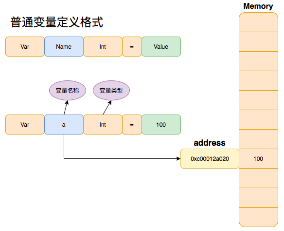
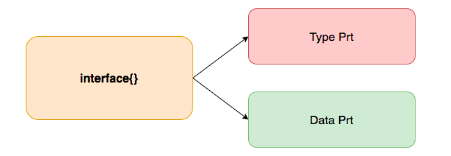
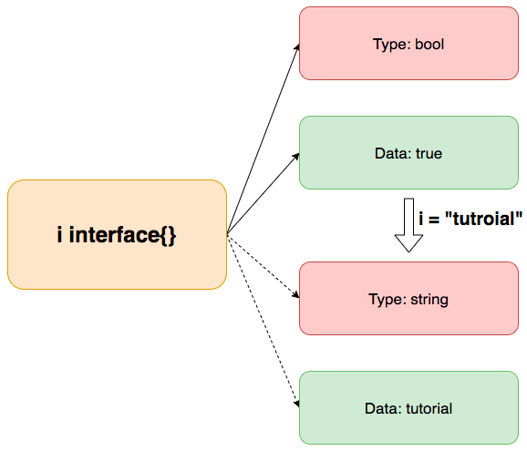
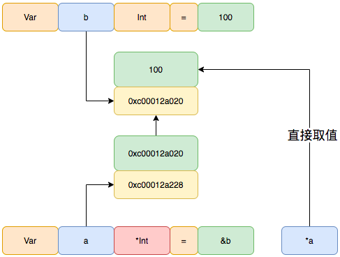

# 变量与常量

变量和常量简单来说就是给**内存中某一个地址**起一个名字, 然后用这个地址**存储某个特定类型的值**。



## 目录

- 数据类型
- 定义变量

- 变量赋值
- 类型转换
- 定义常量
- 定义函数变量
- 定义指针变量
- 占位符
- 运算符

## 数据类型

**数据类型分类：**

- 布尔类型：`bool`。
- 整数类型：`int8`、`uint8`、`int16`、`uint16`、`int32`、`uint32`、`int64`、`uint64`、`int`、`uint`、 `uintptr`。
- 浮点数类型: `float32`、`float64`。
- 复数类型：`complex64`、`complex128`。
- 字符串类型：`string`。
- 字符类型：`byte`。
- 数组类型：`[size]T`。
- 自定义类型：`struct`。
- 函数类型：`func`。
- 指针持有者类型：`[]T`(切片)、`map[T]T`。

**数据类型占用大小：**

```go
bool
string

uint        either 32 or 64 bits
int         same size as uint
uintptr     an unsigned integer large enough to store the uninterpreted bits of
            a pointer value
uint8       the set of all unsigned  8-bit integers (0 to 255)
uint16      the set of all unsigned 16-bit integers (0 to 65535)
uint32      the set of all unsigned 32-bit integers (0 to 4294967295)
uint64      the set of all unsigned 64-bit integers (0 to 18446744073709551615)

int8        the set of all signed  8-bit integers (-128 to 127)
int16       the set of all signed 16-bit integers (-32768 to 32767)
int32       the set of all signed 32-bit integers (-2147483648 to 2147483647)
int64       the set of all signed 64-bit integers
            (-9223372036854775808 to 9223372036854775807)

float32     the set of all IEEE-754 32-bit floating-point numbers
float64     the set of all IEEE-754 64-bit floating-point numbers

complex64   the set of all complex numbers with float32 real and imaginary parts
complex128  the set of all complex numbers with float64 real and imaginary parts

byte        alias for uint8
rune        alias for int32 (represents a Unicode code point)
```

## 定义变量

在`Golang`中, 通过`var`关键字定义变量, 如下格式有多种：

```go
var variableName int			// 定义int类型的变量,初始化为零值
variableName := 1		      // 定义int类型的变量,初始化为 1

// 其它方式
var variableName int = 1
var variableName = 1
```

其中最常用的两种为`var variableName T`和`variableName := Value`（简短声明）。变量可以定义在函数外, 当做该`package`下的全局变量, 也可以定义在函数内当, 做该函数内的局部变量。

```go
package main

import (
	"fmt"
	"unsafe"
)

/*
	通过 var 定义变量
	var variableName T			// 初始化为零值
	var variableName T = Value	// 初始化为Value
	var variableName = Value	// 初始化为Value
	variableName := Value		// 初始化为Value
*/

// var 语句可以声明全局变量
// 全局变量: 函数外声明的变量,全局变量作用域可以在当前的整个包甚至外部包(被导出后)使用
var aa int64

// 可以在 var() 中定义多个全局变量
var (
	bb int8
	cc int16
	dd bool
	ee string
)

func Steps1() {
	// var 语句用于声明一个变量列表,默认值为对应类型零值,
	// 并且声明变量后不使用该变量的话将会抛出错误(该规则适用于函数内定义的变量)

	// 如下 var a int 定义了一个 int 类型的局部变量 a (局部变量：函数内声明的变量,作用域只在函数体内),
	// 这意味着 a 只能在 main 函数内使用（函数的参数和返回值也是局部变量）

	var a int         // 整型 uint8,int8,uint16,int16,uint32,int32,uint64,int64,uintptr
	var b float32     // 浮点型 float64
	var c bool        // 布尔型
	var d string      // 字符串
	var e byte        // 等同于 uint8
	var f rune        // 等同于 int32,表示一个 Unicode 码点
	var g interface{} // 接口型 类似于java中的Object 可以存储任意类型的值

	// 多变量声明 通过 , 隔开
	var h, i string

	// 没有明确初始值的变量声明编译时会被赋予 零值
	// 不同类型的零值:
	//    数值类型为   0
	//    布尔类型为   false
	//    字符串类型为 ""（空字符串）
	// 	  接口类型为   nil

	// 打印对应零值
	fmt.Println("\tint zero value: ", a)
	fmt.Println("\tint64 zero value: ", aa)
	fmt.Println("\tfloat32 zero value: ", b)
	fmt.Println("\tbool zero value: ", c)
	fmt.Println("\tstring zero value: ", d)
	fmt.Println("\tbyte zero value: ", e)
	fmt.Println("\trune zero value: ", f)
	fmt.Println("\tinterface zero value: ", g)

	fmt.Println("\tstring zero value: ", h)
	fmt.Println("\tstring zero value: ", i)
}
是我            6
func main() {
	fmt.Println("Steps1():")
	Steps1()
}
```

## 变量赋值

在`Golang`中通过 `=` 对变量进行赋值, `=` 可以在变量初始化时赋值也可以在变量定义后赋值。还可以通过上文提到的简洁赋值 `:=`, `:=` 表示定义变量并赋值, 可以**替代**`Var`。

需要注意的是，如果您在定义变量时不指定类型，`Go`编译器会**自动推断**其类型, 如下`var b = 2`会自动推导`b`为`int`型。

```go
package main

import (
	"fmt"
	"reflect"
	"unsafe"
)

// var 语句声明全局变量并赋值
var aa int64 = 3

// Steps1 声明变量并赋值
func Steps1() {
	// 声明局部变量并赋初始值
	var a int = 1

	// 如果初始化值已存在,则可以省略类型,Go编译器会自动推导类型
	var b = 2       // 自动推导为int型
	var c = 3.2     // 自动推导为float64型
	var d = "hello" // 自动推导为string型

	// 在函数中,简洁赋值语句 := 可在类型明确的地方代替 var 声明,但 := 结构不能在函数外使用,也就是说不能用于声明全局变量
	e := true

	var f byte = 'a'
	var g rune = '\u72d7' // \u72d7 = 狗

	var h interface{} = "golang"
	var i interface{} = true
	var j, k = 1, "Golang Tutorial" // 多变量声明并赋值

	// 打印变量的 value, 通过 reflect.TypeOf 函数获取变量对应类型
	fmt.Printf("\ta value:%d  a type:%s\n", a, reflect.TypeOf(a))
	fmt.Printf("\taa value:%d  aa type:%s\n", aa, reflect.TypeOf(aa))
	fmt.Printf("\tb value:%d  b type:%s\n", b, reflect.TypeOf(b))
	fmt.Printf("\tc value:%f  c type:%s\n", c, reflect.TypeOf(c))
	fmt.Printf("\td value:%s  d type:%s\n", d, reflect.TypeOf(d))
	fmt.Printf("\te value:%t  e type:%s\n", e, reflect.TypeOf(e))
	fmt.Printf("\tf value:%c  f type:%s\n", f, reflect.TypeOf(f))
	fmt.Printf("\tg value:%c  g type:%s\n", g, reflect.TypeOf(g))
	fmt.Printf("\th value:%s  h type:%s\n", h, reflect.TypeOf(h))
	fmt.Printf("\ti value:%t  i type:%s\n", i, reflect.TypeOf(i))
	fmt.Printf("\tj value:%d  j type:%s\n", j, reflect.TypeOf(j))
	fmt.Printf("\tk value:%s  k type:%s\n", k, reflect.TypeOf(k))
}

func main() {
	fmt.Println("Steps1():")
	Steps1()	
}
```

如上代码中描述了不同类型的声明方式，**其中的`interface`类型可以存储任意类型的值**，具体原因是在 `Go` 的 `runtime` 中，`interface` 是用**两个指针**来实现的(`eface`)。其中一个指针**指向实际类型信息**的指针(`_ytpe`)，另一个指针**指向实际存储数据**的指针(`data`)。

```go
// interface{} 运行时的结构
type eface struct {
	_type *_type
	data  unsafe.Pointer
}
```



具体来说，当一个接口变量被赋值时，`Go` 会在**运行时分配一个包含两个指针的结构体**(`eface`)，其中第一个指针指向一个表示实际类型的指针(`Type Prt`)，第二个指针指向实际存储值的指针(`Data Prt`)。需要注意的是，这里的类型指的是**动态类型**，即**变量的实际类型而非声明时的类型**。

```go
var i interface{} = true
fmt.Printf("i value:%t  i type:%s\n", i, reflect.TypeOf(i))
// i value:true  i type:bool

i = "tutorial"
fmt.Printf("i value:%s  i type:%s\n", i, reflect.TypeOf(i))
// i value:tutorial  i type:string
```

这段代码中，定义了一个空接口变量 `i`，并先后将其赋值为 `true` 和 `"tutorial"`。由于 `i` 是一个空接口变量，它可以容纳任何类型的值。在这种情况下，`i` 的类型会根据所赋的值进行自动推导。

在第一个赋值代码中，`i` 被赋值为 `true`，因此 `i` 的类型被推导为 `bool` 类型。在第二个赋值代码中，`i` 被赋值为 `"tutorial"`，因此 `i` 的类型被推导为 `string` 类型。

在 `fmt.Printf()` 函数中，使用了格式化打印 `i` 的值和类型。因此，在第一次打印时，`i` 的值为 `true`，类型为 `bool`；赋值为`tutorial`后再打印，`i` 的值为 `"tutorial"`，类型为 `string`。



完整代码

```go
package main

import (
	"fmt"
	"reflect"
	"unsafe"
)

// Steps3 interface被动态赋值
func Steps3() {
	var i interface{} = true
	fmt.Printf("\ti value:%t  i type:%s\n", i, reflect.TypeOf(i))

	// i 被重新赋值, 类型转换为string
	i = "tutorial"
	fmt.Printf("\ti value:%s  i type:%s\n", i, reflect.TypeOf(i))
}

// Steps4 证明interface底层是由type和data组成
func Steps4() {
	/*
		interface底层由两部分组成  _type ptr, data ptr
		type eface struct {
			_type *_type
			data  unsafe.Pointer
		}
	*/

	var i interface{} = true
	fmt.Printf("\ti value:%t  i type:%s\n", i, reflect.TypeOf(i))

	fmt.Printf("\ti size:%d\n", unsafe.Sizeof(i))
	fmt.Printf("\ti addr:%p\n", &i)
	fmt.Printf("\ti type pointer value 0x%x\n", *(*uintptr)(unsafe.Pointer(&i)))
	fmt.Printf("\ti data pointer value 0x%x\n", *(*uintptr)(unsafe.Pointer(uintptr(unsafe.Pointer(&i)) + uintptr(8))))
	fmt.Printf("\ti data pointer *value %t\n", *(*bool)(unsafe.Pointer(*(*uintptr)(unsafe.Pointer(uintptr(unsafe.Pointer(&i)) + uintptr(8))))))

	fmt.Printf("\t---------------------------\n")
	// i 被重新赋值, 类型转换为string
	i = "tutorial"
	fmt.Printf("\ti value:%s  i type:%s\n", i, reflect.TypeOf(i))

	fmt.Printf("\ti size:%d\n", unsafe.Sizeof(i))
	fmt.Printf("\ti addr:%p\n", &i)
	fmt.Printf("\ti type pointer value 0x%x\n", *(*uintptr)(unsafe.Pointer(&i)))
	fmt.Printf("\ti data pointer value 0x%x\n", *(*uintptr)(unsafe.Pointer(uintptr(unsafe.Pointer(&i)) + uintptr(8))))
	fmt.Printf("\ti data pointer *value %s\n", *(*string)(unsafe.Pointer(*(*uintptr)(unsafe.Pointer(uintptr(unsafe.Pointer(&i)) + uintptr(8))))))

	// 等同如上
	type eface struct {
		_type *struct{} // *_type
		data  unsafe.Pointer
	}
	s := *(*eface)(unsafe.Pointer(&i))
	fmt.Printf("\ti %+v\n", s)
	fmt.Printf("\ti._type: %+v\n", s._type)
	fmt.Printf("\ti.data:  %+v\n", *(*string)(s.data))
}

func main() {
	fmt.Println("Steps3():")
	Steps3()
	fmt.Println("Steps4():")
	Steps4()
}
```

## 类型转换

在`Golang`中可以将**相近类型的数据进行强转**, 格式为`variableName2 := T(variableName1)`。 需要注意的是，**不是所有类型之间都可以进行转换**。例如，您不能将一个字符串转换为一个整数或浮点型等。

```go
b := float64(a)
var b float64 = float64(a)
```

当进行类型转换时，必须**确保类型转换是安全的**，如果转换失败，则会引发一个**运行时错误**导致程序崩溃。

```go
package main

import (
	"fmt"
	"reflect"
)

/*
	类型转换
	var variableName2 T = T(variableName1)
	variableName2 := T(variableName1)
*/

func Steps1() {
	var a int = 1

	// 表达式 T(v) 将值 v 转换为类型 T

	// 如下将 int 类型的值转换为 float64 类型的值, float64(a) 将值 a 转换为 float64 类型并赋值给 b
	var b float64 = float64(a)

	// 简洁形式 uint(b) 将值 b 转换为 uint 类型并赋值给 c
	c := uint(b)

	fmt.Printf("\ta value:%d  a type:%s\n", a, reflect.TypeOf(a))
	fmt.Printf("\tb value:%f  b type:%s\n", b, reflect.TypeOf(b))
	fmt.Printf("\tc value:%d  c type:%s\n", c, reflect.TypeOf(c))
  
	//var d = bool(c) // panic 不能将 c (uint 类型的变量)转换为 bool 类型
}

func main() {
	fmt.Println("Steps1():")
	Steps1()
}
```

另外，由于类型转换可能导致精度**损失或溢出**，因此在进行类型转换时应特别小心。

```go
package main

import (
	"fmt"
	"reflect"
	"unsafe"
)

func Steps2() {
	d := uint8(255) // 将常量值 255 转换为 uint8 类型并赋值给 d
	fmt.Printf("d value:%d  d type:%s\n", d, reflect.TypeOf(d))

	// 注意：类型转换不能超过转换类型的范围
	//e := uint8(256) // 编译错误, 常量256超出了uint8最大存储限制, 不能转换

	// 转换时,超过转换的类型范围时将导致数据溢出
	var f uint16 = 256
	g := uint8(f) // uint8最大为255, 溢出后从0开始, 所以g等于0
	ff := f + 1
	h := uint8(ff) // 如上可知h等于1

	// uint16   uint8
	// 2 byte   1 byte
	// 16 bit   8 bit

	// 00000001 00000000    f
	//          00000000    g
	// 00000001 00000001    ff
	//          00000001    h

	fmt.Printf("\tf  sizeof:%dbyte  binary value:%016b f  value:%d   f type:%s\n", unsafe.Sizeof(f), f, f, reflect.TypeOf(f))
	fmt.Printf("\tg  sizeof:%dbyte  binary value:%016b g  value:%d     g type:%s\n", unsafe.Sizeof(g), g, g, reflect.TypeOf(g))
	fmt.Printf("\tff sizeof:%dbyte  binary value:%016b ff value:%d  ff type:%s\n", unsafe.Sizeof(ff), ff, ff, reflect.TypeOf(ff))
	fmt.Printf("\th  sizeof:%dbyte  binary value:%016b h  value:%d     h type:%s\n", unsafe.Sizeof(h), h, h, reflect.TypeOf(h))
}

func main() {
	fmt.Println("Steps2():")
	Steps2()
}
```

如上代码中展示了类型转换时的溢出问题，代码片段如下：

```go
// 转换时, 超过转换的类型范围时将导致数据溢出
var f uint16 = 256
g := uint8(f) // uint8最大为255, 溢出后从0开始, 所以g等于0
ff := f + 1
h := uint8(ff) // 如上可知h等于1

 
 1111 1111    255 2^7
10000 0000 +1 256 2^8
10000 0001 +2 257 2^8+2^0
```

其中`uint16`类型的`f`转换为`uint8`类型的`g`,由于`f`存储的值为256超过`uint8`最大可存储值，导致数据溢出。转换时会从`uint16`起始位置截取`uint8`占用的位数(8位), 然后赋值给`g`, 如下图展示：


`uint16`类型的`ff`转换为`uint8`类型的`h`， 如下图展示：


不同类型进行计算时需要转换为相同类型，注意精度丢失：

```go
package main

import (
	"fmt"
	"reflect"
)

func Steps3() {
	j := 10    // 自动推导为int型
	l := 100.1 // 自动推导为float64型

	// 在Go中不同类型的数据不能直接计算，需进行类型转换
	p := float64(j) * l

	fmt.Printf("\t p value:%.2f  p type:%s\n", p, reflect.TypeOf(p))

	pp := j * int(l)
	fmt.Printf("\tpp value:%d     p type:%s\n", pp, reflect.TypeOf(pp))
}

func main() {
	fmt.Println("Steps3():")
	Steps3()
}
```

注意：如果要在类型之间进行转换，但不确定是否能够安全地进行转换，可以使用**类型断言**。类型断言可以判断**一个接口类型(interface{})的值是否属于指定类型**。如果是，则返回转换后的值，否则返回一个错误。（该知识点将在`Interface{}`章节讲解）

## 定义常量

在`Golang`中通过`const`定义常量, 格式为`const constantName = value`或`const constantName T = value`, 其中 `constantName` 表示常量的名称，`T` 表示常量的类型（可以省略，省略后类型会根据值自动推导），`value` 表示常量的值。

```go
const constantName = valueA
const constantName T = value
```

常量可以定义在函数外当做该包下的**全局常量**, 也可以定义在函数内当做该函数内的**局部常量**。注意：常量定义的时候必须赋值，**定义后值不能被修改**。

```go
package main

import (
	"fmt"
	"math"
	"reflect"
)

/*
	1.声明局部常量
	2.声明全局变量
	3.iota赋值
*/

/*
	const NameOfVariable [type] = value  type 可以省略让编译器推导
	const constantName = value
	const constantName T = value
*/

// 常量定义的时候必须赋值，定义后值不能被修改

const PI = 3.14
const NAME = "Golang-tutorial"
const OK bool = true

// 可以通过 const() 定义多个常量
const (
	MaxUint8  = math.MaxUint8
	MaxUint16 = math.MaxUint16
)

// iota 定义常量, iota的值是const语句块里的行索引,行索引从0开始
const (
	One   = iota // 第一行 One值等于 0
	Two          // 第二行 Two值等于 1
	Three        // 第三行 Three值等于 2
)

func main() {
	// 函数内也可以定义常量(局部常量)
	const World = "World"
	fmt.Println("Hello", World)

	fmt.Printf("MaxUint8 value:%d  MaxUint8 type:%s\n", MaxUint8, reflect.TypeOf(MaxUint8))
	fmt.Printf("MaxUint16 value:%d  MaxUint16 type:%s\n", MaxUint16, reflect.TypeOf(MaxUint16))

	fmt.Printf("One value:%d  One type:%s\n", One, reflect.TypeOf(One))
	fmt.Printf("Two value:%d  Two type:%s\n", Two, reflect.TypeOf(Two))
	fmt.Printf("Three value:%d  Three type:%s\n", Three, reflect.TypeOf(Three))

	//MaxUint8 = math.MaxUint32 // 修改常量值将会报错
}
```

在上面的示例中，我们声明了三个常量：`PI`, `NAME` 和 `OK`。`PI` 的类型为 `float64`，其值为 `3.14`,  `NAME` 的类型为 `string`，其值为 `"Golang-tutorial"`, `OK`的类型为 `bool`, 其值为 `true`。

## 定义函数变量

在`Golang`中，**函数可以像普通类型一样被声明和使用**。这意味着可以将一个函数赋值给一个变量, 也可以将一个函数作为另一个函数的参数或返回值。**(函数定义将在下一章讲解)**

```go
// 将一个匿名函数赋值给变量 printConsole
var printConsole = func(){
  fmt.Println("golang tutorial")
}

// 将一个带参数的匿名函数赋值给变量 add
var add = func(x, y int) int {
  return x + y
}

// 将一个带参数的匿名函数当做参数
func compute(x, y int, handler func(x, y int) int) int {}

// 将一个匿名函数当做返回值
func genNum() func() int {}
```

使用实例：

```go
package main

import (
	"fmt"
	"math/rand"
)

/*
	定义函数变量
	var variableName = func
*/

// compute有名函数接收2个int型参数和一个匿名函数(该匿名函数接收2个int类型参数返回一个int类型值)
func compute(x, y int, handler func(x, y int) int) int {
	x = x * 10
	y = y * 10
	result := handler(x, y) // 调用匿名函数 handler
	return result
	//return handler(x, y) //可以直接这样调用
}

func genNum() func() int {
	return func() int {
		return rand.Intn(999999)
	}
}

// 函数也可以当做类型,可以像其它值一样传递
func main() {
	var printConsole = func() {
		fmt.Println("golang tutorial")
	}
	printConsole()

	// 1 将一个匿名函数赋值给变量 add
	var add = func(x, y int) int {
		return x + y
	}
	result := add(1, 2) // 调用函数变量
	fmt.Println("add result", result)

	// 2
	Multi := func(x, y int) int {
		return x * y
	}
	result = compute(1, 2, Multi) // 调用函数compute并传递2个int参数和函数变量参数Multi
	fmt.Println("Multi result", result)

	num := genNum()
	fmt.Println("genNum result", num())
	fmt.Println("genNum result", num())
	fmt.Println("genNum result", num())
}

/*
func(x, y int) int {
		return x + y
} // 被叫做匿名函数，下一小节介绍。
*/
```

在上面的示例中第1部分，我们声明了一个名为 `add` 的函数变量，它接受两个整数作为参数并返回它们的和。然后调用 `add` 变量，将其作为一个普通的函数来计算 1 和 2 的和，最后将结果输出到控制台上。

在上面的示例中第2部分，我们定义了一个函数变量`Multi`，它接受两个整数作为参数并返回它们的乘积。然后，我们定义了一个函数 `compute`，它接受两个整数，以及一个函数作为参数。`compute` 函数将传入的两个整数参数+10后作为参数传递给`handler`。最后，我们在 `main` 函数调用 `compute` 函数，将两个整数和 `Multi`函数作为参数传递给它，然后将结果输出到控制台上。

## 定义指针变量

在`Golang`中通过`var`定义指针变量, 格式有多种选择常用的三种

- `var variableName *T` 定义一个指针变量, **默认值为`nil`**。
- `variableName := &Value` 通过简单语句定义一个指针变量并赋默认值(`&Value`代表取`Value`值的地址)。
-  `variableName := new(T)` 通过内置函数`new()`初始化指针变量，会默认分配一个地址,并存储对应类型的**零值**。

指针变量还可以与 `nil` 进行比较，以检查它们**是否指向了某个地址**。如果一个指针变量为 `nil`，则表示它没有指向地址。

```go
package main

import "fmt"

/*
	通过 var 定义指针变量
	var variableName *T
	var variableName *T = &Value
	var variableName = &Value
	variableName := &Value
*/

// Steps1 定义指针变量
func Steps1() {
	// 定义一个 int 类型的指针变量, 默认值零值为nil
	var a *int     // uint8,int8,uint16,int16,uint32,int32,uint64,int64,uintptr
	var b *float32 // float64
	var c *bool
	var d *string // 定义一个 string 的指针类型
	var e *byte   // 定义一个 byte 的指针类型
	var f *rune
	var g *interface{}

	fmt.Println("\t*int zero value: ", a)
	fmt.Println("\t*float32 zero value: ", b)
	fmt.Println("\t*bool zero value: ", c)
	fmt.Println("\t*string zero value: ", d)
	fmt.Println("\t*byte zero value: ", e)
	fmt.Println("\t*rune zero value: ", f)
	fmt.Println("\t*rune zero value: ", g)
}

func main() {
	fmt.Println("Steps1():")
	Steps1()
}
```

- 指针变量的赋值

在 `Golang` 中可以通过取地址符 `&` 来获取一个变量的内存地址，并将其赋值给指针变量

```go
package main

import "fmt"

// 注释 ①
var b = 100

// Steps2 指针变量赋值与取值
func Steps2() {
	// 定义了一个指针变量 a, 指针变量只能存储地址
	var a *int

	fmt.Println("\ta value:", a) // 打印 a 变量存储的地址值
	fmt.Println("\ta addr:", &a) // 打印 a 变量自己的地址值

	// 取空指针变量存储地址上的值会导致 panic: runtime error: invalid memory address or nil pointer dereference
	//fmt.Println("a value:", *a) // *a 代表取出 a 变量存储的地址, 并获取该地址上存储的值

	fmt.Println("\tb value:", b)  // 打印 b 的值
	fmt.Println("\tb addr :", &b) // 打印 b 的地址

	// 注释 ② & 表示取 b 变量的地址并赋值给 a, 改动 a 就相当于改动 b
	a = &b
	fmt.Println("\ta value:", a)             // 打印 a 变量存储的地址值
	fmt.Println("\ta value over value:", *a) // *a 代表取出 a 变量存储的地址, 并获取该地址上存储的值

	*a = 2                       // *a 取出 a 变量存储的地址，并修该地址上存储的值(赋值为 2)
	fmt.Println("\ta value:", a) // 打印 a 存储的地址值
	fmt.Println("\ta value over value:", *a)
	fmt.Println("\tb value:", b) // 打印 b 的值

	c := &a
	// Go指针不支持算术运算, 下面这两行编译不通过。
	// c++
	// c = (&a) + 8
	_ = c

	// Go指针不支持算术运算, 可以通过 unsafe.Pointer 打破这个限制
}

func main() {
	fmt.Println("Steps2():")
	Steps2()
}
```

在上面的代码中，注释① 我们定义了一个整数变量 `b`，并将其初始化为 100。 注释② 我们使用取地址符 `&` 来获取变量 `b` 的内存地址，并将其赋值给指针变量 `a`。现在，指针变量 `a` 指向了变量 `b` 的内存地址，打印`a`变量存储的地址和地址上的具体值。


`*a` 代表取出`a`变量存储的地址, 并获取该地址上存储的值



需要注意的是，指针变量只能指向相同类型的变量。例如，如果我们定义了一个整数类型的指针变量，那么它只能指向整数类型的变量，而不能指向字符串、浮点数或其他类型的变量。

- 通过内置函数`new`创建指针

使用 `new` 函数创建的指针变量默认值是**零值**，也就是说它们的值为 **0、false、空字符或者空指针**，具体取决于变量类型。

```go
package main

import "fmt"

// Steps3 内置函数 new 创建指针
func Steps3() {
	// 通过内置函数 new 创建一个 int 的指针类型
	a := new(int)
	var b *int
	fmt.Println("\tnew(int) value: ", a)
	fmt.Println("\tnew(int) value over value: ", *a) // 值为 0
	fmt.Println("\t*int value: ", b)

	c := new(string)
	var d *string
	fmt.Println("\tnew(string) value: ", c)
	fmt.Println("\tnew(string) value over value: ", *c) // 值为 ""
	fmt.Println("\t*string value: ", d)
}

func main() {
	fmt.Println("Steps3():")
	Steps3()
}
```

- 空指针nil

在 Go 中，空指针非常有用，可以用于判断一个指针变量是否已经分配了内存空间。

```go
package main

import "fmt"

// Steps4 判断指针是否为nil
func Steps4() {
	var ptr *int // 指向nil
	if ptr == nil {
		fmt.Println("\tptr is nil")
	}

	var a int = 42
	var ptr2 *int = &a // 指向a的地址内存空间
	if ptr2 != nil {
		fmt.Println("\tptr2 is not nil")
	}
}

func main() {
	fmt.Println("Steps4():")
	Steps4()
}
```

在上面的代码中，我们首先定义了一个指针变量 `ptr`，并检查它是否为 `nil`。由于它没有指向任何变量(地址)，因此应该输出 "ptr is nil"。然后，我们定义了一个整数变量 `a`，并使用 `&a` 获取它的内存地址，并将其赋值给指针变量 `ptr2`。由于 `ptr2` 指向了变量 `a`，因此应该输出 "ptr2 is not nil"。

需要注意的是，使用指针变量可能会产生**空指针异常**。如果我们在访问指针变量所指向的变量之前没有检查指针变量是否为 `nil`，则可能会**出现空指针异常，导致程序崩溃**。因此，在使用指针变量之前，应该先检查它是否为 `nil`，以避免出现空指针异常。

## 占位符

`Golang`中常用占位符为`%d、%f、%s、%T、%+v`

```go
package main

import (
   "fmt"
)

// 占位符
func main() {
   var a byte = 255            // byte = uint8 rune = int32
   fmt.Printf("%v:%T\n", a, a) // 255:uint8

   var b int = 380
   // 不足位数前面补0
   fmt.Printf("%05d:%T\n", b, b)  // 00380:int
   fmt.Printf("%010d:%T\n", b, b) // 0000000380:int

   var c int = 88
   // 十进制 -> 二进制
   fmt.Printf("%b:%T\n", c, c) // 1011000:int
   // 十进制 -> 十六进制
   fmt.Printf("%x:%T\n", c, c) // 58:int

   var d string = "Golang"
   fmt.Printf("%s:%T\n", d, d) // Golang:string

   var e float64 = 3.14
   fmt.Printf("%f:%T\n", e, e) // 3.140000:float64
}

/*
[常用]
   %d    十进制表示
   %s    字符串或切片的无解译字节
   %f    有小数点而无指数，例如 123.456

   %v    相应值的默认格式。在打印结构体时，“加号”标记（%+v）会添加字段名
   %#v    相应值的 Go 语法表示
   %T    相应值的类型的 Go 语法表示
   %%    字面上的百分号，并非值的占位符

[布尔]

　　%t    单词 true 或 false。

[整数]

　　%b    二进制表示
　　%c    相应 Unicode 码点所表示的字符
　　%d    十进制表示
　　%o    八进制表示
　　%q    单引号围绕的字符字面值，由 Go 语法安全地转义
　　%x    十六进制表示，字母形式为小写 a-f
　　%X    十六进制表示，字母形式为大写 A-F
　　%U    Unicode 格式：U+1234，等同于 "U+%04X"

[浮点数及其复合构成]

　　%b    无小数部分的，指数为二的幂的科学计数法，与 strconv.FormatFloat 的 'b' 转换格式一致。例如 -123456p-78
　　%e    科学计数法，例如 -1234.456e+78
　　%E    科学计数法，例如 -1234.456E+78
　　%f    有小数点而无指数，例如 123.456
　　%g    根据情况选择 %e 或 %f 以产生更紧凑的（无末尾的 0）输出
　　%G    根据情况选择 %E 或 %f 以产生更紧凑的（无末尾的 0）输出

[字符串与字节切片]

　　%s    字符串或切片的无解译字节
　　%q    双引号围绕的字符串，由 Go 语法安全地转义
　　%x    十六进制，小写字母，每字节两个字符
　　%X    十六进制，大写字母，每字节两个字符

[指针]

　　%p    十六进制表示，前缀 0x

[其它标记]

　　+    总打印数值的正负号；对于 %q（%+q）保证只输出 ASCII 编码的字符。
　　-    在右侧而非左侧填充空格（左对齐该区域）
　　#    备用格式：为八进制添加前导 0（%#o），为十六进制添加前导 0x（%#x）或
　　0X（%#X），为 %p（%#p）去掉前导 0x；如果可能的话，%q（%#q）会打印原始（即反引号围绕的）字符串；如果是可打印字符，%U（%#U）会写出该字符的 Unicode 编码形式（如字符 x 会被打印成 U+0078 'x'）。
　　' '    （空格）为数值中省略的正负号留出空白（% d）；
         以十六进制（% x, % X）打印字符串或切片时，在字节之间用空格隔开：fmt.Printf("% x\n", "Hello")
// 参考 http://www.manongjc.com/detail/25-pmahqixdhaombky.html
*/
```

## 运算符

Go 语言中支持的运算符包括以下几种：

1. 算术运算符：用于执行基本的算术操作，包括加减乘除和取余数。

   - `+`：加法

   - `-`：减法
   - `*`：乘法
   - `/`：除法
   - `%`：取余数

   ```go
   package main
   
   import "fmt"
   
   func Steps1() {
   	x := 10
   	y := 3
   	a := x + y 				// 13
   	fmt.Printf("\t%d \n", a)
   	a = x - y 				// 7
   	fmt.Printf("\t%d \n", a)
   	a = x * y 				// 30
   	fmt.Printf("\t%d \n", a)
   	a = x / y 				// 3
   	fmt.Printf("\t%d \n", a)
   	a = x % y 				// 1
   	fmt.Printf("\t%d \n", a)
   }
   
   func main() {
   	fmt.Println("Steps1():")
   	Steps1()
   }
   ```

2. 关系运算符：用于比较两个值之间的关系，返回一个布尔值（true 或 false）。

   - `==`：等于
   - `!=`：不等于
   - `<`：小于
   - `>`：大于
   - `<=`：小于等于
   - `>=`：大于等于

   ```go
   package main
   
   import "fmt"
   
   func Steps2() {
   	x := 10
   	y := 3
   	b := x == y 		// false
   	fmt.Printf("\t%t \n", b)
   	b = x != y 			// true
   	fmt.Printf("\t%t \n", b)
   	b = x < y 			// false
   	fmt.Printf("\t%t \n", b)
   	b = x > y 			// true
   	fmt.Printf("\t%t \n", b)
   	b = x <= y 			// false
   	fmt.Printf("\t%t \n", b)
   	b = x >= y 			// true
   	fmt.Printf("\t%t \n", b)
   }
   
   func main() {
   	fmt.Println("Steps2():")
   	Steps2()
   }
   ```

3. 逻辑运算符：用于执行布尔逻辑运算，返回一个布尔值（true 或 false）。

   - `&&`：逻辑 AND
   - `||`：逻辑 OR
   - `!`：逻辑 NOT

   ```go
   package main
   
   import "fmt"
   
   func Steps3() {
   	x := true
   	y := false
   	c := x && y 		// false
   	fmt.Printf("\t%t \n", c)
   	c = x || y 			// true
   	fmt.Printf("\t%t \n", c)
   	c = !x 					// false
   	fmt.Printf("\t%t \n", c)
   }
   
   
   func main() {
   	fmt.Println("Steps3():")
   	Steps3()
   }
   ```

4. 位运算符：用于对整数类型的值执行按位运算，返回一个整数类型的值。

   - `&`：按位 AND
   - `|`：按位 OR
   - `^`：按位 XOR
   - `<<`：左移
   - `>>`：右移

   ```go
   package main
   
   import "fmt"
   
   func Steps4() {
   	x := 0b1010 			// 十进制数 10
   	fmt.Printf("\t%05b %d\n", x, x)
   	y := 0b0011 			// 十进制数 3
   	fmt.Printf("\t%05b %d\n", y, y)
   	d := x & y 				// 0b0010，十进制数 2
   	fmt.Printf("\t%05b %d\n", d, d)
   	d = x | y 				// 0b1011，十进制数 11
   	fmt.Printf("\t%05b %d\n", d, d)
   	d = x ^ y 				// 0b1001，十进制数 9
   	fmt.Printf("\t%05b %d\n", d, d)
   	d = x << 1 				// 0b10100，十进制数 20
   	fmt.Printf("\t%05b %d\n", d, d)
   	d = x >> 1 				// 0b0101，十进制数 5
   	fmt.Printf("\t%05b %d\n", d, d)
   }
   
   func main() {
   	fmt.Println("Steps4():")
   	Steps4()
   }
   ```

5. 赋值运算符：用于给变量赋值。

   - `=`：简单的赋值
   - `+=`：加并赋值
   - `-=`：减并赋值
   - `*=`：乘并赋值
   - `/=`：除并赋值
   - `%=`：取余并赋值
   - `&=`：按位 AND 并赋值
   - `|=`：按位 OR 并赋值
   - `^=`：按位 XOR 并赋值
   - `<<=`：左移并赋值
   - `>>=`：右移并赋值

   ```go
   package main
   
   import "fmt"
   
   func Steps5() {
   	x := 10
   	x += 5 				// x = 15
   	fmt.Printf("\t%d \n", x)
   	x -= 3 				// x = 12
   	fmt.Printf("\t%d \n", x)
   	x *= 2 				// x = 24
   	fmt.Printf("\t%d \n", x)
   	x /= 3 				// x = 8
   	fmt.Printf("\t%d \n", x)
   	x %= 5 				// x = 3
   	fmt.Printf("\t%d \n", x)
   	x &= 0b101 		// x = 00001，十进制数 1
   	fmt.Printf("\t%05b %d\n", x, x)
   	x |= 0b110 		// x = 00111，十进制数 7
   	fmt.Printf("\t%05b %d\n", x, x)
   	x ^= 0b011 		// x = 00100，十进制数 4
   	fmt.Printf("\t%05b %d\n", x, x)
   	x <<= 1 			// x = 01000，十进制数 8
   	fmt.Printf("\t%05b %d\n", x, x)
   	x >>= 2 			// x = 00010，十进制数 2
   	fmt.Printf("\t%05b %d\n", x, x)
   }
   
   func main() {
   	fmt.Println("Steps5():")
   	Steps5()
   }
   ```

6. 其他运算符：包括取地址运算符、取值运算符、指针运算符等。

   - `&`：取地址运算符

   ```go
   x := 10
   p := &x     // 取 x 的地址，并赋值给指针变量 p
   ```

   - `*`：取值运算符、指针运算符

   ```go
   x := 10
   var p *int  // 声明一个指向整数类型的指针变量 p
   p = &x      // 将 x 的地址赋值给 p
   *p = 20     // 通过指针 p 修改 x 的值，即 x = 20
   ```

   - `<-`：通道接收运算符 (后面章节讲解)

   ```go
   ch := make(chan int, 10) // 创建一个缓冲大小为 10 的 int 类型的通道 ch
   ch <- 10                 // 向通道 ch 写入数据 10
   x := <-ch                // 从通道 ch 读取数据并赋值给 x
   close(ch)                // 关闭通道 ch
   ```

7. 类型运算符：用于检查和转换数据类型。(后面章节讲解)

   - `.`：选择器，用于从结构体类型变量中选择一个字段
   - `()`：类型转换，用于将一个类型的值转换为另一个类型的值
   - `[]`：切片类型，用于表示切片类型的值
   - `...`：变长参数类型，用于表示函数的可变参数

## 思考题
1. 定义一个值为 1024 的`int`变量`a`, 再定义一个值为 0.1 的`float64`的变量`b`,将这两个变量加减乘除并打印结果。

## 自检

- 数据类型与字节大小 ？
- `var`声明变量的语法 ?

- 变量声明的简化语法 ( :=)  ?
- 变量的赋值和初始化 ?
- 变量的类型推断 ?
- 变量的作用域 ?
- 函数变量 ？

- 匿名变量（用_代替变量名）?
- 零值（默认值）?
- `const`声明常量的语法 ?
- 常量的赋值规则 ?
- 常量的枚举 ?
- 常量的作用域 ?
- 指针的定义和声明 ？
- 取指针符号（&）?
- 解引用符号（*）?

- `new`函数 ?
- 空指针 ?
- 指针的比较 ?

## 参考

https://gobyexample.com/variables

https://www.golangprograms.com/go-language/variables.html

https://learnbatta.com/course/golang/data-types-and-variables/

https://www.callicoder.com/golang-variables-zero-values-type-inference/

https://learnbatta.com/course/golang/data-types-and-variables/

https://gfw.go101.org/article/operators.html

https://gfw.go101.org/article/type-system-overview.html

https://github.com/jincheng9/go-tutorial/blob/main/workspace/lesson2/readme.md

https://github.com/jincheng9/go-tutorial/blob/main/workspace/lesson9/readme.md