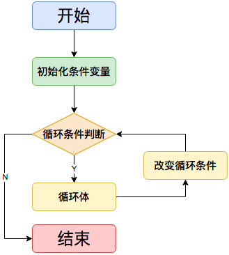
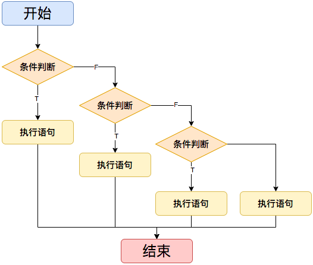
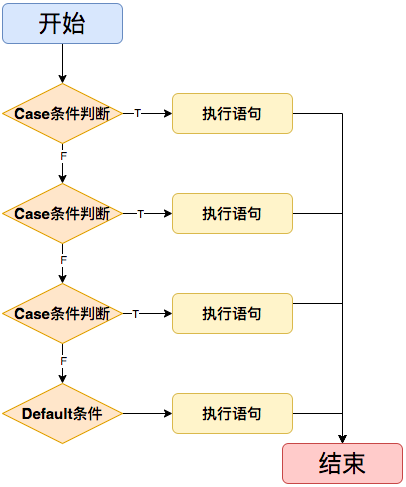
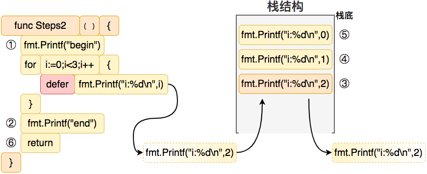
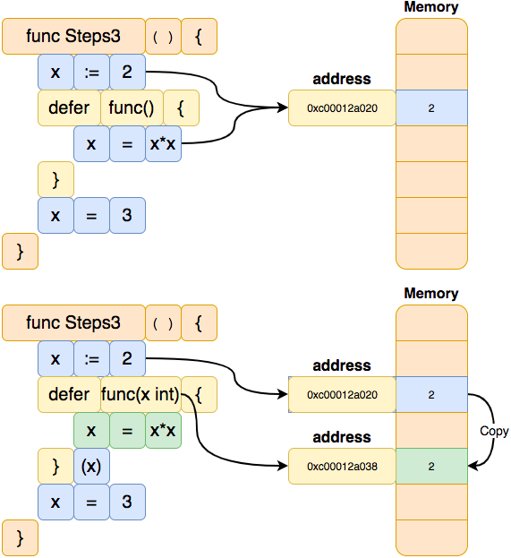

# 流程控制


## 目录

- 循环语句
- `if` 分支判断
- `switch` 分支选择
- `defer` 函数延时调用(栈)
- `defer+recover()` 函数捕获 `panic` 错误

## 循环语句



`Golang`中实现循环有三种类型的语句：`for` 循环、`range` 循环和 `goto` 语句。

- **For循环**

`Golang`中通过`For`关键字来定义一个循环并且只有`For`关键字(`Golang`中没有`while`关键字)，格式

```go
for initialization; condition; post {
  // do something 
}
```

其中，`initialization` 是循环开始前的初始化语句，`condition` 是循环条件，`post` 是每次循环结束后执行的语句。这些语句都是可选的，如果不需要可以省略。

```go
package main

import "fmt"

// Steps1 通过 for 循环累加 0-9
func Steps1() {
	sum := 0
	// for 循环
  // initialization i := 0 初始化语句：在第一次迭代前执行
	// condition      i < 10 条件表达式：在每次迭代前求值
	// post           i++    后置语句：在每次迭代的结尾执行
	for i := 0; i < 10; i++ {
		sum += i
	}
	fmt.Printf("\tsum: %d\n", sum)
}

func main() {
	fmt.Println("Steps1():")
	Steps1()
}
```

通过`For`实现类似`while`的语义

```go
package main

import "fmt"

// Steps2 for循环初始化语句和后置语句不是必须的
func Steps2() {
	sum := 0
	// 初始化语句和后置语句是可选的
	for sum < 5 {
		sum++
	}
	fmt.Printf("\tsum: %d\n", sum)
}

func main() {
	fmt.Println("Steps2():")
	Steps2()
}
```

- **Range**

`Golang`中`Range`也可以实现循环语义, 通过`Range`关键字可以遍历字符串, 数组, 切片或映射。

```go
package main

import "fmt"

// Steps3 range形式的循环遍历
func Steps3() {
	str := "Golang Tutorial"
	for i, v := range str { // 遍历字符串
		fmt.Printf("\ti:%d,v:%c\n", i, v)
	}
}

func main() {
	fmt.Println("Steps3():")
	Steps3()
}
```

`Range`和`For`遍历的区别

```go
package main

import "fmt"

// Steps4 range和for遍历的区别
func Steps4() {
	str := "Golang 教程"
	for i := 0; i < len(str); i++ {
		fmt.Printf("\ti:%d,v:%c\n", i, str[i])
	}

	for i, v := range str { // 遍历字符串
		fmt.Printf("\ti:%d,v:%c\n", i, v)
	}
}

func main() {
	fmt.Println("Steps4():")
	Steps4()
}
```

`For`循环中的`break`和`continue`

```go
package main

import "fmt"

// Steps5 for 循环中的 break 和 continue
func Steps5() {
	for i := 0; i < 10; i++ {
		if i == 5 { // 下一小节介绍
			fmt.Printf("\ti:%d, continue\n", i)
			continue
		}

		if i == 6 {
			fmt.Printf("\ti:%d, break\n", i)
			break
		}
	}
}

func main() {
	fmt.Println("Steps5():")
	Steps5()
}
```

- **Goto实现循环**

```go
package main

import "fmt"

// Steps6 goto 实现循环
func Steps6() {
	i := 0

Next: // 跳转标签声明
	fmt.Printf("\ti:%d\n", i)
	i++
	if i < 5 {
		goto Next // 跳转到Next标签
	}
}

func main() {
	fmt.Println("Steps6():")
	Steps6()
}
```

 `Goto` 语句用于无条件跳转到程序的另一个位置。其中`Next` 是一个标识符，用于指定要跳转到的位置。注意，`Next` **必须在当前函数内部定义**。

## If判断



`Golang`中`If`语句和其它语言语义相同

```go
package main

import "fmt"

// if 分支打印不同字符
func main() {
	flag := 10
	if flag > 5 { // 判断表达式
		fmt.Println("flag:", flag)
	}

	flag = 14
	//flag = 16
	//flag = 21

	if flag > 20 {
		fmt.Println("flag:", flag)
	} else if flag < 15 {
		fmt.Println("flag:", flag)
	} else {
		fmt.Println("flag:", flag)
	}
}
```

## Switch选择



在`Golang`中可以通过`switch-case`来实现分支选择, 每一个`case`分支都是**唯一**的，从上往下逐一判断，直到匹配为止，如果某些`case`分支条件重复了，编译会报错。

每个`case`分支最后**自带`break`效果**，匹配成功就不会执行其它`case`; 如果所有分支都没有匹配成功并且又定义了`default`分支, 那最终会走`default`分支。

`case` 后面的值可以是任何常量表达式，例如字符串、数字、布尔值等等。

示例一：

```go
package main

import "fmt"

// Steps1 基础用法
func Steps1() {
	flag := 1
	//flag = 2
	//flag = 3
	//flag = 4
	//flag = 5

	switch flag { // flag 待判断条件
	case 1: // 条件 flag 是否等于 1。是：执行该case下的流程，否：选择其它满足条件的 case
		fmt.Println("\tcase:", flag)
		// Golang 中每个 case 后面不需要 break 语句。但 return 是可选的
	case 2:
		fmt.Println("\tcase:", flag)
	case 3, 4: // case 可以设置多个条件。只要 flag 等于3或4都能执行当前case流程
		fmt.Println("\tcase:", flag)
	case 5:
		fmt.Println("\tcase:", flag)
		return
	default: // 当所有case都无法满足, 会执行 default 的流程。如果没有 default 那当前 switch 执行完成
		fmt.Println("\tdefault:", flag)
	}
}

// Steps2 switch 条件可以是任何支持判断的类型
func Steps2() {
	flag := "Hello"
	flag = "World"
	flag = "Golang"
	flag = "Tutorial"
	flag = "Process"

	switch flag { // flag 待判断条件
	case "Hello": // 条件 flag 是否等于 "Hello"。是：执行该case下的流程，否：选择其它满足条件的 case
		fmt.Println("\tcase:", flag)
	case "World":
		fmt.Println("\tcase:", flag)
	case "Golang", "Tutorial": // case 可以设置多个条件。只要 flag 等于"Golang"或"tutorial"都能执行当前case流程
		fmt.Println("\tcase:", flag)
	default: // 当所有case都无法满足, 会执行 default 的流程。如果没有 default 那当前 switch 执行完成
		fmt.Println("\tdefault:", flag)
	}
}

// switch 是编写一连串 if - else 语句的简便方法
func main() {
	fmt.Println("Steps1():")
	Steps1()
	fmt.Println("Steps2():")
	Steps2()
}
```

示例二：

```go
package main

import "fmt"

// Steps3 switch true 可以将一长串 if-then-else 写得更加清晰
func Steps3() {
	flag := 1
	//flag = 2
	//flag = 3
	//flag = 4
	//flag = 5
	//flag = 7

	switch { // flag 待判断条件
	case flag < 2: // 条件 flag 是否小于 2。是：执行该case下的流程，否：选择其它满足条件的 case
		fmt.Println("\tcase flag < 2 flag:", flag)
	case flag < 4:
		fmt.Println("\tcase flag < 4, flag:", flag)
	case flag > 6, flag < 10: // case 可以设置多个条件。flag 大于6或小于10都能执行当前case流程
		fmt.Println("\tcase flag > 6 || flag < 10 flag:", flag)
	case flag > 6 && flag < 10: // case 可以设置组合条件。flag 大于6并且小于10都才能执行当前case流程
		fmt.Println("\tcase flag > 6 && flag < 10 flag:", flag)
	}
}

// Steps4 for + switch 的使用
func Steps4() {
	for flag := 0; flag < 11; flag++ {
		switch { // flag 待判断条件
		case flag < 2: // 条件 flag 是否小于 2。是：执行该case下的流程，否：选择其它满足条件的 case
			fmt.Println("\tcase flag < 2 flag:", flag)
		case flag < 4:
			fmt.Println("\tcase flag < 4, flag:", flag)
		case flag > 6, flag < 8: // case 可以设置多个条件。flag 大于6或小于10都能执行当前case流程
			fmt.Println("\tcase flag > 6 || flag < 8 flag:", flag)
		case flag > 6 && flag < 10: // case 可以设置组合条件。flag 大于6并且小于10都才能执行当前case流程
			fmt.Println("\tcase flag > 6 && flag < 10 flag:", flag)
		}
	}
}

// switch 是编写一连串 if - else 语句的简便方法
func main() {
	fmt.Println("Steps3():")
	Steps3()
	fmt.Println("Steps4():")
	Steps4()
}
```

## Defer

在` Golang`中通过`defer`来实现**延时调用**, 用于指定一个函数调用在函数返回之前执行。常用来做一些收尾工作: **关闭连接, 清理资源** (可以把`defer`看成是一个**压栈**的操作)

```go
package main

import "fmt"

// defer作用:
//    释放占用的资源
//    捕捉处理异常 recover

// Steps1 defer 语句会将函数推迟到外层函数返回之后执行。
// 推迟调用的函数其参数会立即求值，但直到外层函数返回前该函数都不会被调用。
func Steps1() {
	defer fmt.Printf(" world\n")

	fmt.Printf("\thello")
}

func main() {
	fmt.Println("Steps1():")
	Steps1()
}
```

在上面的示例中，`defer` 语句都在函数中定义，它们会在函数返回之前执行。`defer fmt.Printf(" world\n")`，会在`func Steps1()`返回前执行。


通过`defer`延时打印数字：

```go
package main

import "fmt"

// Steps2 推迟的函数调用会被压入一个栈中。当外层函数返回时，被推迟的函数会按照后进先出的顺序调用。
func Steps2() {
	fmt.Println("\tbegin")
	for i := 0; i < 3; i++ {
		defer fmt.Println("\t\ti:", i)
		fmt.Printf("\t\ti:%d\n", i)
	}
	fmt.Println("\tend")
}

func main() {
	fmt.Println("Steps2():")
	Steps2()
}

/* 压栈和弹栈
   ----- -----
  |   | |    |
  | | V | |  |
  |	|     |  V
    | ... |
    |  3  |
    |  2  |
    |  1  |
    |  0  |
     —————
*/
/* 执行结果
begin
    i:0
    i:1
    i:2
end
    i: 2
    i: 1
    i: 0
*/
```



如下代码`defer` 语句中**引用函数中的变量**，会在函数调用是根据最新的值计算（`Steps3`）; `defer` 语句中的**函数参数**会在 `defer` 语句定义时计算，而不是在函数调用时计算（`Steps4`）。

```go
package main

import "fmt"

func Steps3() {
	fmt.Println("\tbegin")
	x := 2
	defer func() {
		x = x * x               // 引用外部的x,将以外部函数返回时最新值计算
		fmt.Println("\tx =", x) // x = 9
	}()
	fmt.Println("\tend")
	x = 3
}

func Steps4() {
	fmt.Println("\tbegin")
	x := 2
	defer func(x int) {
		x = x * x               // 引用参数中的x,将以外部函数返回时最新值计算
		fmt.Println("\tx =", x) // x = 4
	}(x)
	fmt.Println("\tend")
	x = 3
}

func main() {
	fmt.Println("Steps3():")
	Steps3()
	fmt.Println("Steps4():")
	Steps4()
}
```

总结来说就是**变量作用域**的问题。



## Recover

`recover`是 `Go `语言中用于从 `panic` 恢复的内置函数。当函数中发生 `panic` 时，程序会**停止执行当前函数**的代码，但是**会继续执行当前函数的 `defer` 语句**，直到所有的 `defer` 语句都执行完毕。如果其中某个 `defer` 语句调用了 `recover`，则程序会**停止向上传递 `panic`**，并在调用 `recover` 的地方继续执行代码，而不是终止程序的运行。

```go
package main

import "fmt"

func Steps1()  {
	defer func() {
		if err := recover(); err != nil {
			// 捕捉错误 run err: runtime error: integer divide by zero
			fmt.Println("run err:", err)
		}
	}()

	a := 10
	b := 0
	_ = a / b // 发生 panic
	fmt.Println("return Steps1")
}

// 捕捉处理异常 recover
func main() {
	Steps1()
	fmt.Println("return main")
}
```

在这个示例中，我们通过`a/b`，因为`b` 是 0 所以会导致程序 `panic`。但是，我们在 `defer` 语句中使用了 `recover`，当程序 `panic` 时，会执行 `defer` 语句中的匿名函数。这个匿名函数调用 `recover` 函数，如果有错误信息，则输出错误信息，并恢复程序的正常执行。

需要注意的是，**`recover` 函数只能在 `defer` 函数中使用**，否则会引发运行时错误。此外，**`recover` 函数只会在发生 `panic` 时返回错误信息**，如果没有 `panic `，则会返回 `nil`。

## os.Exit

需要注意只有`return`退出或者`panic`导致的程序异常退出会调用`defer`。但是使用`os.Exit`退出，程序会立即停止不会调用`defer`函数。

```go
package main

import (
	"fmt"
	"os"
)

// 注意：如果函数因为执行了os.Exit而退出
// 而不是正常return退出或者panic退出，那程序会立即停止，被defer的函数调用不会执行。
func Steps1() {
	fmt.Println("Steps1")
}

func main() {
	fmt.Println("start")
	defer Steps1()
	fmt.Println("stop")
	os.Exit(0)
}
```

## 思考题

1. 计算 100000 以内偶数,并且不是 4 的倍数外的所有数值和
2. 定义函数`Calculation`通过`Switch`实现加减乘除

```go
// 参考
func Calculation(option byte, a float64,b float64) float64{
	switch option {
	case '-':
	.......	
	}
}
```

3. 通过`For`循环打印如下图形

```bigquery
*
**
***
****
*****
******
```
## 自检

- `for`循环的语法和用法 ?
- `for`循环的三个组成部分 ?
- `for`循环的无限循环 ?
- `range`循环的用法 ?
- `break`关键字的用法 ?
- `continue`关键字的用法 ?
- `goto`关键字的用法 ?
- `if`语句的用法 ?
- `if-else`语句的用法 ?
- `if`语句的嵌套使用 ?
- `switch`语句的用法 ?
- `switch`语句的多个`case`匹配 ?
- `switch`语句的默认分支 ?
- `defer`关键字的用法 ?
- `defer`语句的执行顺序 ?
- `defer`语句的注意事项 ?
- `recover`关键字的作用 ?
- `panic`和`recover`的配合使用 ?
- 不同层级之间传递错误信息 ?

## 参考

https://gfw.go101.org/article/control-flows.html

https://www.songx.fun/blog/%E5%BF%85%E4%BF%AE/7golang%E4%B8%AD%E7%9A%84defer%E5%BF%85%E6%8E%8C%E6%8F%A1%E7%9A%847%E7%9F%A5%E8%AF%86%E7%82%B9/

https://tachingchen.com/tw/blog/go-defer-and-os-exit/

https://xiaomi-info.github.io/2020/01/20/go-trample-panic-recover/

https://juejin.cn/post/6946517151251431454