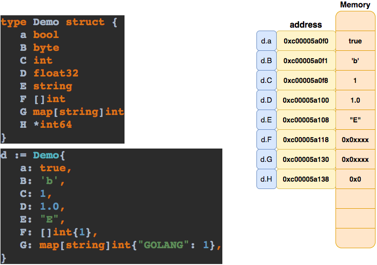
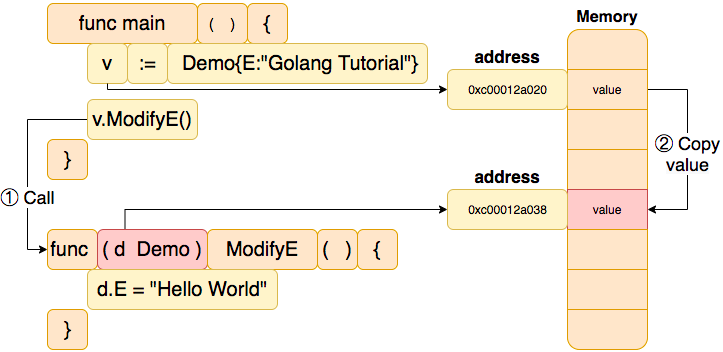

# 结构体

在 `Go` 语言中，`struct` 是一种用户自定义的复合类型，可以将多个字段组合在一起，形成一个新的结构体类型。通常情况下，结构体类型用于封装多个相关的数据字段，以便更方便地进行操作和管理。

## 目录

- 结构体定义
- 结构体Tag
- 结构体内存布局
- 定义结构体值方法
- 定义结构体指针方法
- 自定义类型
- 结构体应用

## 结构体定义

结构体类型的定义可以通过 `type` 关键字和 `struct` 关键字来完成, 语法如下：

```go
type StructName struct {
    Field1 FieldType1
    Field2 FieldType2
    ...
    FieldN FieldTypeN
}
```

其中，`StructName` 表示结构体类型的名称，`Field1`、`Field2` 等表示结构体的数据字段，`FieldType1`、`FieldType2` 等表示字段的数据类型。

- 如下展示结构体中定义常用字段并初始化结构体：

```go
package main

import "fmt"

// Demo 定义结构体
type Demo struct {
	// 小写表示不导出,包外不能引用
	a bool
	// 大写表示导出，包外能引用
	B byte
	C int     // uint8,int8,uint16,int16,uint32,int32,uint64,int64,uintptr
	D float32 // float64
	E string
	F []int
	G map[string]int
	H *int64
}

func Steps1() {
	d := Demo{ // 创建一个 Demo 类型的结构体实例
		a: true,
		B: 'b',
		C: 1,
		D: 1.0,
		E: "E",
		F: []int{1},
		G: map[string]int{"GOLANG": 1},
	}

	fmt.Printf("\td value %+v\n", d)

	// 访问结构体内的成员使用点. , 格式为：结构体变量.成员
	d.a = false // 修改a字段的值

	fmt.Printf("\td value %+v\n", d)

	fmt.Printf("\tdome.B: %c\n", d.B)
}

func main() {
	Steps1()
}
/* 控制台结果
Steps1():
        d value {a:true B:98 C:1 D:1 E:E F:[1] G:map[GOLANG:1] H:<nil>}
        d value {a:false B:98 C:1 D:1 E:E F:[1] G:map[GOLANG:1] H:<nil>}
        dome.B: b
*/
```

以上代码，我们定义了一个`Demo`结构体，包含了一些常见字段。在定义结构体类型之后，我们可以通过结构体字面量的方式来创建结构体变量, 并初始化一些数据。

```go
d := Demo{ // 创建一个 Demo 类型的结构体
  a: true,
  B: 'b',
  C: 1,
  D: 1.0,
  E: "E",
  F: []int{1},
  G: map[string]int{"GOLANG": 1},
}
```

在创建结构体变量之后，我们可以**通过`.`运算符来修改或访问结构体的数据字段**。

```go
// 结构体字段使用点号来访问
d.a = false // 修改a字段的值

fmt.Printf("%+v\n", d) // 打印整个结构体字段和值

fmt.Printf("dome.B: %c\n", d.B)
```

- 函数内定义结构体：

```go
package main

import "fmt"

func Steps2() {
	// 结构体也可以定义在函数内
	type Demo struct {
		a int
		B string
	}

	d := Demo{ // 创建一个 Demo 类型的结构体实例
		a: 1,
	}

	fmt.Printf("\td value %+v\n", d)

	// 结构体字段使用点号来访问
	d.a = 2 // 修改a字段的值

	fmt.Printf("\td value %+v\n", d)
}

func main() {
	Steps2()
}
/* 控制台结果
Steps2():
        d value {a:1 B:}
        d value {a:2 B:}
*/
```

## 结构体Tag

在` Go` 语言中，可以为结构体中的字段设置 `tag`，`tag` 是结构体中的一个特殊字段，它可以用来指定某些字段的元数据信息，比如 `JSON` 序列化时的字段名、`ORM` 映射时的表名、字段类型等。`tag` 是一个字符串，通常以 `key:"value"` 的形式表示，多个 `tag` 之间使用空格分隔。

```go
type User struct {
		UserName string `json:"user_name"`
    PassWord string `json:"pass_word" orm:"passw"`
}
```

其中`json:"user_name"`和`json:"pass_word" orm:"passw"`就分别是`UserName`和`PassWord`的`tag`。如下为具体使用实例：

```go
package main

import (
	"encoding/json"
	"fmt"
)

type User struct {
	UserName string `json:"user_name"`
	PassWord string `json:"pass_word"`
}

func Steps3() {
	u := User{ // 创建一个 Demo 类型的结构体
		UserName: "golang",
		PassWord: "tutorial",
	}

	fmt.Printf("\tu value %+v\n", u)

	bytes, err := json.Marshal(u)
	if err != nil {
		fmt.Printf("\tjson.Marshal error %s\n", err.Error())
	}
	fmt.Printf("\tjson user %s", string(bytes))
}

func main() {
	fmt.Println("Steps3():")
	Steps3()
}
/* 控制台结果
Steps3():
        u value {UserName:golang PassWord:tutorial}
        json user {"user_name":"golang","pass_word":"tutorial"}
*/        
```

在上面的代码中，`User` 结构体中的 `UserName` 和 `PassWord` 字段都有 `tag`，`UserName` 字段的 `json tag`  表示在将`User` 结构体序列化为 `JSON` 格式时，使用 `user_name` 作为字段名；`PassWord` 字段的 `json tag` 表示在将 `User` 结构体序列化为 `JSON` 格式时，使用 `pass_word` 作为字段名。

可以使用 `reflect` 包中的 `Type` 和 `Field` 方法来获取结构体的 `tag`。

```go
package main

import (
	"encoding/json"
	"fmt"
	"reflect"
)

type User struct {
	UserName string `json:"user_name"`
	PassWord string `json:"pass_word"`
}

func Steps4() {
	u := User{ // 创建一个 User 类型的结构体实例
		UserName: "golang",
		PassWord: "tutorial",
	}
	t := reflect.TypeOf(u) // 反射获取u的类型
	for i := 0; i < t.NumField(); i++ { // 通过类型获取结构体字段索引
		field := t.Field(i)
		fmt.Printf("\tfield %d: name=%s, json=%s \n", i, field.Name, field.Tag.Get("json"))
	}
}

func main() {
	fmt.Println("Steps4():")
	Steps4()
}
/* 控制台结果
Steps4():
        field 0: name=UserName, json=user_name 
        field 1: name=PassWord, json=pass_word
*/
```

除了用于序列化和反序列化时的字段名，`tag` 还可以用于其他场景，比如表单验证、`ORM` 映射、日志记录等等。在这些场景下，可以使用 `tag` 来指定不同的元数据信息，方便程序的开发和维护。

## 结构体内存布局

```go
package main

import (
	"fmt"
)

// Demo 定义结构体
type Demo struct {
	// 小写表示不导出,包外不能引用
	a bool
	// 大写表示导出，包外能引用
	B byte
	C int     // uint8,int8,uint16,int16,uint32,int32,uint64,int64,uintptr
	D float32 // float64
	E string
	F []int
	G map[string]int
	H *int64
}

func Steps5() {
	d := Demo{ // 创建一个 Demo 类型的结构体实例
		a: true,
		B: 'b',
		C: 1,
		D: 1.0,
		E: "E",
		F: []int{1},
		G: map[string]int{"GOLANG": 1},
	}

	// 结构体的字段内存地址排列
	fmt.Printf("\tvariable b   addr %p\n", &d)
	fmt.Printf("\tvariable b.a addr %p\n", &d.a)
	fmt.Printf("\tvariable b.B addr %p\n", &d.B)
	fmt.Printf("\tvariable b.C addr %p\n", &d.C)
	fmt.Printf("\tvariable b.D addr %p\n", &d.D)
	fmt.Printf("\tvariable b.E addr %p\n", &d.E)
	fmt.Printf("\tvariable b.F addr %p\n", &d.F)
	fmt.Printf("\tvariable b.G addr %p\n", &d.G)
	fmt.Printf("\tvariable b.H addr %p\n", &d.H)

	fmt.Printf("\t-----------------\n")

	c := d
	fmt.Printf("\tvariable c   addr %p\n", &c)
	fmt.Printf("\tvariable c.a addr %p\n", &c.a)
	fmt.Printf("\tvariable c.B addr %p\n", &c.B)
	fmt.Printf("\tvariable c.C addr %p\n", &c.C)
	fmt.Printf("\tvariable c.D addr %p\n", &c.D)
	fmt.Printf("\tvariable c.E addr %p\n", &c.E)
	fmt.Printf("\tvariable c.F addr %p\n", &c.F)
	fmt.Printf("\tvariable c.G addr %p\n", &c.G)
	fmt.Printf("\tvariable c.H addr %p\n", &c.H)
}

func main() {
	fmt.Println("Steps5():")
	Steps5()
}
```



## 结构体方法

除了定义数据字段之外，结构体类型还可以定义相关的方法。**方法是一种与特定类型相关联的函数**，可以对该类型的值进行操作。在 Go 语言中，可以通过结构体类型的名称和`func` 关键字来定义方法，语法如下：

```go
func (p StructName) MethodName(parameter1 Type1, parameter2 Type2, ...) (ReturnType,...) {
    // 方法的实现代码
}
```

其中`p`是定义的结构体局部变量名称(或者叫**值接收者**)，`StructName` 为结构体名称，表示当前方法属于这结构体。后面依次是方法名、参数列表和返回值，这些与普通函数的定义类似，用于指定方法的输入和输出。

其实结构体方法**等同于**如下的`MethodName`函数 (方法只是函数的另外一种写法并且必须和类型绑定)。

```go
func MethodName(p StructName, parameter1 Type1, parameter2 Type2, ...) ReturnType {
    // 函数的实现代码
}
```

### 值方法

值方法就是接收者定义为普通变量的方法。


```go
package main

import (
	"fmt"
)

// 方法就是一类带特殊的 接收者 参数的函数
// 接收者(可以是struct或自定义类型) 分为：
//  	1.值接收者
// 		2.指针接收者

// Demo 值接收者
type Demo struct {
	a bool
	// 大写表示导出,包外能引用
	B byte
	C int     // uint8,int8,uint16,int16,uint32,int32,uint64,int64,uintptr
	D float32 // float64
	E string
	F []int
	G map[string]int
}

func (d Demo) print() {
	fmt.Printf("d %+v\n", d)
}

func (d Demo) printB() {
	fmt.Printf("d.B %+v\n", d.B)
}

func print(d Demo) {
	fmt.Printf("d %+v\n", d)
}

func printB(d Demo) {
	fmt.Printf("d.B %+v\n", d.B)
}

func (d Demo) ModifyE() {
	d.E = "Hello World"
}

func (d Demo) printAddr1() {
	fmt.Printf("d address:%p\n", &d)
}

func (d Demo) printAddr2() {
	fmt.Printf("d address:%p\n", &d)
}

func main() {
	v := Demo{true, 'G', 1, 1.0, "Golang Tutorial", []int{1, 2}, map[string]int{"Golang": 0, "Tutorial": 1}}
	v.print()
	v.printB()

	print(v)  // 等同于 v.print()
	printB(v) // 等同于 v.printB()

	// 值接收者 无法通过方法改变接收者内部值
	v.ModifyE()
	fmt.Printf("%+v\n", v)

	fmt.Println("--------------")
	fmt.Printf("v address:%p\n", &v)
	fmt.Println("--------------")
	v.printAddr1()
	fmt.Println("--------------")
	v.printAddr1()
	fmt.Println("--------------")
	v.printAddr2()
}
```

在上面的代码中 `print(),printB(),ModifyE(),printAddr1 (),printAddr2()` 方法绑定到 `Demo` 结构体上，并且只能通过`Demo`结构体的实例才能调用。

每个方法中都使用 `d` 作为**接收者名称** (当然接收者`d`可以任意取名)，表示当 `Demo` 类型的实例调用该方法时，实例本身的数据会被赋值给接收者 `d` ，从而可以通过接收者`d`在结构体方法中访问该实例的数据字段,  例如：

```go
func (d Demo) printB() {
	fmt.Printf("d.B %+v\n", d.B)
}

func printB(d Demo) {
	fmt.Printf("d.B %+v\n", d.B)
}

v := Demo{true, 'G', 1, 1.0, "Golang Tutorial", []int{1, 2}, map[string]int{"Golang": 0, "Tutorial": 1}}
v.printB() // 打印 G
printB(v) // 等同于 v.printB()
```

`v`是`Demo`结构体的一个实例，当调用`v.printB()`结构体方法时，`v`实例中的数据会拷贝一份给结构体方法`printB()`中的接收者`d`, 这样在`printB()`中调用`d.B`时就可以获取到`G`这个字符了。

需要注意的是，上面定义的这些方法都是值方法。**`v`实例赋值给值接收者`d`是通过拷贝一份数据的方式**，所以在方法中**修改接收者`d`的数据并不会影响到`v`实例的数据**。

```go
v.ModifyE()
fmt.Printf("value %+v\n", v)

// 执行结果
{a:true B:71 C:1 D:1 E:Golang Tutorial F:[1 2] G:map[Golang:0 Tutorial:1]}
```



以上两个方法调用证明了这一点，`ModifyE()`方法中修改了`E`字段，并不会影响到v实例。

### 指针方法

指针方法和值方法使用方式基本一致，只是在定义接收者的时候需要定义为指针。


```go
func (p *StructName) MethodName(parameter1 Type1, parameter2 Type2, ...) ReturnType {
    // 方法的实现代码
}

// 等同于如上代码
func MethodName(p *StructName, parameter1 Type1, parameter2 Type2, ...) ReturnType {
    // 函数的实现代码
}
```

```go
package main

import (
	"fmt"
)

// 使用指针接收者的原因：
// 		首先，方法能够修改其接收者指向的值。
// 		其次，这样可以避免在每次调用方法时复制该值。若值的类型为大型结构体时，这样做会更加高效。

// Demo 指针接收者
type Demo struct {
	a bool
	// 大写表示导出，包外能引用
	B byte
	C int     // uint8,int8,uint16,int16,uint32,int32,uint64,int64,uintptr
	D float32 // float64
	E string
	F []int
	G map[string]int
}

func (d *Demo) print() {
	fmt.Printf("d %+v\n", d)
}

func (d *Demo) printB() {
	fmt.Printf("d.B %+v\n", d.B)
}

func print(d *Demo) {
	fmt.Printf("d %+v\n", d)
}

func printB(d *Demo) {
	fmt.Printf("d.B %+v\n", d.B)
}

func (d *Demo) ModifyE() {
	d.E = "Hello World"
}

func (d *Demo) printAddr1() {
	fmt.Printf("d address:%p\n", &d)
	fmt.Printf("d   value:%p\n", d)
}

func (d *Demo) printAddr2() {
	fmt.Printf("d address:%p\n", &d)
	fmt.Printf("d   value:%p\n", d)
}

func main() {
	v := Demo{true, 'G', 1, 1.0, "Golang Tutorial", []int{1, 2}, map[string]int{"Golang": 0, "Tutorial": 1}}
	v.print()
	v.printB()

	print(&v)  // 等同于 v.print()
	printB(&v) // 等同于 v.printB()

	// 指针接收者 可以通过方法改变接收者内部值
	v.ModifyE()
	fmt.Printf("%+v\n", v)

	fmt.Println("--------------")
	fmt.Printf("v address:%p\n", &v)
	fmt.Println("--------------")
	v.printAddr1()
	fmt.Println("--------------")
	v.printAddr1()
	fmt.Println("--------------")
	v.printAddr2()
}
```

在上面的代码中， `print(),printB(),ModifyE(),printAddr1 (),printAddr2()` 这些方法都是定义的指针方法，与值方法不同的是定义方法时结构体使用指针类型：`func (p *StructName) MethodName(parameter1 Type1, parameter2 Type2, ...) ReturnType {}`

并且 **`v`实例赋值给接收者`d`是通过传递指针的方式**，所以通过**接收者`d`修改数据会影响`v`实例的数据**。

```go
v.ModifyE()
fmt.Printf("%+v\n", v)

// 执行结果
{a:true B:71 C:1 D:1 E:Hello World F:[1 2] G:map[Golang:0 Tutorial:1]}
```


所以如果方法需要修改接收者的值，那么必须使用指针类型的接收者。如果使用值类型的接收者，则只能访问接收者的数据字段，而不能修改接收者的值。

## 自定义类型定义方法

自定义类型方法和结构体方法使用方式基本一致, 自定义类型只是给现有的类型起的**一个别名**。

```go
package main

import "fmt"

// ResponseStatus 自定义类型的方法
type ResponseStatus int

const (
	QuerySuccess ResponseStatus = iota
	QueryError
)

func (r ResponseStatus) ToCN() string {
	switch r {
	case 0:
		return "query success"
	case 1:
		return "query error"
	default:
		return "non"
	}
}

func main() {
	fmt.Println(QuerySuccess.ToCN())
	fmt.Println(QueryError.ToCN())
}
```

## 结构体应用

通过`struct`结构体定义电脑各个组件和对应属性，然后将这些组装拼装在一起形成一个抽象的电脑并运行他。

- 电脑组装器 在目录下创建computer.go文件

```go
package main

import "fmt"

type ComputerBuilder struct {
	Computer
}

type Computer struct {
	CPU
	Memory
	NetWork
	Display
}

func (c *ComputerBuilder) SetCPU(cpu CPU) *ComputerBuilder {
	c.CPU = cpu
	return c
}

func (c *ComputerBuilder) SetMemory(mem Memory) *ComputerBuilder {
	c.Memory = mem
	return c
}

func (c *ComputerBuilder) SetNetWork(nt NetWork) *ComputerBuilder {
	c.NetWork = nt
	return c
}

func (c *ComputerBuilder) SetDisplay(dis Display) *ComputerBuilder {
	c.Display = dis
	return c
}

func (c *ComputerBuilder) Build() Computer {
	return c.Computer
}

func (c Computer) RUN() {
	c.CPU.operation()
	c.Memory.InteractiveData()
	c.NetWork.TransferData()
	c.Display.Display()
	fmt.Println("computer running")
}
```

- CPU 在目录下创建cpu.go文件

```go
package main

import "fmt"

type CPU struct {
	name       string
	modelType  string
	coreNumber int
}

func (c CPU) operation() {
	fmt.Printf("%s %s %d is operation\n", c.name, c.modelType, c.coreNumber)
}
```

- Memory 在目录下创建memory.go文件

```go
package main

import "fmt"

type Memory struct {
	name string
	typ  string
	cap  int
	mHz  int
}

func (m Memory) InteractiveData() {
	fmt.Printf("%s %s %d %d is interactive data\n", m.name, m.typ, m.cap, m.mHz)
}
```

- NetWork

```go
package main

import "fmt"

type NetWork struct {
	name string
	typ  string
	rate int
}

func (n NetWork) TransferData() {
	fmt.Printf("%s %s %d is transfer data\n", n.name, n.typ, n.rate)
}
```

- Display 在目录下创建display.go文件

```go
package main

import "fmt"

type Display struct {
	name string
	typ  string
}

func (d Display) Display() {
	fmt.Printf("%s %s is display data\n", d.name, d.typ)
}

```

在目录下创建main.go文件并构建`ComputerBuilder`设置电脑并运行：

```go
package main

/*
	1.结构体组合
*/

func main() {
	cb := &ComputerBuilder{}
	cpu := CPU{
		name:       "AMD Ryzen 5 5000",
		modelType:  "十二线程",
		coreNumber: 6,
	}
	mem := Memory{
		name: "DDR4",
		typ:  "金百达",
		cap:  32,
		mHz:  2666,
	}

	net := NetWork{
		name: "Intel 82574L",
		typ:  "千兆以太网",
		rate: 1000,
	}

	dis := Display{
		name: "AOC",
		typ:  "4K",
	}
	c := cb.SetCPU(cpu).SetMemory(mem).SetNetWork(net).SetDisplay(dis).Build()
	c.RUN()
}
```

## 思考题

1. 通过结构体方法的形式实现加减乘除
```go
type numb struct {
	a int
    b int
}

func (n numb) add() int {
	return n.a+n.b
}
```

2. 定义一个圆结构体,并定义求圆面积,周长和输入角度求弧长等方法。

```go
type circle struct{
  radius float64
}
```

## 自检

- `struct`的定义和声明 ？
- `struct`的初始化 ？ 
- `struct`的字段访问 ？
- `struct`的匿名字段 ？
- `struct`嵌套 ？
- `struct`的指针类型 ？
- `struct`的值方法 ？
- `struct`的指针方法 ？
- `struct`标签的定义和语法 ？
- `struct`标签的解析方法 ？

## 参考

https://www.pengrl.com/p/16608/

https://xie.infoq.cn/article/e87f45801f8b694babe5db07e

https://www.liwenzhou.com/posts/Go/struct_memory_layout