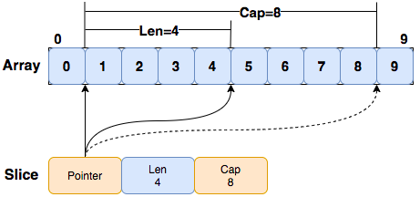
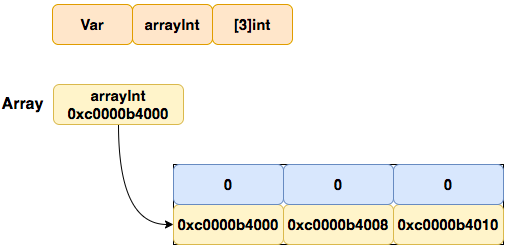
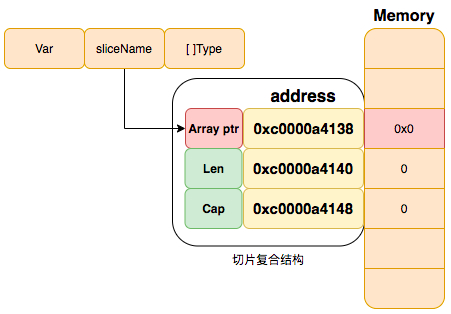
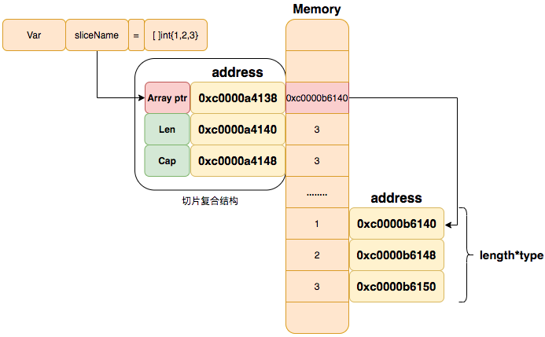
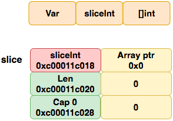
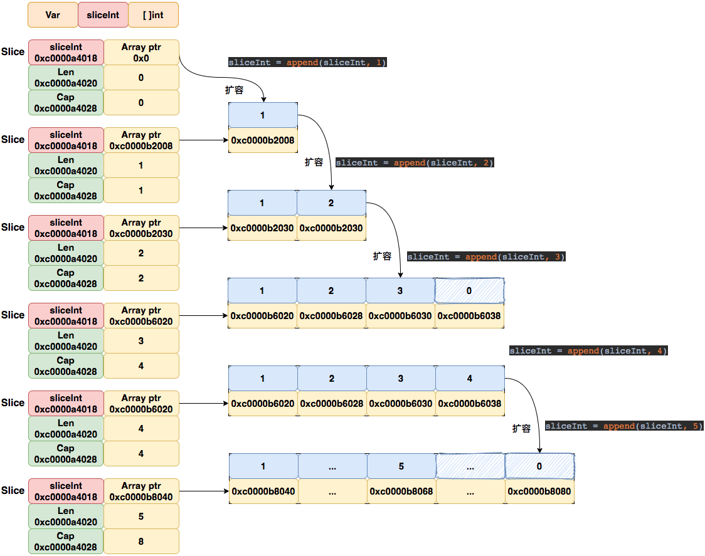
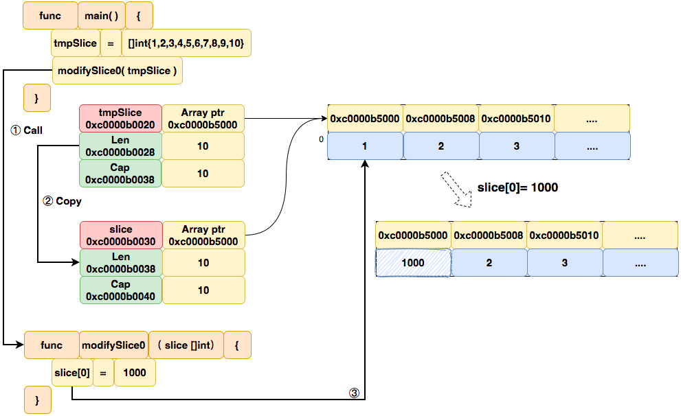
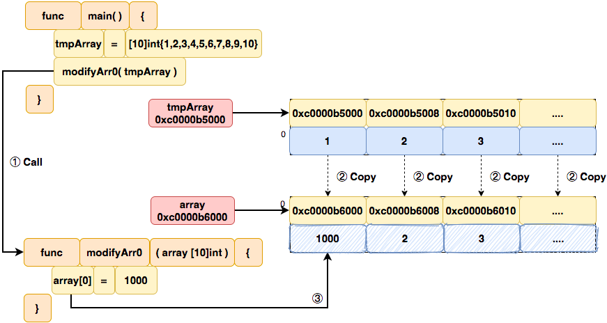

# 数组与切片

在 `Go` 中，数组和切片是两个非常常用的数据结构。它们都可以存储一系列元素，但有着很大的区别。

- **数组是一个固定大小的数据结构**，一旦**创建后，其大小就不能被改变**，数组中的所有元素必须是相同的类型。


- **切片是一个动态大小的数据结构**，它可以根据需要**动态地增长或缩小**。



需要注意的是，**切片中的元素只是对底层数组的引用**，当切片被传递给函数时，函数中对切片元素的修改会反映在原始切片中。这种行为类似于指针，但切片比指针更安全，因为切片有长度信息，它可以帮助我们避免访问超出数组边界的元素。

## 目录

- 数组基础用法
- 切片基础用法
- 数组拷贝
- 数组与切片传参

## 数组基础用法

在 `Golang` 中，数组是具有**相同数据类型**的一组**固定长度**的数据项的集合。数组中的每个元素可以通过**索引**来访问，索引从 0 开始计数。数组的长度在创建时就已经确定，并且不可更改，不同大小的数组被认为是不同的类型。创建一个数组的语法格式:

```go
var ArrayName [length]type
```

数组内存布局(内存被分配为连续的块)：


其中，`ArrayName`表示变量名称，`length` 表示数组的长度，`type` 表示数组元素的数据类型。

```go
package main

import (
	"fmt"
	"unsafe"
)

/*
	1.定义局部数组
	2.定义局部数组并赋值
	3.通过下标赋值
	4.定义全局数组
*/

type dome struct {
	a int
	b float32
}

var arrayUInt [3]uint

// Steps1 定义数组, 数组必须指定大小
func Steps1() {
	// 类型 [n]T 表示拥有 n 个 T 类型值的数组
	// 类型 [3]int 表示拥有 3 个 int 类型值的数组, 默认值为 0
	var arrayInt [3]int // uint8,int8,uint16,int16,uint32,int32,uint64,int64,uintptr
	arrayInt[0] = 1     // 通过 [] 获取对应索引数据并修改
	arrayInt[1] = 2
	fmt.Printf("\tarrayInt: %+v\n", arrayInt)

	// 定义并初始化数组
	arrayBool := [3]bool{false, true}
	fmt.Printf("\tarrayBool: %+v\n", arrayBool)

	arrayFloat32 := [3]float32{1.0, 2.0} // float64
	fmt.Printf("\tarrayFloat32: %+v\n", arrayFloat32)

	arrayString := [3]string{"Golang", "Tutorial"}
	fmt.Printf("\tarrayString: %+v\n", arrayString)

	// 数组结构体
	arrayStruct := [3]dome{{a: 1, b: 2.0}, {a: 11, b: 22.0}}
	fmt.Printf("\tarrayStruct: %+v\n", arrayStruct)

	fmt.Printf("\t------------------------------\n")

	// 数组可以直接通过下标访问 T[x]
	fmt.Printf("\tarrayInt[0]: %d\n", arrayInt[0])

	// 数组可以直接通过下标修改 T[x] = y
	arrayInt[0] = 11
	fmt.Printf("\tarrayInt[0]: %d\n", arrayInt[0])

	fmt.Printf("\t------------------------------\n")

	// 不同大小的数组被认为是不同的类,不能直接赋值
	var arrayInt1 [5]int
	var arrayInt2 = [4]int{1, 2, 3}
	//arrayInt1 = arrayInt2 // panic: cannot use arrayInt2 (variable of type [3]int) as [4]int value in assignment
	fmt.Printf("\tarrayInt1: %+v\n", arrayInt1)
	fmt.Printf("\tarrayInt2: %+v\n", arrayInt2)

	fmt.Printf("\t------------------------------\n")
	// 数组遍历方式一
	for i := 0; i < len(arrayInt); i++ {
		fmt.Printf("\tarrayInt[%d]:%d\n", i, arrayInt[i])
	}

	// 数组地址
	fmt.Printf("\tarrayInt: %p\n", arrayInt) // arrayInt: %!p([3]int=[11 2 0]),arrayInt存储的不是地址值
	fmt.Printf("\t&arrayInt: %p\n", &arrayInt)
	// 数组遍历方式二
	for i, v := range arrayInt { // 数组的地址等于数组第一个元素的地址
		fmt.Printf("\t&arrayInt[%d]:%p value:%d\n", i, &arrayInt[i], v)
	}

	fmt.Printf("\tarrayInt len: %d\n", len(arrayInt))
	fmt.Printf("\tarrayInt cap: %d\n", cap(arrayInt))
}

func main() {
	fmt.Println("Steps1():")
	Steps1()
}
```

如上代码中`var arrayInt [3]int`表示定义一个大小为3的`int`型数组；



 `arrayBool := [3]bool{false, true}`表示定义一个大小为3的`bool`型数组, 并且初始化第一个元素为false, 第二个元素为true。

二维数组的定义与遍历：

```go
package main

import (
	"fmt"
)

// Steps2 二维数组
func Steps2() {
	arrayArrayString := [5][10]string{} // 初始化一个 5x10 的二维数组
	for i := 0; i < len(arrayArrayString); i++ {
		for ii := 0; ii < len(arrayArrayString[i]); ii++ {
			arrayArrayString[i][ii] = "-"
		}
	}

	// 遍历方式一
	for i := 0; i < len(arrayArrayString); i++ {
		fmt.Printf("\t")
		for ii := 0; ii < len(arrayArrayString[i]); ii++ {
			fmt.Printf(arrayArrayString[i][ii])
		}
		fmt.Println()
	}
	fmt.Printf("\t*************\n")
	// 遍历方式二
	for _, v := range arrayArrayString {
		fmt.Printf("\t")
		for _, vv := range v {
			fmt.Printf(vv)
		}
		fmt.Println()
	}
}

func main() {
	fmt.Println("Steps2():")
	Steps2()
}
```

需要注意: 由于数组长度是固定的，因此在 `Golang` 中很少直接使用数组。更常见的是使用切片（`slice`），它是一个动态数组，可以根据需要动态增加或减少大小。

## 切片基础用法

在 `Golang` 中，切片是一个**引用类型**(指针持有者类型)，它是一个动态数组，可以根据需要**动态增加或减少大小**。创建一个切片的语法格式：其中，`type` 表示切片中元素的数据类型。

```go
var slice []type
```

切片内存布局：



创建并初始化切片(以int类型为例)：

```go
var slice = []int{1,2,3}
```



### 定义切片

```go
package main

import (
	"fmt"
	"unsafe"
)

// 切片也可以定义在全局
var sliceByte []byte

// Steps1 定义切片
func Steps1() {
	// Steps 1-1: 类型 []T 表示一个元素类型为 T 的切片
	// 切片拥有长度和容量, 切片在添加数据时会自动扩容, 可以通过len(),cap()获取切片长度和容量

	// 类型为 int 的切片, 初始化后长度容量都为 0, 不指向任何底层数组
	var sliceInt []int // uint8,int8,uint16,int16,uint32,int32,uint64,int64,uintptr
	fmt.Printf("\t&sliceInt:%p sliceInt:%p sliceInt:%+v len:%d cap:%d\n",
		&sliceInt,
		sliceInt,
		sliceInt,
		len(sliceInt),
		cap(sliceInt))
	//_ = sliceInt[0] // 在未初始化长度前直接通过下标读取或赋值数据将会报错, 只能通过 append 添加元素

	// Steps 1-2: append 向切片中添加元素（可能会导致内存重新分配）
	for i := 1; i < 11; i++ {
		sliceInt = append(sliceInt, i)
		fmt.Printf("\t&sliceInt:%p sliceInt:%p sliceInt:%+v len:%d cap:%d\n",
			&sliceInt,
			sliceInt,
			sliceInt,
			len(sliceInt),
			cap(sliceInt))
	}

	// Steps 1-3: 获取切片长度
	fmt.Println("\tsliceInt len:", len(sliceInt))

	// Steps 1-4: 获取切片的容量
	fmt.Println("\tsliceInt cap:", cap(sliceInt))

	// Steps 1-5: 类型为 bool 的切片, 初始化后长度和容量为 0 且没有底层数组
	var sliceBool []bool
	fmt.Printf("\tsliceBool:%+v len:%d cap:%d\n",
		sliceBool,
		len(sliceBool),
		cap(sliceBool))
}

// 每个数组的大小都是固定的。而切片则为数组元素提供动态大小的、灵活的视角
func main() {
	fmt.Println("Steps1():")
	Steps1()
}
```

首先，代码定义了一个全局变量 `sliceByte`，它是一个 `[]byte` 类型的切片。接着，在 `Steps1()` 函数中，定义了一个名为 `sliceInt` 的 `[]int` 类型的切片



并使用 `append()` 函数向其中添加了 10 个元素。并通过 `fmt.Printf()` 函数，格式化输出切片的地址、值、长度和容量。

```go
&sliceInt:0xc0000a4018 sliceInt:0x0 sliceInt:[] len:0 cap:0
&sliceInt:0xc0000a4018 sliceInt:0xc0000b2008 sliceInt:[1] len:1 cap:1
&sliceInt:0xc0000a4018 sliceInt:0xc0000b2030 sliceInt:[1 2] len:2 cap:2
&sliceInt:0xc0000a4018 sliceInt:0xc0000b6020 sliceInt:[1 2 3] len:3 cap:4
&sliceInt:0xc0000a4018 sliceInt:0xc0000b6020 sliceInt:[1 2 3 4] len:4 cap:4
&sliceInt:0xc0000a4018 sliceInt:0xc0000b8040 sliceInt:[1 2 3 4 5] len:5 cap:8
&sliceInt:0xc0000a4018 sliceInt:0xc0000b8040 sliceInt:[1 2 3 4 5 6] len:6 cap:8
&sliceInt:0xc0000a4018 sliceInt:0xc0000b8040 sliceInt:[1 2 3 4 5 6 7] len:7 cap:8
&sliceInt:0xc0000a4018 sliceInt:0xc0000b8040 sliceInt:[1 2 3 4 5 6 7 8] len:8 cap:8
&sliceInt:0xc0000a4018 sliceInt:0xc0000ba080 sliceInt:[1 2 3 4 5 6 7 8 9] len:9 cap:16
&sliceInt:0xc0000a4018 sliceInt:0xc0000ba080 sliceInt:[1 2 3 4 5 6 7 8 9 10] len:10 cap:16
```



然后，通过使用 `len()` 函数获取切片的长度，以及使用 `cap()` 函数获取切片的容量。

最后，代码定义了一个名为 `sliceBool` 的 `[]bool` 类型的切片，它的长度和容量都为 0，且没有底层数组。

### 初始化切片

```go
package main

import (
	"fmt"
	"unsafe"
)

// Steps2 定义并初始化切片
func Steps2() {
	// Steps 2-1: 定义并初始化切片
	sliceString := []string{"Golang", "Tutorial"}
	fmt.Printf("\tsliceString:%+v len:%d cap:%d\n",
		sliceString,
		len(sliceString),
		cap(sliceString))

	// 数组地址
	fmt.Printf("\t         &sliceString addr: %p\n", &sliceString)
	fmt.Printf("\t    sliceString value addr: %p\n", sliceString)
	fmt.Printf("\t&sliceString[0] value addr: %p\n", &sliceString[0])
	fmt.Printf("\t&sliceString[1] value addr: %p\n", &sliceString[1])

	// Steps 2-2: 初始化切片
	sliceInt := []int{1, 2, 3}
	fmt.Printf("\tsliceInt:%+v len:%d cap:%d\n",
		sliceInt,
		len(sliceInt),
		cap(sliceInt))

	// 数组地址
	fmt.Printf("\t         &sliceInt addr: %p\n", &sliceInt)
	fmt.Printf("\t    sliceInt value addr: %p\n", sliceInt)
	fmt.Printf("\t&sliceInt[0] value addr: %p\n", &sliceInt[0])
	fmt.Printf("\t&sliceInt[1] value addr: %p\n", &sliceInt[1])
	fmt.Printf("\t&sliceInt[2] value addr: %p\n", &sliceInt[2])
}

func main() {
	fmt.Println("Steps2():")
	Steps2()
}
```

如上代码使用了简短声明语法初始化了一个字符串类型的切片 `sliceString`，并且包含了两个元素 "Golang" 和 "Tutorial"。通过 `len()` 和 `cap()` 函数可以分别获取切片的长度和容量。


### 通过make创建切片

通过 make() 函数来创建切片，语法格式如下：

```go
make([]T, len)
make([]T, len, cap)
```

其中，`T` 表示切片元素的类型，`len` 表示切片的长度，`cap` 表示切片的容量。如果没有指定容量，则默认容量等于长度。使用 `make()` 函数创建的切片在内存中是连续的，并且**所有元素都被初始化为对应类型的零值**。

```go
package main

import (
	"fmt"
	"unsafe"
)

// Steps3 通过 make 创建切片
func Steps3() {
	// Steps 3-1: 用内建函数 make 来创建切片
	// make([]T,len,cap) 如下：创建一个 float32 类型, 长度为 5 的数组
	// 和 var sliceFloat32 []float32 的区别是 make 创建的切片会分配底层数组并赋零值
	sliceFloat32 := make([]float32, 5)
	fmt.Printf("\t&sliceFloat32:%p sliceFloat32:%p sliceFloat32:%+v len:%d cap:%d\n",
		&sliceFloat32,
		sliceFloat32,
		sliceFloat32,
		len(sliceFloat32),
		cap(sliceFloat32))
	for i := 0; i < len(sliceFloat32); i++ {
		sliceFloat32[i] = float32(i)
	}

	fmt.Printf("\t&sliceFloat32:%p sliceFloat32:%p sliceFloat32:%+v len:%d cap:%d\n",
		&sliceFloat32,
		sliceFloat32,
		sliceFloat32,
		len(sliceFloat32),
		cap(sliceFloat32))

	// 创建一个 float64 类型, 长度为 5, 容量为 10 的数组
	sliceFloat64 := make([]float64, 5, 10)
	fmt.Printf("\t&sliceFloat64:%p sliceFloat64:%p sliceFloat64:%+v len:%d cap:%d\n",
		&sliceFloat64,
		sliceFloat64,
		sliceFloat64,
		len(sliceFloat64),
		cap(sliceFloat64))
	//for i := 0 ;i < cap(sliceFloat64);i++ { // cap-len的部分并没有分配，不能直接赋值
	//	sliceFloat64[i] = float64(i) // panic: runtime error: index out of range [5] with length 5
	//}
	for i := 0; i < len(sliceFloat64); i++ {
		sliceFloat64[i] = float64(i)
	}
	fmt.Printf("\t&sliceFloat64:%p sliceFloat64:%p sliceFloat64:%+v len:%d cap:%d\n",
		&sliceFloat64,
		sliceFloat64,
		sliceFloat64,
		len(sliceFloat64),
		cap(sliceFloat64))
}

func main() {
	fmt.Println("Steps4():")
	Steps3()
}
```

如上代码

1. 通过`make`创建一个长度为 5 的 `float32` 类型切片 `sliceFloat32`，并且切片容量等于长度，因为没有指定容量。
2. 通过`make`创建一个长度为 5，容量为 10 的 `float64` 类型切片 `sliceFloat64`。

### 定义二维切片

```go
package main

import (
	"fmt"
	"unsafe"
)

// Steps4 二维切片
func Steps4() {
	// Steps 4-1: 定义二维切片，并赋值
	sliceStringString := [][]string{
		[]string{"0", "0", "0", "0", "0"},
		[]string{"0", "0", "0", "0", "0"},
		[]string{"0", "0", "0", "0", "0"},
		[]string{"0", "0", "0", "0", "0"},
	}
	fmt.Printf("\tsliceStringString:%+v len:%d cap:%d\n",
		sliceStringString,
		len(sliceStringString),
		cap(sliceStringString))
  
	// Steps 4-3: 添加一行
	sliceStringString = append(sliceStringString, []string{"1", "1", "1", "1", "1"})
	fmt.Printf("\tsliceStringString:%+v len:%d cap:%d\n",
		sliceStringString,
		len(sliceStringString),
		cap(sliceStringString))

	// Steps 4-3: 打印二维数组
	for i := 0; i < len(sliceStringString); i++ { // len(sliceStringString) y轴数组长度
		fmt.Print("\t")
		for j := 0; j < len(sliceStringString[i]); j++ { // len(sliceStringString[i]) 第i行 x轴数组长度
			fmt.Printf("%s ", sliceStringString[i][j])
		}
		fmt.Println()
	}
}

// 每个数组的大小都是固定的。而切片则为数组元素提供动态大小的、灵活的视角
func main() {
	fmt.Println("Steps4():")
	Steps4()
}
```

### 截取切片

在 `Go` 中，可以使用切片来**截取数组或切片的一部分**，得到一个新的切片。

```go
slice[low:high]
slice[low:high:cap]

array[low:high]
array[low:high:cap]
```

截取的格式为 `slice[low:high]`，其中 `low` 是需要截取的开始位置（包含），`high` 是需要截取的结束位置（不包含），新的切片包含从 `low` 到 `high-1` 的所有元素。

```go
a := [5]int{0,1,2,3,4,5}
a[1:3] // 1,2 len 2 cap 5
```

例如，给定一个数组 `a := [5]int{0, 1, 2, 3, 4,5}`，则 `a[1:3]` 将会得到一个切片 `[1, 2]`。如果省略 `low` 则默认从 0 开始，如果省略 `high` 则默认到切片的末尾。

```go
slice[low:high:cap]
a := [5]int{0,1,2,3,4,5}
a[1:3:3] // 1,2 len 2 cap 2
```

在截取切片时还可以指定容量，格式为 `slice[low:high:cap]`，其中 `cap` 是截取后切片的容量。如果省略 `cap`，则新切片的容量等于从 `low` 开始的剩余容量，也就是原始切片的容量减去 `low`。如果指定了 `cap`，则新切片的容量将是 `cap-low`。


```go
package main

import (
	"fmt"
	"unsafe"
)

// Steps5 切片上截取切片
func Steps5() {
	// Steps 5-1: 定义切片并初始化
	sliceInt := []int{0, 1, 2, 3, 4, 5, 6, 7, 8, 9}
	fmt.Printf("\t&sliceInt:%p sliceInt:%p sliceInt:%+v len:%d cap:%d\n",
		&sliceInt,
		sliceInt,
		sliceInt,
		len(sliceInt),
		cap(sliceInt))
	for i := 0; i < len(sliceInt); i++ {
		fmt.Printf("\t&sliceInt[%d]:%p\n", i, &sliceInt[i])
	}

	fmt.Printf("\t--------------------------------\n")
	// Steps 5-2: 可以用 array[low : high] or slice[low : high] 来截取数组或切片的一个片段长度为 high-low
	// 注意: sliceInt[0:3] 等同于 sliceInt[:3]
	interceptionSliceInt := sliceInt[1:3] // 获取 sliceInt 下标 1-2 的元素:[1,2] 长度为2 容量为9
	fmt.Printf("\t&interceptionSliceInt:%p interceptionSliceInt:%p interceptionSliceInt:%+v len:%d cap:%d\n",
		&interceptionSliceInt,
		interceptionSliceInt,
		interceptionSliceInt,
		len(interceptionSliceInt),
		cap(interceptionSliceInt))
	for i := 0; i < len(interceptionSliceInt); i++ {
		fmt.Printf("\t&interceptionSliceInt[%d]:%p\n", i, &interceptionSliceInt[i])
	}
	/*
		对比sliceInt[1],sliceInt[2]的地址和interceptionSliceInt[0],interceptionSliceInt[1]的地址, 会发现他们是相等滴
		证明他们底层共用一片地址空间
		&sliceInt[1]:0xc0000200f8
		&sliceInt[2]:0xc000020100

		&interceptionSliceInt[0]:0xc0000200f8
		&interceptionSliceInt[1]:0xc000020100
	*/

	fmt.Printf("\t--------------------------------\n")
	// Steps 5-3: 可以用 slice[low : high: cap] 来截取切片或数组的一个片段长度为 high-low,容量为cap
	interceptionSliceIntCap := sliceInt[1:3:5] // 获取 sliceInt 下标 1-2 的元素:[1,2,3] 长度为2, 容量为4
	fmt.Printf("\t&interceptionSliceIntCap:%p interceptionSliceIntCap:%p interceptionSliceIntCap:%+v len:%d cap:%d\n",
		&interceptionSliceIntCap,
		interceptionSliceIntCap,
		interceptionSliceIntCap,
		len(interceptionSliceIntCap),
		cap(interceptionSliceIntCap))
	for i := 0; i < len(interceptionSliceInt); i++ {
		fmt.Printf("\t&interceptionSliceIntCap[%d]:%p\n", i, &interceptionSliceIntCap[i])
	}

	fmt.Printf("\t--------------------------------\n")
	// Steps 5-4: 切片并不存储任何数据，它只是描述了底层数组中的一段
	// 更改切片的元素会修改其底层数组中对应的元素,与它共享底层数组的其它切片都会观测到这些修改
	fmt.Printf("\t[modify before] sliceInt:%+v len:%d cap:%d\n",
		sliceInt,
		len(sliceInt),
		cap(sliceInt))
	fmt.Printf("\t[modify before] interceptionSliceInt:%+v len:%d cap:%d\n",
		interceptionSliceInt,
		len(interceptionSliceInt),
		cap(interceptionSliceInt))
	interceptionSliceIntCap[0] = 111
	fmt.Printf("\t[modify after ] sliceInt:%+v len:%d cap:%d\n",
		sliceInt,
		len(sliceInt),
		cap(sliceInt))
	fmt.Printf("\t[modify after ] interceptionSliceInt:%+v len:%d cap:%d\n",
		interceptionSliceInt,
		len(interceptionSliceInt),
		cap(interceptionSliceInt))

	fmt.Printf("\t--------------------------------\n")
	// Steps 5-5: 通过unsafe.Pointer函数强行获取截取切片之外的数据
	// interceptionSliceIntCap[2] 超出当前len, 打印报错 panic: runtime error: index out of range [2] with length 2
	//fmt.Printf("interceptionSliceIntCap[2]:%d",interceptionSliceIntCap[2])

	// 通过指针偏移强行获取interceptionSliceIntCap[2]底层元素（这种方式是不安全的）
	fmt.Printf("\tinterceptionSliceCap[2]:%d\n", *(*int)(unsafe.Pointer(uintptr(unsafe.Pointer(&interceptionSliceIntCap[0])) + uintptr(16))))

	fmt.Printf("\t[modify before] sliceInt:%+v\n", sliceInt)
	// Steps 5-6: 修改interceptionSliceCap[2]的值为33,底层切片sliceInt对应[3]位置改变33
	*(*int)(unsafe.Pointer(uintptr(unsafe.Pointer(&interceptionSliceIntCap[0])) + uintptr(16))) = 33
	fmt.Printf("\t[modify after ] sliceInt:%+v\n", sliceInt)
}

func main() {
	fmt.Println("Steps5():")
	Steps5()
}
```

在上面代码中，我们还展示了如何**通过指针偏移来获取底层数组中的元素**。这种方法是**不安全**的，因为它不受到 `Go` 语言类型系统的保护，可能会导致程序崩溃或者其他不可预测的结果。

需要注意的是，**切片只是底层数组的一个映射，所以修改切片的元素会修改底层数组中对应的元素**。此外，与切片共享底层数组的其他切片也会观察到这些修改。

## 切片的拷贝

切片拷贝不是将新旧切片直接赋值，这样**只会赋值切片的引用**，他们底层还是共用的同一片存储空间，修改新切片会导致旧切片也一起变。

```go
package main

import (
	"fmt"
)

// 指针持有者类型的拷贝问题

// Steps1 浅拷贝
func Steps1() {
	var sliceInt = []int{1, 2, 3, 4, 5, 6, 7, 8, 9}
	var sliceIntTmp []int

	fmt.Printf("\t   sliceInt:%+v len:%d cap:%d\n",
		sliceInt,
		len(sliceInt),
		cap(sliceInt))

	sliceIntTmp = sliceInt // 将指向底层数组的指针赋值给了sliceIntTmp

	fmt.Printf("\tsliceIntTmp:%+v len:%d cap:%d\n",
		sliceIntTmp,
		len(sliceIntTmp),
		cap(sliceIntTmp))

	sliceIntTmp[0] = 111

	fmt.Printf("\t   sliceInt:%+v len:%d cap:%d\n",
		sliceInt,
		len(sliceInt),
		cap(sliceInt))
	fmt.Printf("\tsliceIntTmp:%+v len:%d cap:%d\n",
		sliceIntTmp,
		len(sliceIntTmp),
		cap(sliceIntTmp))
}

func main() {
	fmt.Println("Steps1():")
	Steps1()
}
```

所以真正的拷贝是将旧的切片的所有元素复制到新的切片中，可以使用内建函数 `copy` 来完成。其函数为：

```go
func copy(dst, src []T) int
```

其中`dst` 是目标切片，`src` 是源切片，`T` 是切片元素类型。`copy` 函数会将源切片的元素复制到目标切片中，并返回实际复制的元素个数（复制长度为两个切片长度的最小值）。

```go
package main

import (
	"fmt"
)

// Steps2 深拷贝
func Steps2() {
	var sliceInt = []int{1, 2, 3, 4, 5, 6, 7, 8, 9}
	var sliceIntTmp []int

	fmt.Printf("\t   sliceInt:%+v len:%d cap:%d\n",
		sliceInt,
		len(sliceInt),
		cap(sliceInt))

	sliceIntTmp = make([]int, len(sliceInt))

	copy(sliceIntTmp, sliceInt) // 深拷贝

	fmt.Printf("\tsliceIntTmp:%+v len:%d cap:%d\n",
		sliceIntTmp,
		len(sliceIntTmp),
		cap(sliceIntTmp))

	sliceIntTmp[0] = 111

	fmt.Printf("\t   sliceInt:%+v len:%d cap:%d\n",
		sliceInt,
		len(sliceInt),
		cap(sliceInt))
	fmt.Printf("\tsliceIntTmp:%+v len:%d cap:%d\n",
		sliceIntTmp,
		len(sliceIntTmp),
		cap(sliceIntTmp))
}

func main() {
	fmt.Println("Steps2():")
	Steps2()
}
```

Copy切片抽象图：


需要注意的是，`copy` 函数不会创建新的切片，只是将源切片的元素复制到目标切片中。如果目标切片长度小于源切片长度，只会复制目标切片长度的元素，而源切片中剩余的元素会被丢弃。如果目标切片长度大于源切片长度，只会复制源切片长度的元素，而目标切片中剩余的元素会保持原值不变。

## 数组与切片参数传递时的区别

```go
package main

import (
	"fmt"
)


// 数组参数和切片参数的区别

func modifySlice0(slice []int) {
	fmt.Printf("\t[modifySlice0] slice value    addr: %p\n", slice) // 改值等于 sliceInt 的值
	fmt.Printf("\t[modifySlice0] slice variable addr: %p\n", &slice)
	slice[0] = 1000
}

// Steps3 切片作为函数参数时传递的是指针类型的全拷贝(array的uintptr指针，len，cap)
func Steps3() {
	var sliceInt = []int{1, 2, 3, 4, 5, 6, 7, 8, 9}

	fmt.Printf("\t[Steps3] sliceInt:%+v len:%d cap:%d\n",
		sliceInt,
		len(sliceInt),
		cap(sliceInt))

	fmt.Printf("\t[Steps3] sliceInt value    addr: %p\n", sliceInt)
	fmt.Printf("\t[Steps3] sliceInt variable addr: %p\n", &sliceInt)
	modifySlice0(sliceInt)

	fmt.Printf("\t[Steps3] sliceInt:%+v len:%d cap:%d\n",
		sliceInt,
		len(sliceInt),
		cap(sliceInt))
}

func modifyArr0(arr [10000000]int) {
	fmt.Printf("\t[modifyArr0] arr value    addr: %p\n", &arr[0])
	fmt.Printf("\t[modifyArr0] arr variable addr: %p\n", &arr)
	arr[0] = 1000
}

// Steps4 数组作为函数参数时传递的是值类型的全拷贝([10]int的全部数据)
func Steps4() {
	var arrInt = [10000000]int{1, 2, 3, 4, 5, 6, 7, 8, 9}

	fmt.Printf("\t[Steps4] len:%d cap:%d\n",
		len(arrInt),
		cap(arrInt))

	fmt.Printf("\t[Steps4] arrInt value    addr: %p\n", &arrInt[0])
	fmt.Printf("\t[Steps4] arrInt variable addr: %p\n", &arrInt)
	modifyArr0(arrInt) // 数组地址很特别,数组地址就等于第一个元素地址

	fmt.Printf("\t[Steps4] arrInt[0]:%+v len:%d cap:%d\n",
		arrInt[0],
		len(arrInt),
		cap(arrInt))
}

func main() {
	fmt.Println("Steps3():")
	Steps3()
	fmt.Println("Steps4():")
	Steps4()
}
```

**当切片作为函数参数传递时，会传递切片的指针(也是拷贝，只是拷贝的是指针)**。也就是说，在函数内部对切片的修改会影响原切片。需要注意的是，在函数内部将一个新的切片赋值给原切片的变量时，这不会影响到原切片。因为函数内部的变量是在函数内部的作用域范围内的，它与原切片变量是两个不同的变量。



**当数组作为函数参数传递时，会进行一次数组拷贝**。也就是说，传递给函数的是一个新的数组，这个新数组和原数组具有相同的值，在函数内部对新数组的修改不会影响原数组。



## 思考题

1. 定义一个方法求出数组中奇数和偶数的和, 并同时返回。
2. 定义一个int型大小为5的自定义类型数组, 并定义打印所有元素的方法和求和方法。
```go
type myInt []int
```

3. 计算任意两个20位的整数的加减乘除

```go
12345678912345678912+12345678912345678912
```

4. 通过slice,struct,func实现求一个班级所有学生最高总分,最低总分,各学科最高,最低分,平均分

```go
type Student struct {
  name     string
	language float32
	math     float32
	english  float32
}

type class struct {
	students []Student
}

func ClassMaxScore(students []Student) float64 {

	return 0
}

func ClassLanguageMaxScore(students []Student) float64 {

	return 0
}

func .....
```

## 自检

- 数组的定义和声明 ？
- 数组的初始化 ?
- 数组的访问和赋值 ?
- 数组的长度 ?
- 数组的传递方式 ?
- 多维数组的定义和使用 ?
- 切片的定义和声明 ?
- 切片的底层原理 ？
- 切片的容量和长度 ?
- 切片的访问和修改 ?
- 切片的传递方式 ?
- 切片的扩容 ?
- 切片的拷贝 ?
- 切片和数组的关系 ?

## 参考

https://github.com/ardanlabs/gotraining/blob/master/topics/go/language/arrays/README.md

https://i6448038.github.io/2018/08/11/array-and-slice-principle/

https://gfw.go101.org/article/value-part.html

https://tour.go-zh.org/moretypes/7

https://blog.go-zh.org/go-slices-usage-and-internals

https://emmie.work/posts/golang-slice-assignment-%E8%88%87-append-%E6%96%B9%E6%B3%95/

https://ueokande.github.io/go-slice-tricks/

https://divan.dev/posts/avoid_gotchas/

https://juejin.cn/post/7055660145988075550

https://www.practical-go-lessons.com/chap-21-slices

https://emmie.work/posts/golang-slice-assignment-%E8%88%87-append-%E6%96%B9%E6%B3%95/

https://geekr.dev/posts/go-slice-usage

https://technobeans.com/2019/01/27/golang-composite-data-types-arrays-and-slices/

https://www.practical-go-lessons.com/chap-21-slices