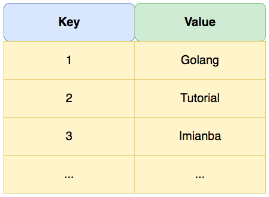
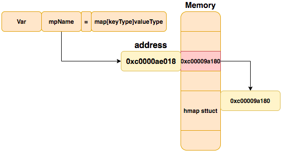
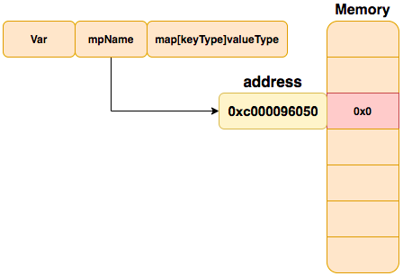
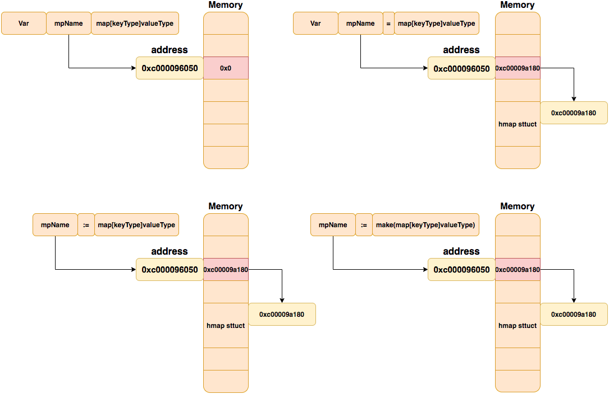
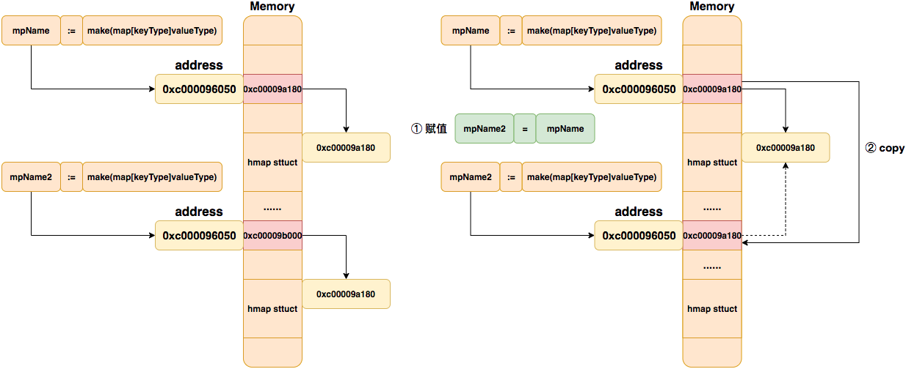

# Map

`map`是`Go`语言中的一种内置数据结构，也称为**哈希表或字典**。它是一种**无序的键值对集合**，其中每个键唯一对应一个值，通过键来快速查找对应的值。在`map`中，**所有的键都必须是同一类型，所有的值也必须是同一类型**。



`map`也是一种指针持有者类型,指针指向底层`hmap`结构。



## 目录

- 定义 Map与赋值
- Map深浅拷贝
- Map参数传递

## 定义 Map与赋值

`map`的声明方式：

```go
var mapName map[keyType]valueType
```

其中`mapName`表示变量名称，`keyType`表示键的类型(**键必须是可比较的值**)，`valueType`表示值的类型。需要注意的是，这里**只是声明了`map`变量并没有初始化**，如果**添加或修改**将会引发运行时错误。



正确的初始化方式是使用`make`函数：

```go
mapName := make(map[keyType]valueType,[size]) // size 可选
```


或者直接定义并附上初始值：

```go
mapName := map[keyType]valueType{}
mapName := map[keyType]valueType{
    key1: value1,
    key2: value2,
    ...
}
```

在`map`中**添加或修改**可以直接使用下标运算符`[]`，例如：

```go
mapName[key] = value
```

如果`map`键值对中的键已经存在，那么它所对应的值就会被更新；如果不存在，就会添加一个新的键值对。

**查找**`map`中的键值对也是使用下标运算符`[]`，例如：

```go
value := mapName[key]
```

这个操作会返回`key`对应的值并赋值给变量`value`, 如果该**键不存在，会返回该值类型的零值**。

具体示例：

```go
package main

import "fmt"

/*
	1.定义map
	2.定义map并赋值
	3.通过key赋值
	4.通过make创建map
*/

// Steps1 定义和初始化map
func Steps1() {
	// Steps 1-1: map[T]X 表示定义了一个 Key 类型为 T, Value 类型为 X 的映射
	// 1.注意 Key 的 T 必须支持 == 和 != 比较, 才能用作 map 的 Key
	// 2.可以通过 [] 操作符对 map 的 Value 进行访问/修改
	var mpIntInt map[int]int // 定义一个 int->int 的零值map
	fmt.Printf("\t&mpIntInt:%p mpIntInt:%p mpIntInt:%+v len:%d\n",
		&mpIntInt,
		mpIntInt,
		mpIntInt,
		len(mpIntInt)) // len 可以获取当前 map 存储的映射数量

	// 定义后没有初始化的 map 为 nil(0x0), nil 映射不能添加键,否则报错 panic: assignment to entry in nil map
	// mpIntInt[1] =1

	// 未初始化的 map 不能写但可以读, 值为对应类型零值
	v := mpIntInt[2]
	fmt.Printf("\tmpIntInt[2]:%+v\n", v)

	fmt.Printf("\t---------------------\n")

	// Steps 1-2: 定义一个 int->string 的map并初始化
	mpIntString := map[int]string{1: "Golang", 2: "Tutorial"}
	fmt.Printf("\tmpIntString:%+v len:%d\n",
		mpIntString,
		len(mpIntString))

	fmt.Printf("\t---------------------\n")

	// Steps 1-3: 用内建函数 make 来创建map
	// make(map[T][T],size) 表示定义一个key为T类型value为T类型,容量为size的映射
	mpIntBool := make(map[int]bool) // 通过make创建map会分配内存,对比 var mpIntInt map[int]int 定义 map 不会分别内存
	fmt.Printf("\t&mpIntBool:%p mpIntBool:%p mpIntBool:%+v len:%d\n",
		&mpIntBool,
		mpIntBool,
		mpIntBool,
		len(mpIntBool))
	mpIntBool[0] = true
	fmt.Printf("\tmpIntBool:%+v len:%d\n",
		mpIntBool,
		len(mpIntBool))

	fmt.Printf("\t---------------------\n")

	// 创建了一个key为int类型value为float32类型,容量为10的映射
	mpIntFloat32 := make(map[int]float32, 10)
	fmt.Printf("\tmpIntFloat32:%+v len:%d\n",
		mpIntFloat32,
		len(mpIntFloat32))

	// 创建了一个key为string类型value为[]int,容量为10的映射
	mpStringSliceInt := make(map[string][]int, 10)
	fmt.Printf("\tmpStringSliceInt:%+v len:%d\n",
		mpStringSliceInt,
		len(mpStringSliceInt))
}

func main() {
	fmt.Println("Steps1():")
	Steps1()
}
```

`map`还有一些其他操作：

- `delete(mapName, key)`：**删除**指定键的键值对。
- `len(mapName)`：返回map中键值对的数量。
- `for key, value := range mapName`：遍历map中的键值对。
- `value, ok := map[index]`: **双赋值检测**, 判断元素是否存在, 存在ok为true,value为具体值; 不存在ok为false,value为对应类型零值。

需要注意的是，由于`map`是无序的，所以遍历时**不能保证顺序**。

具体示例：

```go
package main

import (
	"fmt"
	"unsafe"
)

/*
	1.用内建函数 make 来创建map
	2.赋值
	3.获取元素
	4.删除元素
	5.通过双赋值检测某个key是否存在
	6.通过range遍历map
*/

// Steps2 map的基础使用
func Steps2() {
	// Steps 2-1: 用内建函数 make 来创建map
	mpIntString := make(map[int]string)
	fmt.Printf("\tmpIntString:%+v len:%d\n",
		mpIntString,
		len(mpIntString))

	// Steps 2-2: 映射 mpIntString 中插入或修改元素
	// 映射添加元素容量不够时会自动扩容
	mpIntString[0] = "Golang"
	mpIntString[1] = "World"
	mpIntString[1] = "Tutorial" // 覆盖mpIntString[1]的value
	mpIntString[2] = "Study"
	fmt.Printf("\tmpIntString:%+v len:%d\n",
		mpIntString,
		len(mpIntString))

	fmt.Printf("\t---------------------\n")

	// Steps 2-3: 获取元素
	elem := mpIntString[0]
	fmt.Printf("\telem:%+v\n", elem)

	fmt.Printf("\t---------------------\n")

	// Steps 2-4: 删除元素
	// 通过内置函数 delete(map,key)
	delete(mpIntString, 0)
	fmt.Printf("\tmpIntString:%+v len:%d\n",
		mpIntString,
		len(mpIntString))

	fmt.Printf("\t---------------------\n")

	// Steps 2-5: 通过双赋值检测某个key是否存在
	// 若 key 在 mpIntString 中，ok 为 true ; 否则 ok 为 false
	elem, ok := mpIntString[0]
	fmt.Printf("\telem:%+v ok:%t\n", elem, ok)

	fmt.Printf("\t---------------------\n")

	// Steps 2-6: 通过range遍历map
	// 方法1，拿到key，再根据key获取value
	for k := range mpIntString {
		fmt.Printf("\tKey:%d, Value:%s\n", k, mpIntString[k])
	}

	fmt.Printf("\t---------------------\n")

	// 方法2，同时拿到key和value
	for k, v := range mpIntString {
		fmt.Printf("\tKey:%d, Value:%s\n", k, v)
	}
}

// Steps3 不同方式创建map的区别
func Steps3() {
	var mpIntBool map[int]bool
	fmt.Printf("\tmpIntBool:%+v len:%d\n",
		mpIntBool,
		len(mpIntBool))
	fmt.Printf("\tmpIntBool       size:%d\n", unsafe.Sizeof(mpIntBool))
	fmt.Printf("\tmpIntBool       addr:%p\n", &mpIntBool)
	fmt.Printf("\tmpIntBool value addr:%p\n", mpIntBool)

	fmt.Printf("\t---------------------\n")

	var mpIntBool1 = map[int]bool{} // 与 var mpIntBool map[int]bool 的区别; 会开辟内存空间
	fmt.Printf("\tmpIntBool1:%+v len:%d\n",
		mpIntBool1,
		len(mpIntBool1))
	fmt.Printf("\tmpIntBool1       size:%d\n", unsafe.Sizeof(mpIntBool1))
	fmt.Printf("\tmpIntBool1       addr:%p\n", &mpIntBool1)
	fmt.Printf("\tmpIntBool1 value addr:%p\n", mpIntBool1)

	fmt.Printf("\t---------------------\n")

	mpIntBool2 := map[int]bool{} // 与 var mpIntBool map[int]bool 的区别; 会开辟内存空间
	fmt.Printf("\tmpIntBool2:%+v len:%d\n",
		mpIntBool2,
		len(mpIntBool2))
	fmt.Printf("\tmpIntBool2       size:%d\n", unsafe.Sizeof(mpIntBool2))
	fmt.Printf("\tmpIntBool2       addr:%p\n", &mpIntBool2)
	fmt.Printf("\tmpIntBool2 value addr:%p\n", mpIntBool2)

	fmt.Printf("\t---------------------\n")

	var mpIntBool3 = make(map[int]bool, 10) // 与 var mpIntBool map[int]bool 的区别; 会开辟内存空间
	fmt.Printf("\tmpIntBool3:%+v len:%d\n",
		mpIntBool3,
		len(mpIntBool3))
	fmt.Printf("\tmpIntBool3       size:%d\n", unsafe.Sizeof(mpIntBool3))
	fmt.Printf("\tmpIntBool3       addr:%p\n", &mpIntBool3)
	fmt.Printf("\tmpIntBool3 value addr:%p\n", mpIntBool3)
}

func main() {
	fmt.Println("Steps2():")
	Steps2()
	fmt.Println("Steps3():")
	Steps3()
}
```



## Map深浅拷贝

`Map`拷贝不是将新旧`Map`直接赋值，这样**只会赋值`Map`内部的引用(指针)**，他们**底层**还是**共用的同一片存储空间**，修改新`Map`会导致旧`Map`也一起变。所以真正的拷贝是将旧的`Map`的所有元素复制到新的`Map`中。

```go
package main

import (
	"fmt"
	"unsafe"
)

/*
	1.map深浅拷贝
*/

// Steps4 浅拷贝
func Steps4() {
	mpIntString := map[int]string{
		1: "golang",
		2: "tutorial",
	}
	fmt.Printf("\tmpIntString:%+v len:%d\n",
		mpIntString,
		len(mpIntString))
	fmt.Printf("\tmpIntString       addr:%p\n", &mpIntString)
	fmt.Printf("\tmpIntString value addr:%p\n", mpIntString)
	fmt.Println("\t-------------------------")
	tmpIntString := make(map[int]string, 2)
	fmt.Printf("\ttmpIntString:%+v len:%d\n",
		tmpIntString,
		len(tmpIntString))
	fmt.Printf("\ttmpIntString       addr:%p\n", &tmpIntString)
	fmt.Printf("\ttmpIntString value addr:%p\n", tmpIntString)

	tmpIntString = mpIntString // 将指向底层映射的指针赋值给了 tmpIntString

	fmt.Printf("\ttmpIntString:%+v len:%d\n",
		tmpIntString,
		len(tmpIntString))
	fmt.Printf("\ttmpIntString       addr:%p\n", &tmpIntString)
	fmt.Printf("\ttmpIntString value addr:%p\n", tmpIntString)

	tmpIntString[2] = "IMianBa"
	fmt.Println("\t-------------------------")
	fmt.Printf("\tmpIntString:%+v len:%d\n",
		mpIntString,
		len(mpIntString))
	fmt.Printf("\ttmpIntString:%+v len:%d\n",
		tmpIntString,
		len(tmpIntString))
}

// Steps5 深拷贝
func Steps5() {
	mpIntString := map[int]string{
		1: "golang",
		2: "tutorial",
	}
	fmt.Printf("\tmpIntString:%+v len:%d\n",
		mpIntString,
		len(mpIntString))
	fmt.Printf("\tmpIntString       addr:%p\n", &mpIntString)
	fmt.Printf("\tmpIntString value addr:%p\n", mpIntString)
	fmt.Println("\t-------------------------")

	tmpIntString := make(map[int]string, 2)
	fmt.Printf("\ttmpIntString:%+v len:%d\n",
		tmpIntString,
		len(tmpIntString))
	fmt.Printf("\ttmpIntString       addr:%p\n", &tmpIntString)
	fmt.Printf("\ttmpIntString value addr:%p\n", tmpIntString)

	for k, v := range mpIntString {
		tmpIntString[k] = v
	}

	fmt.Printf("\ttmpIntString:%+v len:%d\n",
		tmpIntString,
		len(tmpIntString))
	fmt.Printf("\ttmpIntString       addr:%p\n", &tmpIntString)
	fmt.Printf("\ttmpIntString value addr:%p\n", tmpIntString)

	tmpIntString[2] = "IMianBa"
	fmt.Println("\t-------------------------")
	fmt.Printf("\tmpIntString:%+v len:%d\n",
		mpIntString,
		len(mpIntString))
	fmt.Printf("\ttmpIntString:%+v len:%d\n",
		tmpIntString,
		len(tmpIntString))
}

// Steps6 证明 map 的底层结构
func Steps6() {
	mpIntString := map[int]string{
		1: "golang",
		2: "tutorial",
		3: "World",
	}
	fmt.Printf("\tmpIntString:%+v len:%d\n",
		mpIntString,
		len(mpIntString))
	fmt.Printf("\tmpIntString       size:%d\n", unsafe.Sizeof(mpIntString))
	fmt.Printf("\tmpIntString       addr:%p\n", &mpIntString)
	fmt.Printf("\tmpIntString value addr:%p\n", mpIntString)

	/*
		// A header for a Go map.
		type hmap struct {
			// Note: the format of the hmap is also encoded in cmd/compile/internal/reflectdata/reflect.go.
			// Make sure this stays in sync with the compiler's definition.
			count     int // # live cells == size of map.  Must be first (used by len() builtin)
			flags     uint8
			B         uint8  // log_2 of # of buckets (can hold up to loadFactor * 2^B items)
			noverflow uint16 // approximate number of overflow buckets; see incrnoverflow for details
			hash0     uint32 // hash seed

			buckets    unsafe.Pointer // array of 2^B Buckets. may be nil if count==0.
			oldbuckets unsafe.Pointer // previous bucket array of half the size, non-nil only when growing
			nevacuate  uintptr        // progress counter for evacuation (buckets less than this have been evacuated)

			extra *mapextra // optional fields
		}
	*/

	fmt.Printf("\tmpIntString value addr:0x%x\n", *(*uintptr)(unsafe.Pointer(&mpIntString)))
	fmt.Printf("\tmpIntString value struct.filed_1      count %d\n", *(*int)(unsafe.Pointer(*(*uintptr)(unsafe.Pointer(&mpIntString)))))
	fmt.Printf("\tmpIntString value struct.filed_2      flags %d\n", *(*uint8)(unsafe.Pointer(*(*uintptr)(unsafe.Pointer(&mpIntString)) + uintptr(8))))
	fmt.Printf("\tmpIntString value struct.filed_3          B %d\n", *(*uint8)(unsafe.Pointer(*(*uintptr)(unsafe.Pointer(&mpIntString)) + uintptr(9))))
	fmt.Printf("\tmpIntString value struct.filed_4  noverflow %d\n", *(*uint16)(unsafe.Pointer(*(*uintptr)(unsafe.Pointer(&mpIntString)) + uintptr(10))))
	fmt.Printf("\tmpIntString value struct.filed_5      hash0 %d\n", *(*uint32)(unsafe.Pointer(*(*uintptr)(unsafe.Pointer(&mpIntString)) + uintptr(12))))
	fmt.Printf("\tmpIntString value struct.filed_6    buckets 0x%x\n", *(*uintptr)(unsafe.Pointer(*(*uintptr)(unsafe.Pointer(&mpIntString)) + uintptr(16))))
	fmt.Printf("\tmpIntString value struct.filed_7 oldbuckets 0x%x\n", *(*uintptr)(unsafe.Pointer(*(*uintptr)(unsafe.Pointer(&mpIntString)) + uintptr(32))))

	fmt.Printf("\t-------------------------------------------\n")
	// 等同于上面的结果，参考 go/src/runtime/export_test.go 548 行
	h := *(**hmap)(unsafe.Pointer(&mpIntString))
	fmt.Printf("\thmap %+v\n", h)
	fmt.Printf("\thmap %p\n", h)
	fmt.Printf("\thmap     count %p\n", &h.count)
	fmt.Printf("\thmap     flags %p\n", &h.flags)
	fmt.Printf("\thmap         B %p\n", &h.B)
	fmt.Printf("\thmap noverflow %p\n", &h.noverflow)
	fmt.Printf("\thmap     hash0 %p\n", &h.hash0)
	fmt.Printf("\thmap   buckets %p\n", &h.buckets)

	fmt.Printf("\t-------------------------------------------\n")
	tmpMpIntString := mpIntString
	tmpMpIntString[4] = "World"
	fmt.Printf("\ttmpMpIntString:%+v len:%d\n",
		tmpMpIntString,
		len(tmpMpIntString))
	fmt.Printf("\ttmpMpIntString       addr:%p\n", &tmpMpIntString)
	fmt.Printf("\ttmpMpIntString value addr:%p\n", tmpMpIntString)

	tmp := *(**hmap)(unsafe.Pointer(&tmpMpIntString))
	fmt.Printf("\thmap %+v\n", tmp)
	fmt.Printf("\thmap %p\n", tmp)
	fmt.Printf("\thmap     count %p\n", &tmp.count)
	fmt.Printf("\thmap     flags %p\n", &tmp.flags)
	fmt.Printf("\thmap         B %p\n", &tmp.B)
	fmt.Printf("\thmap noverflow %p\n", &tmp.noverflow)
	fmt.Printf("\thmap     hash0 %p\n", &tmp.hash0)
	fmt.Printf("\thmap   buckets %p\n", &tmp.buckets)
}

func main() {
	fmt.Println("Steps4():")
	Steps4()
	fmt.Println("Steps5():")
	Steps5()
	fmt.Println("Steps6():")
	Steps6()
}

type bmap struct {
	tophash [8]uint8
}
type mapextra struct {
	overflow     *[]*bmap
	oldoverflow  *[]*bmap
	nextOverflow *bmap
}
type hmap struct {
	count     int // # live cells == size of map.  Must be first (used by len() builtin)
	flags     uint8
	B         uint8  // log_2 of # of buckets (can hold up to loadFactor * 2^B items)
	noverflow uint16 // approximate number of overflow buckets; see incrnoverflow for details
	hash0     uint32 // hash seed

	buckets    unsafe.Pointer // array of 2^B Buckets. may be nil if count==0.
	oldbuckets unsafe.Pointer // previous bucket array of half the size, non-nil only when growing
	nevacuate  uintptr        // progress counter for evacuation (buckets less than this have been evacuated)

	extra *mapextra // optional fields
}
```



## Map参数传递

`map`的传递和切片的传递非常类似，传递的`map`在函数中改变值，会影响主函数中的`map` (导致这个问题的原因就是**深浅拷贝的问题**)。

```go
package main

import "fmt"

/*
	1.map当做参数传递
*/

func addMap(mp map[int]string) { // 将 mpIntString 指向底层映射的指针赋值给了 mp
	fmt.Printf("\tmp value addr:%p\n", mp)
	fmt.Printf("\tmp       addr:%p\n", &mp)
	mp[0] = "0"
	mp[1] = "1"
	mp[2] = "2"
	mp[3] = "3"
	fmt.Printf("\tmp value addr:%p\n", mp)
	fmt.Printf("\tmp       addr:%p\n", &mp)
}

// Steps5 map参数传递
func Steps5() {
	// 用内建函数 make 来创建map
	mpIntString := make(map[int]string, 2)
	fmt.Printf("\tmpIntString:%+v len:%d\n",
		mpIntString,
		len(mpIntString))

	fmt.Printf("\tmpIntString value addr:%p\n", mpIntString)
	fmt.Printf("\tmpIntString       addr:%p\n", &mpIntString)
	addMap(mpIntString)
	fmt.Printf("\tmpIntString value addr:%p\n", mpIntString)
	fmt.Printf("\tmpIntString       addr:%p\n", &mpIntString)
	fmt.Printf("\tmpIntString:%+v len:%d\n",
		mpIntString,
		len(mpIntString))
}

func main() {
	fmt.Println("Steps5():")
	Steps5()
}
```

## 思考题

1. 通过Map实现一个人员统计小程序 
  
    1.1. 实现添加一个名字
   
    1.2. 实现查询一个名字是否存在

    1.3. 实现删除一个名字

    1.4. 实现更新一个名字
    
    1.5. 实现打印所有名字

    1.6. 实现统计总人数
    
2. 通过map,struct,func实现求一个班级所有学生最高总分,最低总分,各学科最高,最低分,平均分,打印所有学生所有学科成绩

```go
type Student struct {
	language float32
	math     float32
	english  float32
}

type class struct {
	mp map[string]Student
}

func (c class)ClassMaxScore() float64 {

	return 0
}

func (c class)ClassLanguageMaxScore() float64 {

	return 0
}

func (c class)PrintAllStudent()  {
	
}

func .....
```

## 自检

- `map`的定义和声明 ？
- `map`的初始化 ？
- `map`的元素访问和赋值 ？
- `map`的长度和删除元素 ？
- `map`的遍历 ？
- `map`的传递方式 ?

## 参考

https://technobeans.com/2019/02/21/golang-composite-data-types-maps/

https://www.cnblogs.com/linkstar/p/10969631.html

https://www.kevinwu0904.top/blogs/golang-map/

https://go.dev/blog/maps

https://www.cnblogs.com/qcrao-2018/p/10903807.html

https://jonny.website/posts/go-map-bmap/

https://draveness.me/golang/docs/part2-foundation/ch03-datastructure/golang-hashmap
