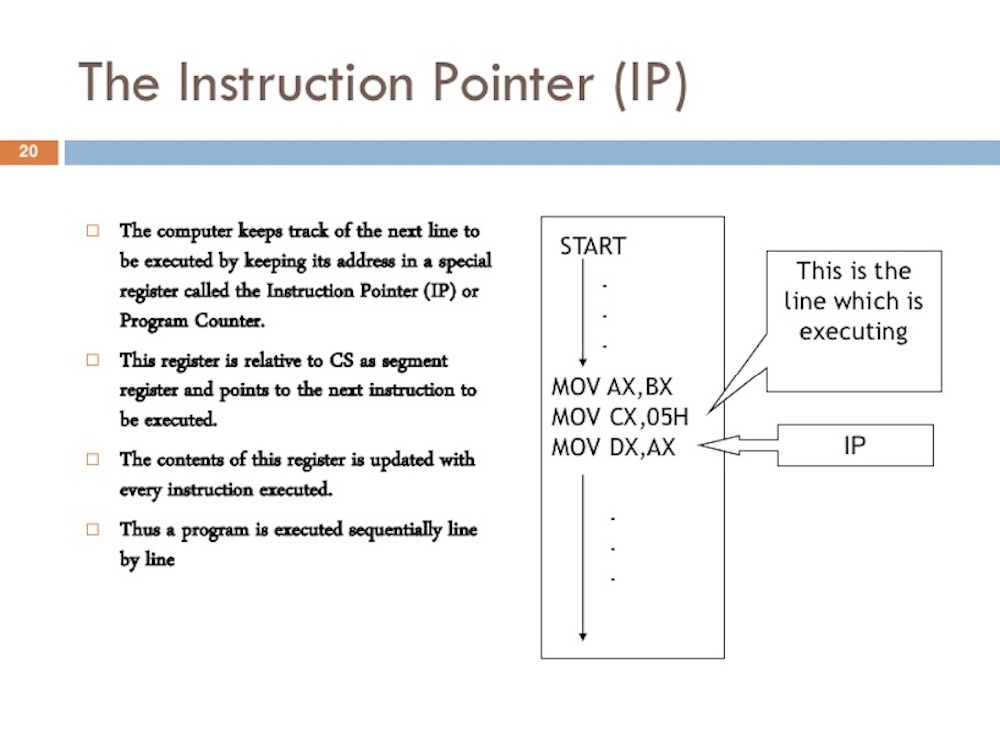
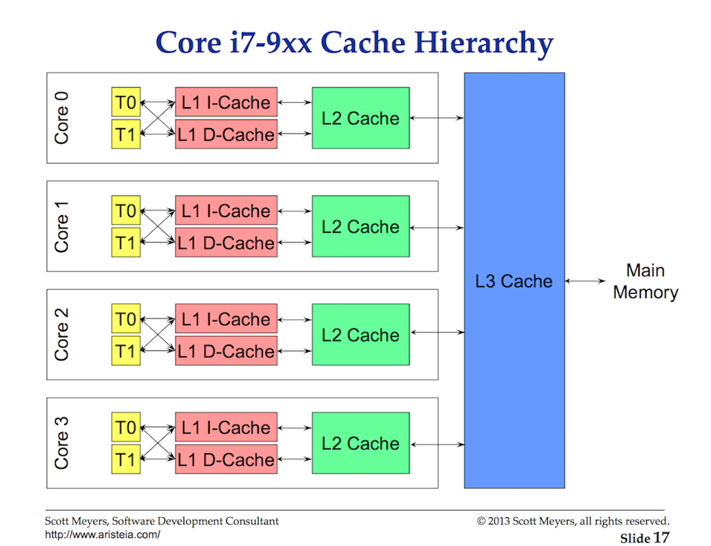
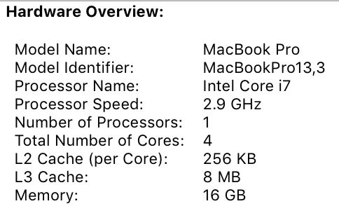
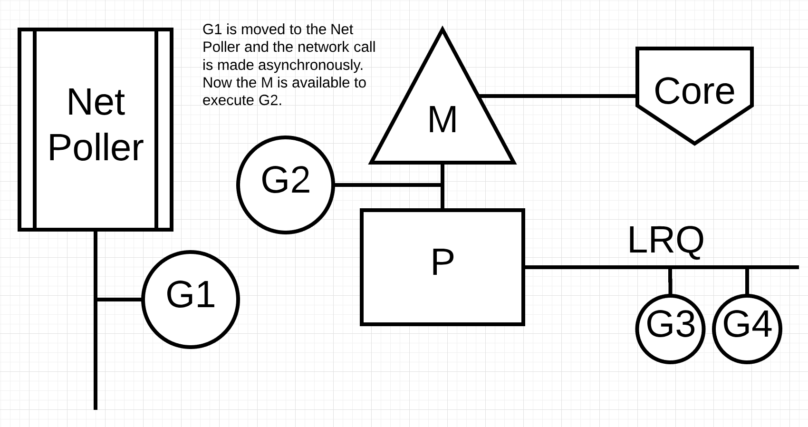
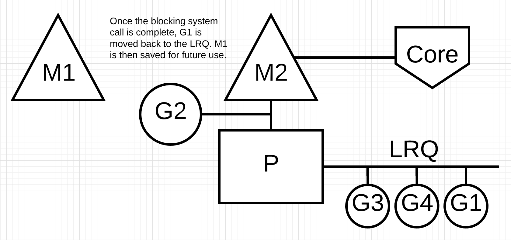
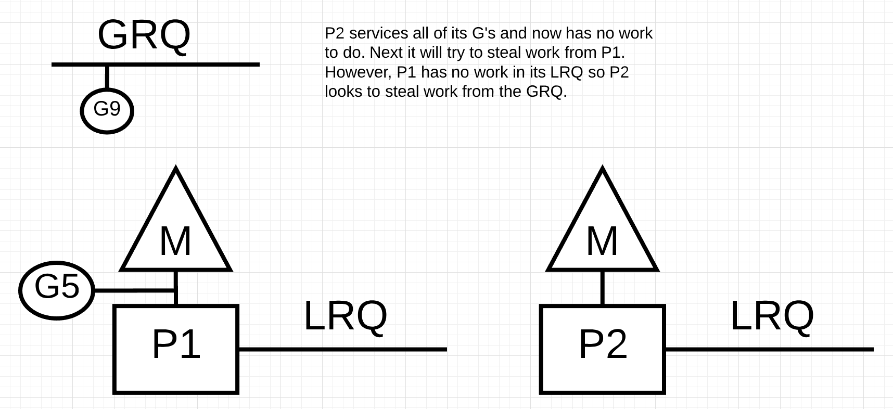

# Part I - OS Scheduler

## 介绍

Go 调度程序的设计和行为使您的多线程 Go 程序更加高效且高性能。这要归功于 Go 调度程序对操作系统 (OS) 调度程序的机械同情。然而，如果多线程 Go 程序的设计和行为在机械上与调度程序的工作方式不相符，那么这一切都无关紧要。为了正确设计多线程软件，对操作系统和 Go 调度程序如何工作有一个全面且有代表性的理解非常重要。

这篇由多部分组成的文章将重点讨论调度程序的高级机制和语义。我将提供足够的详细信息，让您直观地了解事物的工作原理，以便您做出更好的工程决策。尽管您需要为多线程应用程序做出很多工程决策，但机制和语义构成了您所需的基础知识的关键部分。

## 操作系统调度程序

操作系统调度程序是一个复杂的软件。他们必须考虑运行硬件的布局和设置。这包括但不限于多个处理器和内核、CPU 缓存和 NUMA 的存在。如果没有这些知识，调度程序就无法尽可能高效。很棒的是，您仍然可以建立一个关于操作系统调度程序如何工作的良好思维模型，而无需深入研究这些主题。

**您的程序只是一系列需要依次执行的机器指令。**为了实现这一点，操作系统使用了线程的概念。线程的工作是负责按顺序执行分配给它的指令集，直到线程不再有指令可以执行。这就是为什么我将线程称为**“执行路径”**。

您运行的每个程序都会创建一个进程，并且每个进程都会被赋予一个初始线程。**线程有能力创建更多线程**。所有这些不同的线程彼此独立运行，并且调度决策是在线程级别而不是进程级别做出的。**线程可以并发运行（每个线程在一个单独的核心上轮流运行），也可以并行运行（每个线程同时在不同的核心上运行）**。线程还维护自己的状态，以允许安全、本地和独立地执行其指令。

操作系统调度程序负责确保在有线程可以执行时，内核不空闲。它还必须创造**所有可以执行的线程同时执行的错觉**。在创造这种幻觉的过程中，调度程序需要运行优先级较高的线程。但是，优先级较低的线程不能缺少执行时间。调度程序还需要快速做出明智的决策来尽可能减少调度延迟。

为了实现这一目标，需要在算法上投入很多精力，但幸运的是，可以利用该行业数十年的工作和经验。为了更好地理解这一切，最好描述和定义一些重要的概念。

## 执行指令

程序计数器（PC），有时也称为指令指针（IP），它允许线程跟踪下一条要执行的指令。在大多数处理器中，**PC 指向下一条指令**而不是当前指令。



如果您曾经见过 Go 程序的堆栈跟踪，您可能已经注意到每行末尾的这些小十六进制数字。如下 `+0x39` 和 `+0x72`。

```go
goroutine 1 [running]:
   main.example(0xc000042748, 0x2, 0x4, 0x106abae, 0x5, 0xa)
       stack_trace/example1/example1.go:13 +0x39                 <- LOOK HERE
   main.main()
       stack_trace/example1/example1.go:8 +0x72                  <- LOOK HERE
```

这些数字表示 PC 值相对于相应函数顶部的偏移量。`+0x39` PC 偏移值表示如果程序没有发生恐慌，线程将在example函数内执行的下一条指令。如果控制碰巧返回到该函数，则 `0+x72` PC 偏移值是main函数内的下一条指令。更重要的是，该指针之前的指令告诉您正在执行什么指令。

查看下面 的程序，它产生了清单 1 中的堆栈跟踪。

```go
07 func main() {
08     example(make([]string, 2, 4), "hello", 10)
09 }

12 func example(slice []string, str string, i int) {
13    panic("Want stack trace")
14 }
```

十六进制数字 `+0x39` 表示example函数内指令的 PC 偏移量，该偏移量位于函数起始指令下方 57（基数 10）字节处。在下面的代码中，您可以看到二进制文件中example函数的 objdump。找到底部列出的第 12 条指令。请注意该指令上方的代码行是对panic的调用。

```go
$ go tool objdump -S -s "main.example" ./example1
TEXT main.example(SB) stack_trace/example1/example1.go
func example(slice []string, str string, i int) {
  0x104dfa0		65488b0c2530000000	MOVQ GS:0x30, CX
  0x104dfa9		483b6110		CMPQ 0x10(CX), SP
  0x104dfad		762c			JBE 0x104dfdb
  0x104dfaf		4883ec18		SUBQ $0x18, SP
  0x104dfb3		48896c2410		MOVQ BP, 0x10(SP)
  0x104dfb8		488d6c2410		LEAQ 0x10(SP), BP
	panic("Want stack trace")
  0x104dfbd		488d059ca20000	LEAQ runtime.types+41504(SB), AX
  0x104dfc4		48890424		MOVQ AX, 0(SP)
  0x104dfc8		488d05a1870200	LEAQ main.statictmp_0(SB), AX
  0x104dfcf		4889442408		MOVQ AX, 0x8(SP)
  0x104dfd4		e8c735fdff		CALL runtime.gopanic(SB)
  0x104dfd9		0f0b			UD2              <--- LOOK HERE PC(+0x39)
```

请记住：PC 是下一条指令，而不是当前指令。如上代码是基于 amd64 指令的一个很好的示例，该 Go 程序的线程负责顺序执行这些指令。

## 线程状态

另一个重要的概念是**线程状态**，它规定了调度程序在线程中扮演的角色。线程可以处于三种状态之一：**Waiting, Runnable, Executing**。

**Waiting**: 这意味着线程已停止并等待某些内容才能继续。这可能是由于等待硬件（磁盘、网络）、操作系统（系统调用）或同步调用（原子、互斥）等原因。这些类型的延迟是性能不佳的根本原因。

**Runnable**: 这意味着线程需要核心上的时间，以便它可以执行分配的机器指令。如果有很多线程需要时间，那么线程必须等待更长的时间才能获得时间。此外，随着更多线程竞争时间，任何给定线程获得的单独时间量都会缩短。这种类型的调度延迟也可能是性能不佳的原因。

**Executing**: 这意味着线程已被放置在核心上并正在执行其机器指令。与应用程序相关的工作正在完成。

## 工作类型

线程可以执行两种类型的工作。第一个称为 **CPU-Bound**，第二个称为 **IO-Bound**。

**CPU-Bound**: 这项工作永远不会造成线程可能处于等待状态的情况。这是一个不断进行计算的工作。类似：计算圆周率到第 N 位的线程就是 CPU-Bound。

**IO-Bound**: 这是导致线程进入等待状态的工作。这项工作包括请求通过网络访问资源或对操作系统进行系统调用。类似：需要访问数据库的线程就是 IO-Bound。我将包括导致线程等待的同步事件（互斥体、原子）作为此类别的一部分。

## 上下文切换

如果您在 Linux、Mac 或 Windows 上运行，则您正在运行具有**抢占式调度程序的操作系统**。这意味着一些重要的事情。首先，这意味着调度程序在任何给定时间将选择运行哪些线程时是**不可预测**的。线程优先级与事件（例如在网络上接收数据）一起使得无法确定调度程序将选择做什么以及何时执行。

其次，这意味着你永远不能根据一些你很幸运地经历过但不能保证每次都会发生的感知行为来编写代码。**如果在应用程序中需要确定性，则必须控制线程的同步和编排。**

在核心上交换线程的物理行为称为**上下文切换(context switch)**。当调度器将一个正在执行的线程从核心取出并替换另一个可运行线程时，就会发生上下文切换。被取出的线程可以移回可运行状态（如果它仍然具有运行能力），或进入等待状态（如果是由于 IO-Bound 类型的请求被替换）；替换的线程将进入执行状态。

**上下文切换被认为是昂贵的**，因为在核心上切换线程需要花费时间。上下文切换过程中产生的延迟取决于不同的因素，它花费**约 1000 到约 1500 纳秒**之间。考虑到硬件应该能够合理地在每个内核每纳秒执行（平均）12 条指令，**上下文切换可能会导致约 12k 到约 18k 指令的延迟**。从本质上讲，您的程序正在失去在上下文切换期间执行大量指令的能力。

如果您有一个专注于 IO-Bound(IO密集型) 工作的程序，那么上下文切换将是一个优势。一旦线程进入等待状态，另一个处于可运行状态的线程就会取代它的位置。这使得核心始终在工作。这是调度最重要的方面之一。如果有工作（处于可运行状态的线程）需要完成，则不允许核心闲置。

如果您的程序专注于 CPU-Bound(CPU密集型) 工作，那么上下文切换将成为性能噩梦。由于 Thead 总是有工作要做，因此上下文切换会阻止该工作的进行。这种情况与 IO-Bound 工作负载发生的情况形成鲜明对比。

## 少即是多

在早期，处理器只有一个核心，调度并不太复杂。**因为你只有一个单核处理器，所以在任何给定的时间都只能执行一个线程**。有一个想法是定义一个调度周期，并尝试在该时间周期内执行所有可运行线程。没问题：将调度周期除以需要执行的线程数。

例如，如果您将调度周期定义为 1000 毫秒（1 秒）并且您有 10 个线程，则每个线程各获得 100 毫秒。如果有 100 个线程，每个线程各获得 10 毫秒。但是，当您有 1000 个线程时会发生什么？每个线程各获得1ms，然而给每个线程 1ms 的时间片是行不通的，因为您花费在上下文切换上的时间百分比与您花费在应用程序工作上的时间多。

你需要设定一个给定时间片可以有多小的限制。在最后一个场景中，如果最小时间片为 10 毫秒并且您有 1000 个线程，则调度周期需要增加到 10000 毫秒（10 秒）。如果有 10000 个线程，现在您看到的调度程序周期为 100000 毫秒（100 秒）。在 10000 个线程中，最小时间片为 10 毫秒，如果每个线程都使用其完整时间片，所有线程运行一次需要 100 秒。

请注意，这是一个非常简单的世界观。调度器在做出调度决策时需要考虑和处理的事情还有更多。您可以控制应用程序中使用的线程数。当需要考虑更多线程并且发生 IO-Bound 工作时，就会出现更多混乱和不确定性行为。这些事情需要更长的时间来安排和执行。

这就是为什么游戏规则是“少即是多”。处于可运行状态的线程越少，意味着调度开销越少，每个线程占用的时间越长。处于可运行状态的线程越多，意味着每个线程占用的时间越少。这意味着随着时间的推移，你完成的工作也越来越少。

## 找到平衡点

您需要在拥有的核心数量和所需的线程数量之间找到平衡，以获得应用程序的最佳吞吐量。当谈到管理这种平衡时，线程池是一个很好的答案。我将在第二部分中向您展示，对于 Go 来说，这不再是必要的。我认为这是Go为简化多线程应用程序开发所做的好事之一。

在用Go编码之前，我在NT上用c++和c#编写代码。在那个操作系统上，IOCP (IO Completion Ports)线程池的使用对编写多线程软件至关重要。作为一名工程师，你需要弄清楚你需要多少个线程池，以及任何给定池的最大线程数，以便在给定的核数下最大化吞吐量。

当编写与数据库通信的 Web 服务时，每个核心 3 个线程的神奇数字似乎总是能在 NT 上提供最佳吞吐量。换句话说，每个核心 3 个线程最大限度地减少了上下文切换的延迟成本，同时最大限度地延长了核心上的执行时间。创建 IOCP 线程池时，我知道对于我在主机上识别的每个核心，从最少 1 个线程和最多 3 个线程开始。

如果我每个核心使用 2 个线程，则需要更长的时间才能完成所有工作，因为有未被利用的时间。如果我每个核心使用 4 个线程，它也会花费更长的时间，因为我在上下文切换中有更多的延迟。无论出于何种原因，每个核心 3 个线程的平衡似乎始终是 NT 上的神奇数字。

如果您的服务正在执行许多不同类型的工作怎么办？这可能会产生不同且不一致的延迟。也许它还创建了许多需要处理的不同系统级事件。可能无法找到一个始终适用于所有不同工作负载的神奇数字。当使用线程池来调整服务的性能时，找到正确的一致配置可能会变得非常复杂。

## 缓存行

**访问主内存数据的延迟成本非常高（约 100 到约 300 个时钟周期）**，因此处理器和内核具有本地缓存，以使数据靠近需要它的硬件线程。**从缓存访问数据的成本要低得多（约 3 到约 40 个时钟周期）**，具体取决于所访问的缓存。如今，性能的一方面在于如何有效地将数据输入处理器以减少这些数据访问延迟。编写**改变状态**的多线程应用程序需要考虑缓存系统的机制。

**图2**



使用高速缓存线在处理器和主存储器之间交换数据。缓存行是在主内存和缓存系统之间交换的 64 字节内存块。每个核心都有自己需要的缓存行副本，这意味着**硬件使用值语义**。**这就是为什么多线程应用程序中的内存突变会造成性能噩梦**。

当并行运行的多个线程**访问相同的数据值，甚至邻近的数据值时**，它们**将访问同一缓存行上的数据**。在任何核心上运行的任何线程都将获得同一缓存行的自己的副本。

**图3**


如果给定核心上的一个线程对其缓存行的副本进行更改，则通过硬件的魔力，同一缓存行的所有其他副本都必须标记为脏。当线程尝试对脏缓存行进行读或写访问时，需要访问主内存（约 100 到约 300 个时钟周期）才能获取缓存行的新副本。

也许在 2 核处理器上这不是什么大问题，但是如果 32 核处理器并行运行 32 个线程并在同一缓存行上访问和修改数据呢？如果系统有两个物理处理器（每个处理器有 16 个内核）呢？由于处理器间通信的延迟增加，情况会变得更糟。该**应用程序将在内存中运行，性能将非常糟糕**，而且很可能您不明白为什么。

这称为[缓存一致性问题](https://youtu.be/WDIkqP4JbkE)，并且还会引入错误共享等问题。当编写将改变共享状态的多线程应用程序时，必须考虑缓存系统。

## 调度决策场景

想象一下，我要求您根据我提供给您的高级信息编写操作系统调度程序。考虑一下您必须考虑的这一场景。请记住，这是调度程序在做出调度决策时必须考虑的许多有趣的事情之一。

您启动应用程序，主线程已创建并在核心 1 上执行。当线程开始执行其指令时，将检索缓存行，因为需要数据。该线程现在决定创建一个新线程来进行某些并发处理(这是问题所在)。

一旦线程创建并准备好运行，调度程序应该：

1. 将主线程从核心 1 上下文切换出来？这样做可以提高性能，因为这个新线程需要已缓存的相同数据的机会非常大。但主线程没有获得其完整的时间片。
2. 线程是否等待核心 1 变得可用，等待主线程的时间片完成？线程未运行，但一旦启动，获取数据的延迟将被消除。
3. 线程是否等待下一个可用核心？这意味着所选核心的缓存行将被刷新、检索和复制，从而导致延迟。但是，线程将启动得更快，并且主线程可以完成其时间片。

玩得开心吗？这些是操作系统调度程序在做出调度决策时需要考虑的有趣问题。对每个人来说幸运的是，我们不是制作它们的人。我只能告诉你，如果有空闲核心，就会使用它。

## 结论

本文的第一部分深入介绍了在编写多线程应用程序时必须考虑的有关线程和操作系统调度程序的内容。这些也是 Go 调度程序考虑的因素。在下一篇文章中，我将描述 Go 调度程序的语义以及它们如何与此信息相关。最后，您将通过运行几个程序看到所有这些的实际情况。

# Part II - Go Scheduler

## 介绍

在本调度系列的第一部分中，我解释了操作系统调度程序的各个方面，我相信这对于理解和欣赏 Go 调度程序的语义很重要。在这篇文章中，我将在语义层面解释 Go 调度程序的工作原理，并重点关注高层行为。Go 调度器是一个复杂的系统，小的机械细节并不重要。重要的是拥有一个关于事物如何运作和表现的良好模型。

## 你的程序开始

**当你的 Go 程序启动时，会为主机上的每个虚拟核心提供一个逻辑处理器 (P)**。如果您的处理器每个物理核心有多个硬件线程，每个硬件线程都将作为虚拟核心呈现给您的 Go 程序。为了更好地理解这一点，请查看我的 MacBook Pro 的系统报告。



您可以看到我有一个带有 4 个物理核心的处理器。该报告没有透露我每个物理核心的硬件线程数。Intel Core i7 处理器具有超线程功能，这意味着每个物理核心有 2 个硬件线程。**这将向 Go 程序报告有 8 个虚拟核心可用于并行执行操作系统线程。**

为了测试这一点，请考虑以下程序:

```go
package main

import (
	"fmt"
	"runtime"
)

func main() {

    // NumCPU returns the number of logical
    // CPUs usable by the current process.
    fmt.Println(runtime.NumCPU())
}
```

当我在本地计算机上运行该程序时，NumCPU() 函数调用的结果将为 8。我的机器上运行的任何 Go 程序都会获得 8 个P。

**每个 P 都分配有一个操作系统线程（“M”）**，“M”代表机器。**该线程仍然由操作系统管理并且操作系统仍然负责将线程放在核心上执行**，如上一篇文章中所述。**这意味着当我在我的机器上运行 Go 程序时，我有 8 个线程可用于执行我的工作，每个线程单独附加到一个 P。**

**每个 Go 程序还被赋予一个初始 Goroutine（“G”），这是Go程序的执行路径**。Goroutine 本质上是 Coroutine，但这是 Go，所以我们用“G”替换字母“C”，我们得到单词 Goroutine。您可以将 Goroutine 视为应用程序级线程，它们在很多方面与操作系统线程相似。正如**操作系统线程在核心上进行上下文切换一样，Goroutines 在 M 上进行下文切换**。

最后一个难题是运行队列。**Go调度器中有两个不同的运行队列：全局运行队列（GRQ）和本地运行队列（LRQ）**。**每个 P 都有一个 LRQ，用于管理分配在 P 上下文中执行的 Goroutine。这些 Goroutine 轮流进行上下文切换，打开和关闭分配给该 P 的 M**。**GRQ 适用于尚未分配给 P 的 Goroutine。将 Goroutine 从 GRQ 转移到 LRQ 有一个过程，我们稍后会讨论。**

图 2 提供了所有这些组件的图像。


## 合作调度器

正如我们在第一篇文章中讨论的那样，操作系统调度程序是抢占式调度程序。本质上，这意味着您无法预测调度程序在任何给定时间将要做什么。内核正在做决定，一切都是不确定的。**在操作系统之上运行的应用程序无法通过调度控制内核内部发生的事情，除非它们利用原子指令和互斥调用等同步原语。**

**Go 调度器是 Go 运行时的一部分，并且 Go 运行时内置于您的应用程序中**。这意味着 Go 调度程序在用户空间运行，内核之上。**目前Go调度器的实现不是抢占式调度器，而是协作式调度器**。作为一个协作调度程序意味着调度程序需要在代码中的安全点发生明确定义的用户空间事件来做出调度决策。

Go 协作调度程序的出色之处在于它看起来和感觉上都是抢占式的。你无法预测 Go 调度程序将要做什么。这是因为这个协作调度程序的决策权并不掌握在开发人员手中，而是掌握在 Go 运行时中。将 Go 调度程序视为抢占式调度程序很重要，因为调度程序是不确定的，这并不是什么难事。

## Goroutine 状态

就像线程一样，Goroutines 也具有相同的三个高级状态。这些决定了 Go 调度程序在任何给定的 Goroutine 中所扮演的角色。Goroutine 可以处于三种状态之一：Waiting, Runnable or Executing。

**Waiting**: 这意味着 Goroutine 已停止并等待某些事情才能继续。这可能是由于等待操作系统（系统调用）或同步调用（原子和互斥操作）等原因。这些类型的延迟是性能不佳的根本原因。

**Runnable**: 这意味着 Goroutine 需要 M 上的时间，以便它可以执行分配的指令。如果你有很多 Goroutines 需要时间，那么 Goroutine 必须等待更长的时间才能获得时间。此外，随着更多 Goroutine 争夺时间，任何给定 Goroutine 获得的单独时间都会缩短。这种类型的调度延迟也可能是性能不佳的原因。

**Executing**: 这意味着 Goroutine 已被放置在 M 上并正在执行其指令。与应用程序相关的工作正在完成。

## 上下文切换

**Go 调度程序需要定义明确的用户空间事件**，这些事件发生在代码中的**安全点**以进行上下文切换。这些事件和安全点在函数调用中体现出来。函数调用对于 Go 调度程序的健康至关重要。今天（使用 Go 1.11 或更低版本），如果您运行任何不进行函数调用的紧密循环，您将导致调度程序和垃圾收集内的延迟。函数调用在合理的时间范围内发生至关重要。

> 注意：1.12 有一个提案被接受，在 Go 调度程序中应用非合作抢占技术，以允许抢占紧密循环。

Go 程序中发生四类事件，允许调度程序做出调度决策。这并不意味着它总是会发生在这些事件之一。这意味着调度程序获得了机会点。

- go 关键字的使用
- 垃圾收集
- 系统调用
- 同步和编排

**go 关键字的使用**

关键字 go 是创建 Goroutines 的方式。一旦创建了新的 Goroutine，它就为调度程序**提供了做出调度决策的机会。**

**垃圾收集**

由于 GC 使用自己的一组 Goroutines 运行，因此这些 Goroutines 需要 M 上的时间来运行。因此GC造成很多调度混乱。然而，调度程序非常了解 Goroutine 正在做什么，它将利用这些情报做出明智的决策。一个明智的决定是对想要接触堆的 Goroutine 与那些在 GC 期间不接触堆的 Goroutine 进行上下文切换。当GC运行时，会做出很多调度决策。

**系统调用**

如果 Goroutine 进行系统调用会导致 Goroutine 阻塞 M，**有时，调度程序能够将 Goroutine 与 M 进行上下文切换并将一个新的 Goroutine 上下文切换到这个 M 上。然而，有时需要一个新的 M 来继续执行在 P 中排队的 Goroutine。**下一节将更详细地解释其工作原理。

**同步和编排**

如果原子、互斥或通道操作调用将导致 Goroutine 阻塞，调度程序可以上下文切换一个新的 Goroutine 来运行。一旦 Goroutine 可以再次运行，它就可以重新排队并最终在 M 上切换回上下文。

## 异步系统调用

当您**运行的操作系统能够异步处理系统调用时**，可以使用称为网络轮询器的东西来更有效地处理系统调用。这是通过在这些各自的操作系统中使用 kqueue (MacOS)、epoll (Linux) 或 iocp (Windows) 来完成的。

我们今天使用的许多操作系统都可以异步处理基于网络的系统调用。这就是网络轮询器的名字的由来，因为它的主要用途是处理网络操作。**通过使用网络轮询器进行网络系统调用，当进行这些系统调用时，调度程序可以防止 Goroutines 阻塞 M。**这有助于保持 M 可以执行 P 的 LRQ 中的其他 Goroutine，而无需创建新的 M。这有助于减少操作系统上的调度负载。

了解其工作原理的最佳方法是运行一个示例。


图 3 显示了我们的基本调度图。Goroutine-1 正在 M 上执行，还有 3 个 Goroutine 在 LRQ 中等待在 M 上获取时间。网络轮询器闲置，无事可做。



图 4 中，Goroutine-1想要进行网络系统调用，因此 Goroutine-1 被移至网络轮询器并处理异步网络系统调用。一旦 Goroutine-1 被移动到网络轮询器，M 现在可以执行与 LRQ 不同的 Goroutine。在这种情况下，Goroutine-2 在 M 上进行上下文切换。


在图5中，异步网络系统调用由网络轮询器完成，Goroutine-1被移回到P的LRQ中。一旦 Goroutine-1 可以在 M 上进行上下文切换，它负责的Go相关代码可以再次执行。**这里最大的好处是，执行网络系统调用时，不需要额外的 M**。网络轮询器有一个操作系统线程，它正在处理一个高效的事件循环。。

## 同步系统调用

当 Goroutine 想要进行无法异步完成的系统调用时会发生什么？在这种情况下，网络轮询器无法使用，并且进行系统调用的 Goroutine 将阻塞 M。这很不幸，但没有办法阻止这种情况发生。无法异步进行的系统调用的一个示例是基于文件的系统调用。如果您使用 CGO，则可能存在其他情况，调用 C 函数也会阻塞 M。

>  注意：Windows 操作系统确实具有异步进行基于文件的系统调用的功能。从技术上讲，当在 Windows 上运行时，可以使用网络轮询器。

让我们看一下同步系统调用（如文件 I/O）会导致 M 阻塞的情况。


图 6 再次显示了我们的基本调度图，但这次 Goroutine-1 将进行同步系统调用，该调用将阻塞 M1。


在图 7 中，调度程序能够识别 Goroutine-1 导致 M 阻塞。此时，调度程序将 M1 从 P 中分离出来，而阻塞的 Goroutine-1 仍然连接着M1。然后调度程序引入一个新的 M2 来为 P 提供服务。此时，可以从 LRQ 中选择 Goroutine-2，并在 M2 上进行上下文切换。如果由于先前的交换而导致 M 已存在，则此转换比创建新的 M 更快。



在图 8 中，Goroutine-1 发出的阻塞系统调用完成。此时，Goroutine-1 可以移回 LRQ 并再次由 P 提供服务。然后将 M1 放在一边，以备将来需要再次发生这种情况时使用。

## 执行偷窃

调度程序的另一个方面是它是**一个工作窃取调度程序**。这在某些方面有助于保持调度效率。首先，**您最不想看到的就是 M 进入等待状态，因为一旦发生这种情况，操作系统就会将 M 从 Core 中切换出来**。这意味着即使有处于可运行状态的 Goroutine，P 也无法完成任何工作，直到 M 上下文切换回 Core。工作窃取还有助于平衡所有 P 上的 Goroutines，以便更好地分配工作并更有效地完成工作。

让我们看一个例子。


在图 9 中，我们有一个多线程 Go 程序，其中有两个 P，每个 P 服务于四个 Goroutine，并且 GRQ 中有一个 Goroutine。如果 P 的其中一个快速为其所有 Goroutines 提供服务，会发生什么？


在图 10 中，P1 没有更多的 Goroutine 需要执行。但是在 P2 的 LRQ 和 GRQ 中都有处于可运行状态的 Goroutine。这时P1需要窃取工作的时刻到了。窃取工作的规则如下。

```go
runtime.schedule() {
    // only 1/61 of the time, check the global runnable queue for a G.
    // if not found, check the local queue.
    // if not found,
    //     try to steal from other Ps.
    //     if not, check the global runnable queue.
    //     if not found, poll network.
}
```

因此，根据如上清单中的这些规则，P1 需要在其 LRQ 中检查 P2 的 Goroutine，并获取找到的一半。


在图 11 中，一半的 Goroutines 取自 P2，现在 P1 可以执行这些 Goroutine。

如果 P2 完成其所有 Goroutine 的服务并且 P1 的 LRQ 中没有任何内容，会发生什么？



在图 12 中，P2 完成了所有工作，现在需要窃取一些工作。首先，它会查看 P1 的 LRQ，但找不到任何 Goroutines。接下来，它将查看 GRQ。在那里它将找到 Goroutine-9。


在图 13 中，P2 从 GRQ 中窃取 Goroutine-9 并开始执行工作。所有这些工作窃取的好处在于，它可以让 M 保持忙碌，而不是闲着。这种工作窃取在内部被认为是旋转 M。这种旋转还有其他好处，JBD 在她的工作窃取博客文章中详细解释了这一点。

## 实际例子

有了适当的机制和语义，我想向您展示所有这些如何结合在一起，让 Go 调度程序随着时间的推移执行更多的工作。想象一下用 C 语言编写的多线程应用程序，其中该程序管理两个相互来回传递消息的操作系统线程。


在图 14 中，有 2 个线程来回传递消息。线程 1 在 Core 1 上进行上下文切换并且现在正在执行，这允许线程 1 将其消息发送到线程 2。

> 注意：消息如何传递并不重要。重要的是编排过程中线程的状态。


在图 15 中，线程 1 完成消息发送后，它需要等待响应。这将导致线程 1 与核心 1 进行上下文切换并进入等待状态。一旦线程 2 收到有关该消息的通知，它就会进入可运行状态。现在，操作系统可以执行上下文切换并让线程 2 在 Core 上执行，而该 Core 恰好是 Core 2。接下来，线程 2 处理该消息并将新消息发送回线程 1。


在图 16 中，当线程 1 收到线程 2 发出的消息时，线程再次进行上下文切换。现在，线程 2 上下文从执行状态切换到等待状态，线程 1 上下文从等待状态切换到可运行状态，最后返回到执行状态，这允许它处理并向回发送新消息。

**所有这些上下文切换和状态更改都需要时间来执行，这限制了工作完成的速度**。每个上下文切换可能会产生大约 1000 纳秒的延迟，然而硬件每纳秒执行 12 条指令，因此您会看到或多或少有 12k 条指令在这些上下文切换期间不执行。**由于这些线程也在不同的核心之间跳跃，因此由于缓存行未命中而产生额外延迟的可能性也很高。**

让我们以同样的示例为例，但使用 Goroutines 和 Go 调度程序。


在图 17 中，有两个 Goroutines 相互协调来回传递消息。G1 在 M1 上进行上下文切换，而 M1 恰好在 Core 1 上运行，这允许 G1 执行工作。G1 的工作是向 G2 发送消息。


在图 18 中，G1 完成消息发送后，需要等待响应。这将导致 G1 与 M1 进行上下文切换并进入等待状态。一旦 G2 收到消息通知，它就会进入可运行状态。现在，Go 调度程序可以执行上下文切换并让 G2 在 M1 上执行，而 M1 仍在 Core 1 上运行。接下来，G2 处理该消息并将新消息发送回 G1。


在图 19 中，当 G1 收到 G2 发送的消息时，再次进行上下文切换。现在，G2 上下文从执行状态切换到等待状态，G1 上下文从等待状态切换到可运行状态，最后回到执行状态，这允许它处理并向回发送新消息。

表面上看，事情并没有什么不同。无论您使用线程还是 Goroutines，都会发生所有相同的上下文切换和状态更改。然而，使用线程和 Goroutine 之间存在一个重大差异，乍一看可能并不明显。

**在使用 Goroutine 的情况下，相同的操作系统线程和核心用于所有处理**。这意味着，**从操作系统的角度来看，操作系统线程永远不会进入等待状态**。**因此，我们在使用线程时因上下文切换而丢失的所有指令在使用 Goroutines 时都不会丢失。**

本质上，Go 将 IO阻塞工作转变为操作系统级别的 CPU 密集型工作。由于所有上下文切换都发生在应用程序级别，因此每次上下文切换我们不会丢失使用线程时丢失的约 12k 指令（平均）。在 Go 中，这些相同的上下文切换会花费您约 200 纳秒或约 2.4k 条指令。该调度程序还有助于提高缓存行效率和 NUMA。**这就是为什么我们不需要比虚拟核心更多的线程**。**在 Go 中，随着时间的推移，可以完成更多的工作，因为 Go 调度程序尝试使用更少的线程并在每个线程上执行更多操作，这有助于减少操作系统和硬件上的负载**。

## 结论

Go 调度程序的设计确实令人惊叹，它考虑了操作系统和硬件工作方式的复杂性。**在操作系统级别将 IO阻塞工作转变为 CPU 密集型工作的能力是我们在利用更多 CPU 容量方面取得巨大胜利的地方**。这就是为什么您不需要比虚拟核心更多的操作系统线程。您可以合理地期望每个虚拟核心仅使用一个操作系统线程即可完成所有工作（CPU 和 IO阻塞限制）。对于网络应用程序和其他不需要阻止操作系统线程的系统调用的应用程序来说，这样做是可能的。

作为开发人员，您仍然需要根据您正在处理的工作类型来了解您的应用程序正在做什么。您无法创建无限数量的 Goroutines 并期望获得惊人的性能。少即是多，但是通过理解这些 Go 调度程序语义，您可以做出更好的工程决策。在下一篇文章中，我将探讨以保守的方式利用并发来获得更好的性能，同时仍然平衡您可能需要添加到代码中的复杂性的想法。

#Part III - Concurrency

## 介绍

当我解决一个问题时，特别是当它是一个新问题时，我一开始不会考虑并发性是否合适。我首先寻找一个顺序的解决方案，并确保它是有效的。然后，在可读性和技术审查之后，我将开始提出并发性是否合理和实用。有时并发显然很适合，但有时又不太合适。

在本系列的第一部分中，我解释了操作系统调度程序的机制和语义，我认为如果您计划编写多线程代码，这些机制和语义很重要。在第二部分中，我解释了 Go 调度程序的语义，我认为这对于理解如何在 Go 中编写并发代码非常重要。在这篇文章中，我开始将操作系统和 Go 调度程序的机制和语义结合在一起，以更深入地理解什么是并发、什么不是并发。

这篇文章的目标是：

- 提供关于必须考虑的语义的指导，以确定工作负载是否适合使用并发性。
- 向您展示不同类型的工作负载如何改变语义，从而改变您想要做出的工程决策。

## 什么是并发

并发意味着“乱序”执行。将一组本来要按顺序执行的指令，找到一种方法来无序地执行它们，并仍然产生相同的结果。根据您面前的问题，必须清楚地知道无序执行将增加价值。当我说价值时，我的意思是在复杂性成本的基础上增加足够的性能收益。当然根据您的问题，乱序执行也可能是不可能的，甚至是没有意义的。

了解[并发性与并行性不同](https://blog.golang.org/concurrency-is-not-parallelism)也很重要。并行是指同时执行两条或多条指令。这是与并发不同的概念。仅当您有至少 2 个可用的操作系统 (OS) 和硬件线程，并且您有至少 2 个 Goroutine，每个 Goroutine 在每个 OS/硬件线程上独立执行指令时，并行才可能实现。

**图 1：并发与并行**


在图1中，您可以看到两个逻辑处理器(P)的关系图，每个逻辑处理器的独立操作系统线程(M)连接到机器上的独立硬件线程(Core)。您可以看到两个 Goroutine（G1 和 G2）正在并行执行，同时在各自的操作系统/硬件线程上执行指令。在每个逻辑处理器中，三个 Goroutine 轮流共享各自的操作系统线程。所有这些 Goroutine 都是并发运行的，不按特定顺序执行指令，并在操作系统线程上共享时间。

问题在于，有时利用并发性而不使用并行性实际上会降低吞吐量。同样有趣的是，有时利用并行性并不能给您带来比您想象的更大的性能增益。

## 工作负载

您如何知道何时可以进行无序执行或何时有意义？了解您的问题正在处理的工作负载类型是一个很好的起点。在考虑并发性时，有两种类型的工作负载需要理解。

- **CPU-Bound：**这种工作负载永远不会造成 Goroutine 自然地进入和退出等待状态的情况。这是一个不断进行计算的工作。类似：计算圆周率到第 N 位的线程就是 CPU-Bound。
- **IO-Bound：**这是一种导致 Goroutine 自然进入等待状态的工作负载。这项工作包括通过网络请求访问资源，或者对操作系统进行系统调用，或者等待事件发生。类似：需要读取文件的 Goroutine 是 IO-Bound。我将包括导致 Goroutine 等待的同步事件（互斥体、原子），作为此类别的一部分。

对于 CPU 密集型工作负载，您需要并行性来利用并发性。**单个操作系统/硬件线程处理多个goroutine效率不高，因为 Goroutines 不会作为其工作负载的一部分进入和退出等待状态。**拥有比操作系统/硬件线程更多的 Goroutines 会减慢工作负载的执行速度，因为在操作系统线程上移动 Goroutine 会产生延迟成本（所需的时间）。上下文切换正在为您的工作负载创建一个“Stop The World”事件，因为在切换期间没有执行任何工作负载。

对于 IO 密集型工作负载，您不需要并行性来使用并发性。**单个操作系统/硬件线程可以高效地处理多个 Goroutine，因为 Goroutine 会作为其工作负载的一部分自然地进入和退出等待状态。**拥有比操作系统/硬件线程更多的 Goroutines 可以加快工作负载的执行速度，因为将 Goroutines 移入和移出操作系统线程的延迟成本不是创建“Stop The World”事件。您的工作负载自然停止，这允许不同的 Goroutine 有效地利用相同的操作系统/硬件线程，而不是让操作系统/硬件线程闲置。

您如何知道每个硬件线程有多少 Goroutines 可以提供最佳吞吐量？Goroutine 太少，空闲时间就更多。Goroutine 太多，上下文切换延迟时间就会更长。这是值得您思考的事情，但超出了本文的范围。

现在重要的是检查一些代码，以巩固您确定工作负载何时可以利用并发、何时不能以及是否需要并行的能力。

## 添加数字

我们不需要复杂的代码来可视化和理解这些语义。看看下面这个`add`函数，它对一组整数求和。

**清单 1**

```go
36 func add(numbers []int) int {
37     var v int
38     for _, n := range numbers {
39         v += n
40     }
41     return v
42 }
```

在清单1的第36行中，声明了一个名为add的函数，它接受一个整数集合并返回集合的和。它从第37行开始，声明了变量v来保存和。然后在第38行，该函数线性遍历集合，并将每个数字与第39行给出的当前和相加。最后，在第41行，该函数将最终的和返回给调用者。

问题：add函数是适合乱序执行的工作负载吗?我相信答案是肯定的。整数集合可以被分解为更小的列表，这些列表可以并发处理。将所有小列表求和后，就可以将这些和集合相加，得到与顺序结果相同的结果。

然而，我想到了另一个问题。为了获得最佳的吞吐量，应该创建并独立处理多少个较小的列表?要回答这个问题，您必须知道正在执行哪种工作负载。add函数正在执行CPU-Bound的工作负载，因为算法正在执行纯数学运算，它所做的任何事情都不会导致goroutine进入自然等待状态。这意味着为每个操作系统/硬件线程使用一个Goroutine即可获得良好的吞吐量。

下面的清单 2 是我的并发版本`add`。

>  注意：编写并发版本的 add 时可以采用多种方法和选项。此时不要纠结于我的特定实现。如果您有一个更具可读性且性能相同或更好的版本，我很乐意与您分享。

**清单 2**

```go
44 func addConcurrent(goroutines int, numbers []int) int {
45     var v int64
46     totalNumbers := len(numbers)
47     lastGoroutine := goroutines - 1
48     stride := totalNumbers / goroutines
49
50     var wg sync.WaitGroup
51     wg.Add(goroutines)
52
53     for g := 0; g < goroutines; g++ {
54         go func(g int) {
55             start := g * stride
56             end := start + stride
57             if g == lastGoroutine {
58                 end = totalNumbers
59             }
60
61             var lv int
62             for _, n := range numbers[start:end] {
63                 lv += n
64             }
65
66             atomic.AddInt64(&v, int64(lv))
67             wg.Done()
68         }(g)
69     }
70
71     wg.Wait()
72
73     return int(v)
74 }
```

清单 2 中`addConcurrent`给出的函数是该`add`函数的并发版本。并发版本使用 26 行代码，而非并发版本使用 5 行代码。有很多代码，所以我只会突出显示需要理解的重要行。

**第 48 行：**每个 Goroutine 将获得自己唯一但较小的要添加的数字列表。列表的大小是通过将集合的大小除以 Goroutine 的数量来计算的。

**第 53 行：**创建 Goroutine 池来执行添加工作。

**第 57-59 行：**最后一个 Goroutine 将添加剩余的数字列表，这些数字可能大于其他 Goroutine。

**第 66 行：**将较小列表的总和加在一起形成最终总和。

并发版本肯定比顺序版本更复杂，但是这种复杂性值得吗？回答这个问题的最佳方法是创建一个基准。对于这些基准测试，我使用了 1000 万个数字的集合，并关闭了垃圾收集器。有一个顺序版本使用add函数，还有一个并发版本使用addConcurrent函数。

**清单 3**

```go
func BenchmarkSequential(b *testing.B) {
    for i := 0; i < b.N; i++ {
        add(numbers)
    }
}

func BenchmarkConcurrent(b *testing.B) {
    for i := 0; i < b.N; i++ {
        addConcurrent(runtime.NumCPU(), numbers)
    }
}
```

清单 3 显示了基准测试函数。以下是当只有一个操作系统/硬件线程可用于所有 Goroutine 时的结果。顺序版本使用1 Goroutine，并发版本使用runtime。在我的机器上有NumCPU或8个Goroutines。在这种情况下，并发版本利用的是并发而不是并行。

**清单 4**

```go
10 Million Numbers using 8 goroutines with 1 core
2.9 GHz Intel 4 Core i7
Concurrency WITHOUT Parallelism
-----------------------------------------------------------------------------
$ GOGC=off go test -cpu 1 -run none -bench . -benchtime 3s
goos: darwin
goarch: amd64
pkg: github.com/ardanlabs/gotraining/topics/go/testing/benchmarks/cpu-bound
BenchmarkSequential      	    1000	   5720764 ns/op : ~10% Faster
BenchmarkConcurrent      	    1000	   6387344 ns/op
BenchmarkSequentialAgain 	    1000	   5614666 ns/op : ~13% Faster
BenchmarkConcurrentAgain 	    1000	   6482612 ns/op
```

>  注意：在本地计算机上运行基准测试很复杂。有很多因素可能导致您的基准测试不准确。确保您的机器尽可能空闲并运行基准测试几次。你需要确保结果的一致性。让测试工具运行两次基准测试可以得到最一致的结果。

清单 4 中的基准测试显示，当所有 Goroutine 只有一个操作系统/硬件线程可用时，顺序版本比并发版本快大约 10% 到 13%。这是我所期望的，因为并发版本在单个操作系统线程上有上下文切换的开销和Goroutines的管理开销。

以下是当每个Goroutine都有单独的操作系统/硬件线程可用时的结果。顺序版本使用1 Goroutine，并发版本使用runtime。在我的机器上有NumCPU或8个Goroutines。在这种情况下，并发版本利用了并发和并行。

**清单 5**

```go
10 Million Numbers using 8 goroutines with 8 cores
2.9 GHz Intel 4 Core i7
Concurrency WITH Parallelism
-----------------------------------------------------------------------------
$ GOGC=off go test -cpu 8 -run none -bench . -benchtime 3s
goos: darwin
goarch: amd64
pkg: github.com/ardanlabs/gotraining/topics/go/testing/benchmarks/cpu-bound
BenchmarkSequential-8        	    1000	   5910799 ns/op
BenchmarkConcurrent-8        	    2000	   3362643 ns/op : ~43% Faster
BenchmarkSequentialAgain-8   	    1000	   5933444 ns/op
BenchmarkConcurrentAgain-8   	    2000	   3477253 ns/op : ~41% Faster
```

清单 5 中的基准测试显示，当每个 Goroutine 有一个单独的操作系统/硬件线程可用时，并发版本比顺序版本快大约 41% 到 43%。这是我所期望的，因为所有 Goroutine 现在都是并行运行的，八个 Goroutine 同时执行并发工作。

## 排序

重要的是要了解，并非所有 CPU 密集型工作负载都适合并发。当分解工作或合并所有结果的成本非常昂贵时。称为冒泡排序的排序算法就是一个例子。看下面在 Go 中实现冒泡排序的代码。

**清单 6**

```go
01 package main
02
03 import "fmt"
04
05 func bubbleSort(numbers []int) {
06     n := len(numbers)
07     for i := 0; i < n; i++ {
08         if !sweep(numbers, i) {
09             return
10         }
11     }
12 }
13
14 func sweep(numbers []int, currentPass int) bool {
15     var idx int
16     idxNext := idx + 1
17     n := len(numbers)
18     var swap bool
19
20     for idxNext < (n - currentPass) {
21         a := numbers[idx]
22         b := numbers[idxNext]
23         if a > b {
24             numbers[idx] = b
25             numbers[idxNext] = a
26             swap = true
27         }
28         idx++
29         idxNext = idx + 1
30     }
31     return swap
32 }
33
34 func main() {
35     org := []int{1, 3, 2, 4, 8, 6, 7, 2, 3, 0}
36     fmt.Println(org)
37
38     bubbleSort(org)
39     fmt.Println(org)
40 }
```

清单 6 中有一个用 Go 编写的冒泡排序示例。该排序算法在每次遍历时都会扫描交换值的整数集合。根据列表的顺序，可能需要多次遍历集合才能对所有内容进行排序。

问题：该`bubbleSort`函数是适合乱序执行的工作负载吗？我相信答案是否定的。整数集合可以分解为更小的列表，并且可以同时对这些列表进行排序。然而，在完成所有并发工作之后，没有有效的方法将较小的列表排序在一起。这是冒泡排序的并发版本的示例。

**清单 8**

```go
01 func bubbleSortConcurrent(goroutines int, numbers []int) {
02     totalNumbers := len(numbers)
03     lastGoroutine := goroutines - 1
04     stride := totalNumbers / goroutines
05
06     var wg sync.WaitGroup
07     wg.Add(goroutines)
08
09     for g := 0; g < goroutines; g++ {
10         go func(g int) {
11             start := g * stride
12             end := start + stride
13             if g == lastGoroutine {
14                 end = totalNumbers
15             }
16
17             bubbleSort(numbers[start:end])
18             wg.Done()
19         }(g)
20     }
21
22     wg.Wait()
23
24     // Ugh, we have to sort the entire list again.
25     bubbleSort(numbers)
26 }
```

清单 8 中`bubbleSortConcurrent`给出的函数是该`bubbleSort`函数的并发版本。它使用多个 Goroutine 同时对列表的各个部分进行排序。然而，您剩下的是一个按块排序的值列表。给定一个包含 36 个数字的列表，分成 12 个组，如果整个列表在第 25 行没有再次排序，这将是结果列表。

**清单 9**

```go
Before:
  25 51 15 57 87 10 10 85 90 32 98 53
  91 82 84 97 67 37 71 94 26  2 81 79
  66 70 93 86 19 81 52 75 85 10 87 49

After:
  10 10 15 25 32 51 53 57 85 87 90 98
   2 26 37 67 71 79 81 82 84 91 94 97
  10 19 49 52 66 70 75 81 85 86 87 93
```

由于冒泡排序的本质是扫描列表，因此对`bubbleSort`第 25 行的调用将抵消使用并发性带来的任何潜在收益。对于冒泡排序，使用并发不会提高性能。

## 读取文件

已经介绍了两种 CPU 密集型工作负载，但是 IO 密集型工作负载又如何呢？当 Goroutines 自然地进入和退出等待状态时，语义是否有所不同？查看读取文件并执行文本搜索的 IO 密集型工作负载。

第一个版本是名为 的函数的顺序版本`find`。

**清单 10**

```go
42 func find(topic string, docs []string) int {
43     var found int
44     for _, doc := range docs {
45         items, err := read(doc)
46         if err != nil {
47             continue
48         }
49         for _, item := range items {
50             if strings.Contains(item.Description, topic) {
51                 found++
52             }
53         }
54     }
55     return found
56 }
```

在清单10中，可以看到find函数的顺序版本。第43行声明了变量found，用于记录在给定文档中找到指定主题的次数。然后在第44行，遍历文档，并使用第45行的read函数读取每个文档。最后，第49至53行使用了strings包中的Contains函数来检查从文档中读取的元素集合中是否能找到该主题。如果找到了主题，则将变量found加1。

下面是find调用的read函数的实现。

**清单 11**

```go
33 func read(doc string) ([]item, error) {
34     time.Sleep(time.Millisecond) // Simulate blocking disk read.
35     var d document
36     if err := xml.Unmarshal([]byte(file), &d); err != nil {
37         return nil, err
38     }
39     return d.Channel.Items, nil
40 }
```

清单 11 中的函数从调用`time.Sleep`1毫秒开始。这个调用用于模拟执行实际的系统调用从磁盘读取文档时可能产生的延迟。这种延迟的一致性对于准确地测量顺序版本和并发版本的find性能非常重要。然后，在第35-39行，存储在全局变量文件中的模拟xml文档被解包到一个结构值中进行处理。最后，第39行将一个元素集合返回给调用者。

有了顺序版本，下面是并发版本。

> 注意:在编写并发版本的find时，有几种方法和选项可供选择。现在不要纠结于我的具体实现。如果你有一个可读性更好的版本，性能相同或更好，我很乐意与大家分享它。

**清单 12**

```go
58 func findConcurrent(goroutines int, topic string, docs []string) int {
59     var found int64
60
61     ch := make(chan string, len(docs))
62     for _, doc := range docs {
63         ch <- doc
64     }
65     close(ch)
66
67     var wg sync.WaitGroup
68     wg.Add(goroutines)
69
70     for g := 0; g < goroutines; g++ {
71         go func() {
72             var lFound int64
73             for doc := range ch {
74                 items, err := read(doc)
75                 if err != nil {
76                     continue
77                 }
78                 for _, item := range items {
79                     if strings.Contains(item.Description, topic) {
80                         lFound++
81                     }
82                 }
83             }
84             atomic.AddInt64(&found, lFound)
85             wg.Done()
86         }()
87     }
88
89     wg.Wait()
90
91     return int(found)
92 }
```

清单 12 中`findConcurrent`显示的函数是该`find`函数的并发版本。并发版本使用 30 行代码，而非并发版本使用 13 行代码。我实现并发版本的目标是控制用于处理未知数量文档的 Goroutine 数量。我选择了一种池化模式，其中使用通道来为 Goroutines 池提供数据。

有很多代码，所以我只会突出显示需要理解的重要行。

**第 61-64 行：**创建一个通道并填充所有要处理的文档。

**第 65 行：**通道关闭，因此当所有文档处理完毕后，Goroutines 池自然终止。

**第 70 行：**创建 Goroutines 池。

**第73-83行：**池中的每个Goroutine从通道接收一个文档，将文档读入内存并检查主题的内容。当存在匹配时，lFound变量就会递增。

**第 84 行：**将各个 Goroutine 计数的总和汇总为最终计数。

并发版本肯定比顺序版本更复杂，但是这种复杂性值得吗？再次回答这个问题的最佳方法是创建一个基准。对于这些基准测试，我使用了 1000 个文档的集合，并且关闭了垃圾收集器。有使用该`find`函数的顺序版本和使用该`findConcurrent`函数的并发版本。

**清单 13**

```go
func BenchmarkSequential(b *testing.B) {
    for i := 0; i < b.N; i++ {
        find("test", docs)
    }
}

func BenchmarkConcurrent(b *testing.B) {
    for i := 0; i < b.N; i++ {
        findConcurrent(runtime.NumCPU(), "test", docs)
    }
}
```

清单 13 显示了基准测试函数。以下是当只有一个操作系统/硬件线程可用于所有 Goroutine 时的结果。顺序版本使用1 Goroutine，并发版本使用runtime。在我的机器上有NumCPU或8个Goroutines。在这种情况下，并发版本利用的是并发而不是并行。

**清单 14**

```go
10 Thousand Documents using 8 goroutines with 1 core
2.9 GHz Intel 4 Core i7
Concurrency WITHOUT Parallelism
-----------------------------------------------------------------------------
$ GOGC=off go test -cpu 1 -run none -bench . -benchtime 3s
goos: darwin
goarch: amd64
pkg: github.com/ardanlabs/gotraining/topics/go/testing/benchmarks/io-bound
BenchmarkSequential      	       3	1483458120 ns/op
BenchmarkConcurrent      	      20	 188941855 ns/op : ~87% Faster
BenchmarkSequentialAgain 	       2	1502682536 ns/op
BenchmarkConcurrentAgain 	      20	 184037843 ns/op : ~88% Faster
```

清单 14 中的基准测试表明，当所有 Goroutine 只有一个操作系统/硬件线程可用时，并发版本比顺序版本快大约 87% 到 88%。这是我所期望的，因为所有 Goroutines 都有效地共享单个操作系统/硬件线程。每个Goroutine在read调用时发生的自然上下文切换允许在单个操作系统/硬件线程上完成更多的工作。

这是使用并发性和并行性时的基准。

**清单 15**

```go
10 Thousand Documents using 8 goroutines with 1 core
2.9 GHz Intel 4 Core i7
Concurrency WITH Parallelism
-----------------------------------------------------------------------------
$ GOGC=off go test -run none -bench . -benchtime 3s
goos: darwin
goarch: amd64
pkg: github.com/ardanlabs/gotraining/topics/go/testing/benchmarks/io-bound
BenchmarkSequential-8        	       3	1490947198 ns/op
BenchmarkConcurrent-8        	      20	 187382200 ns/op : ~88% Faster
BenchmarkSequentialAgain-8   	       3	1416126029 ns/op
BenchmarkConcurrentAgain-8   	      20	 185965460 ns/op : ~87% Faster
```

清单 15 中的基准测试表明，引入额外的操作系统/硬件线程并不能提供任何更好的性能。

## 结论

这篇文章的目的是提供关于您必须考虑的语义的指导，以确定工作负载是否适合使用并发。我试图提供不同类型的算法和工作负载的示例，以便您可以看到语义上的差异以及需要考虑的不同工程决策。

您可以清楚地看到，对于 IO 密集型工作负载，不需要并行性即可获得性能的大幅提升。这与您在 CPU 密集型工作中看到的相反。当涉及到像冒泡排序这样的算法时，并发的使用会增加复杂性，而不会带来任何真正的性能优势。确定您的工作负载是否适合并发，然后确定必须使用正确语义的工作负载类型非常重要。


https://www.ardanlabs.com/blog/2018/08/scheduling-in-go-part1.html

https://www.ardanlabs.com/blog/2018/08/scheduling-in-go-part2.html

https://www.ardanlabs.com/blog/2018/12/scheduling-in-go-part3.html